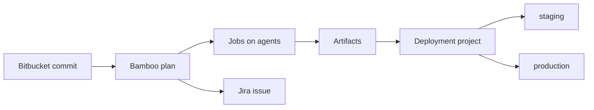

import { ConceptTemplate } from '@/features/kb/components/templates/ConceptTemplate'
import { Callout } from '@/features/kb/components/mdx/Callout'
import { ComparisonTable } from '@/features/kb/components/mdx/ComparisonTable'

export default function Layout({ children }) {
  return (
    <ConceptTemplate title="Bamboo">
      {children}
    </ConceptTemplate>
  )
}

**Bamboo** is Atlassian's build and deployment server. A **build plan** is a tree of stages, jobs, and tasks that produces artifacts. A **deployment project** takes those artifacts through named environments with permissions and release versioning. It exists because Bitbucket + Jira customers wanted CI that speaks issue keys and commit hashes without standing up Jenkins. Cloud CI for Bitbucket is now **Pipelines**; Bamboo remains the Data Center / self-managed choice.

## 1. Deep Dive and Mechanics

**Plans.** Linked to a Bitbucket (or other) repo. Stages run sequentially; jobs inside a stage can fan out on agents. Tasks are the steps (script, Maven, Docker, SCP). Specs (Java or YAML) can define plans as code so the UI is not the only source of truth.

**Agents.** Local or remote. Capabilities (JDK 17, Windows, Docker) match job requirements. Elastic agents historically spawned in AWS; many shops just keep a static farm.

**Deployments.** Distinct from builds: a release is an immutable artifact set plus a version. Deploying "the same release" to staging then prod is the point — you do not rebuild for prod.

**Jira join.** Plan names and commit messages with `PROJ-123` show builds on the issue. Release versions in Jira can be driven from Bamboo deployments.

**Permissions.** Plan admin versus view, plus environment-level deploy rights. This is Bamboo's analogue of GitHub environments.

<Callout icon="info" title="Bamboo Cloud is gone">
Atlassian retired Bamboo Cloud years ago. New Atlassian Cloud CI is Bitbucket Pipelines. Bamboo you meet in 2026 is almost always Data Center in a private network.
</Callout>

## 2. Mathematical / Theoretical Foundation

A plan run is a DAG with stage barriers: jobs in stage k+1 wait for all jobs in stage k. Artifact edges are explicit (share artifact from job A to deploy). Rebuilding for production violates **artifact immutability**: the binary you tested is not the binary you ship if compile is not bit-for-bit.

**Agent matching** is constraint satisfaction: job demands ⊆ agent capabilities. Starvation happens when rare capabilities (a signed macOS notary agent) are a single machine.

**Specs as code.** The plan definition is data. Drift between UI-edited plans and Specs in Git is two sources of truth — pick one.

<ComparisonTable
  headers={['Tool', 'Natural pair', 'Artifact model', 'Hosting']}
  rows={[
    ['Bamboo', 'Bitbucket + Jira', 'Build then deploy project', 'Data Center'],
    ['Bitbucket Pipelines', 'Bitbucket Cloud', 'Steps in YAML', 'Cloud'],
    ['Jenkins', 'Anything', 'Whatever you script', 'Self-host'],
    ['TeamCity', 'JetBrains shops', 'Build configurations', 'Self-host / Cloud'],
  ]}
/>

## 3. Real-World Implementation

```yaml
# bamboo-specs style (simplified)
---
version: 2
plan:
  project-key: PAY
  key: LEDGER
  name: ledger-build
stages:
  - Test:
      jobs:
        - Unit
Unit:
  tasks:
    - script: npm ci && npm test
  artifacts:
    - name: dist
      pattern: dist/**
```

Keep Specs in the app repo or a `bamboo-specs` repo and fail the pipeline if the live plan diverges. Wire the deployment project to consume `dist`, not to run `npm run build` again.

## 4. Visualizations



## 5. Interview Prep

**Q: Why Bamboo instead of Jenkins?**
**A:** Atlassian SSO, Jira/Bitbucket integration, and a supported Data Center binary. Not because it is more flexible — Jenkins wins flexibility and loses maintainability.

**Q: Build plan versus deployment project?**
**A:** Plan compiles and tests. Deployment ships a **release** (pinned artifacts) through environments. Collapsing them into "the prod job rebuilds" is how you ship untested bits.

**Q: Bamboo versus Bitbucket Pipelines?**
**A:** Pipelines if you are on Bitbucket Cloud and jobs fit Docker steps. Bamboo if you need Data Center, exotic agents, or existing plan investment.

## 6. Production Use Cases

- **Atlassian Data Center** estates that cannot use Cloud Pipelines.
- **Windows + JDK agent farms** already documented as Bamboo capabilities.
- **Jira-centric release** where the version object is the audit spine.

<Callout icon="tip" title="Export Specs before you 'just click a new task'">
The first undocumented UI edit is the start of a plan nobody can recreate after the server dies. Specs in Git are the backup.
</Callout>
