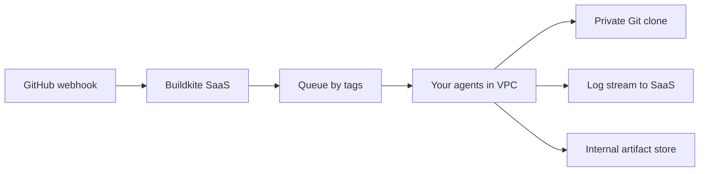

import { ConceptTemplate } from '@/features/kb/components/templates/ConceptTemplate'
import { Callout } from '@/features/kb/components/mdx/Callout'
import { ComparisonTable } from '@/features/kb/components/mdx/ComparisonTable'

export default function Layout({ children }) {
  return (
    <ConceptTemplate title="Buildkite">
      {children}
    </ConceptTemplate>
  )
}

**Buildkite** splits CI in two. The **control plane** (pipelines, logs UI, secrets metadata, GitHub/GitLab app) is Buildkite's SaaS. The **data plane** is **agents you run** — on laptops, in Kubernetes, or on metal next to the artifact store. Jobs never have to leave your VPC. That hybrid model is why security-sensitive and monorepo-heavy teams pick it over fully hosted runners.

## 1. Deep Dive and Mechanics

**Agents.** A small binary polls Buildkite for work matching its tags (queue, arch, "high-mem"). It checks out the repo, runs steps, streams logs. You scale agents; Buildkite does not see your source unless you let the checkout hit a public host.

**Pipelines.** Defined in the UI or, preferably, as a YAML uploaded dynamically (`pipeline upload`). Dynamic pipelines are the signature trick: a first step computes the affected graph and uploads only the jobs you need.

**Blocks and wait.** Manual block steps are approval gates. `wait` is a barrier. Parallel steps fan out on any matching agent.

**Clusters and queues.** Isolation: prod-deploy agents are a different queue with different IAM than PR lint agents. Never share a queue that has cloud-admin credentials with untrusted PR jobs.

**Packages and test engine.** Adjacent products (package registry, test splitting) sit on the same agent idea: compute stays yours.

<Callout icon="warning" title="Dynamic YAML is still code execution">
A PR that can change the uploaded pipeline can request any step your agents will run. Pin the generator, restrict who can upload, and use separate queues for untrusted events.
</Callout>

## 2. Mathematical / Theoretical Foundation

Scheduling is **work-stealing from tagged queues**. Let each agent advertise a tag set. A job with required tags is eligible for agents whose tags are a superset. Imbalance appears when one tag is rare (GPU, macOS).

**Dynamic pipelines** are a two-phase compile: phase 1 maps git diff → job list J; phase 2 executes J. Soundness of "affected" is the same monorepo graph problem as Nx/Bazel. If the map is wrong, you skip tests (false green) or overbuild (cost).

**Trust boundary.** Buildkite SaaS sees logs and metadata you send. Source and secrets in the agent environment stay in your network. That is the security theorem; log redaction still matters because logs *do* leave.

<ComparisonTable
  headers={['CI', 'Who runs the job', 'Dynamic pipelines', 'Typical win']}
  rows={[
    ['Buildkite', 'Your agents', 'First-class upload', 'VPC + monorepo'],
    ['GitHub Actions', 'GH or self-hosted', 'Reusable workflows', 'Forge-native'],
    ['Jenkins', 'Your controllers/agents', 'Groovy', 'Legacy flexibility'],
    ['CircleCI', 'Their cloud or self-hosted', 'Setup workflows', 'Hosted convenience'],
  ]}
/>

## 3. Real-World Implementation

```yaml
# .buildkite/pipeline.yml
steps:
  - label: ":pipeline: generate"
    command: python3 scripts/affected.py | buildkite-agent pipeline upload
  - wait
  - label: ":rocket: deploy"
    if: build.branch == "main"
    command: ./deploy.sh
    agents:
      queue: prod-deploy
```

`affected.py` prints a YAML fragment of test steps. The deploy step is statically present but constrained to the `prod-deploy` queue so a generated PR step cannot inherit those credentials.

## 4. Visualizations



## 5. Interview Prep

**Q: Why not just self-host GitHub Actions?**
**A:** You can. Buildkite's differentiator is dynamic pipeline upload, agent-centric scaling, and a UI built for huge fan-out. Actions is better if you want zero extra vendor and live on GitHub.

**Q: Where do secrets live?**
**A:** Preferably in your agent environment or a vault the agent already authenticates to — not only in Buildkite's secret store if policy forbids it. Cluster/queue split still required.

**Q: How do you stop a noisy monorepo from melting the farm?**
**A:** Affected-target generation, concurrency limits per pipeline, and separate queues so lint cannot starve deploy.

## 6. Production Use Cases

- **Monorepos** that generate hundreds of parallel steps from a build graph.
- **Air-gapped-adjacent** builds: agents and source never on the public internet.
- **Mixed fleets** (macOS signing, Windows, GPU) tagged as queues.

<Callout icon="tip" title="One queue per trust level">
PR from a fork, merge to main, and prod deploy are three trust levels. Three queues. Shared agents are how a `curl | bash` step in a PR inherits the prod role.
</Callout>
