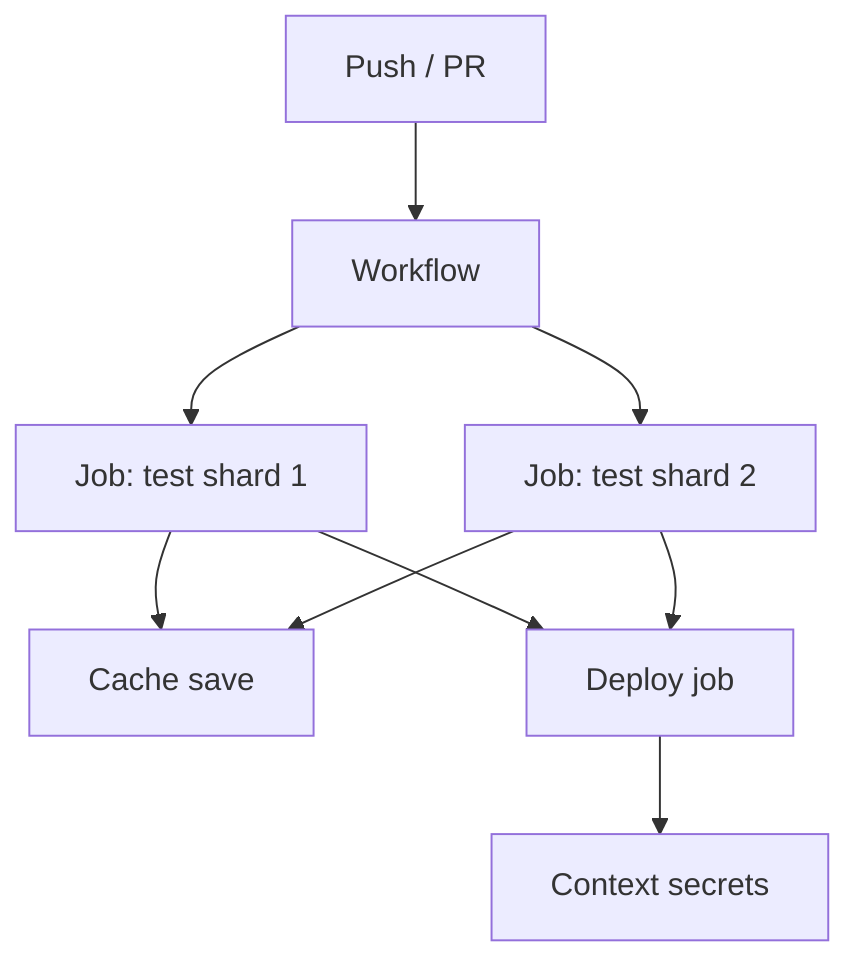

import { ConceptTemplate } from '@/features/kb/components/templates/ConceptTemplate'
import { Callout } from '@/features/kb/components/mdx/Callout'
import { ComparisonTable } from '@/features/kb/components/mdx/ComparisonTable'

export default function Layout({ children }) {
  return (
    <ConceptTemplate title="CircleCI">
      {children}
    </ConceptTemplate>
  )
}

**CircleCI** is a hosted CI service (plus self-hosted runners) that builds from a `.circleci/config.yml` in the repo. It grew up with GitHub-centric startups: Docker executors, aggressive caching, fan-out workflows, and **orbs** (reusable config packages). You still meet it in teams that adopted it before Actions existed, and in shops that want a CI vendor independent of their forge.

## 1. Deep Dive and Mechanics

**Config.** Version 2.1: `orbs`, `commands`, `jobs`, `workflows`. Workflows are the DAG. Jobs pick an **executor**: Docker image, `machine` VM, macOS, Windows, or a self-hosted runner.

**Orbs.** Named, versioned bundles of jobs/commands (e.g. `node`, AWS). They are a supply chain. Pin a semver; treat unpinned `@volatile` as untrusted code in your pipeline.

**Caching and workspaces.** `restore_cache` / `save_cache` keyed by lockfile checksum. Workspaces pass files between jobs in the same workflow (different from cache, which is across runs).

**Contexts.** Org-level secret sets attached to workflows. Restrict contexts to groups — this is how you stop a fork PR from seeing prod keys (also: disable secrets on fork builds).

**Insights and test splitting.** Timing-based split across parallelism is Circle's old trick for keeping wall time flat as the suite grows.

<Callout icon="warning" title="Orbs run with your secrets">
An orb step is not a comment. It is code on the executor. Pin versions, review source, and prefer first-party or internally published orbs for deploy jobs.
</Callout>

## 2. Mathematical / Theoretical Foundation

A workflow is a DAG of jobs. `requires` edges are the partial order. **Parallelism N** shards a test job into N containers; total CPU is N times one shard. Optimal N balances suite time against queue + boot overhead.

**Cache keys.** A key is a prefix plus a hash of inputs (lockfile). Hit rate is the fraction of jobs whose key exists. Bad keys (too coarse) reuse stale deps; too fine (include `package.json` time) never hit.

**Credits.** Circle bills compute credits. Fan-out reduces wall time and increases credits. That is the same trade as every hosted CI.

<ComparisonTable
  headers={['Feature', 'CircleCI', 'GitHub Actions', 'Buildkite']}
  rows={[
    ['Config', 'config.yml + orbs', 'workflow YAML + actions', 'pipeline.yml + upload'],
    ['Default compute', 'Their cloud', 'Their cloud', 'Your agents'],
    ['Reuse unit', 'Orb', 'Action / reusable workflow', 'Hooks + dynamic YAML'],
    ['Forge coupling', 'Loose', 'Tight', 'Loose'],
  ]}
/>

## 3. Real-World Implementation

```yaml
version: 2.1
orbs:
  node: circleci/node@5.2.0
workflows:
  test:
    jobs:
      - node/test:
          version: 22.11.0
      - deploy:
          requires: [node/test]
          filters:
            branches:
              only: main
          context: prod-aws
jobs:
  deploy:
    docker:
      - image: cimg/base:current
    steps:
      - checkout
      - run: ./scripts/deploy.sh
```

Attach `prod-aws` only to the deploy job on `main`. Do not put that context on the test job.

## 4. Visualizations



## 5. Interview Prep

**Q: Orb versus GitHub Action?**
**A:** Same idea: reusable CI code with a version and a trust problem. Migration is mapping orbs to actions and contexts to environments.

**Q: Why is my cache never hit?**
**A:** The key includes a volatile file, or you save from a different path than you restore, or the branch namespace isolates caches. Print the computed key in the job.

**Q: Circle versus Actions in 2026?**
**A:** Actions is the default on GitHub. Circle still wins if you need their executors, existing orbs, or a CI vendor not named Microsoft. Do not run both "for redundancy" without a clear split.

## 6. Production Use Cases

- **Startup monorepos** already invested in orbs and test splitting.
- **macOS / iOS** jobs on Circle's mac fleet when you do not want self-hosted Macs.
- **Multi-forge** orgs (GitHub + Bitbucket) with one CI vendor.

<Callout icon="tip" title="Contexts are environments">
Name contexts after trust (`prod-aws`, `pr-readonly`), not after teams (`mobile`). Team names change; trust boundaries should not.
</Callout>
