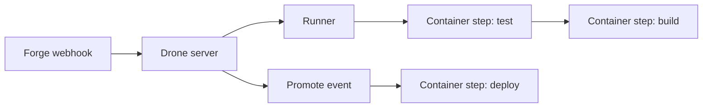

import { ConceptTemplate } from '@/features/kb/components/templates/ConceptTemplate'
import { Callout } from '@/features/kb/components/mdx/Callout'
import { ComparisonTable } from '@/features/kb/components/mdx/ComparisonTable'

export default function Layout({ children }) {
  return (
    <ConceptTemplate title="Drone CI">
      {children}
    </ConceptTemplate>
  )
}

**Drone** is a CI engine built around one idea: **each step is a container**. A `.drone.yml` lists pipelines of steps; the runner mounts the workspace and runs those images. It is small, self-hostable, and maps cleanly onto Kubernetes or a Docker socket. Harness acquired Drone; you will see Drone OSS, Drone Cloud remnants, and Harness CI as the commercial continuation. The mental model remains "CI as compose file."

## 1. Deep Dive and Mechanics

**Server + runner.** The server owns webhooks, secrets, and UI. Runners (Docker, Kubernetes, Exec) execute. This split is like Buildkite but you host both pieces.

**Steps as images.** `image: golang:1.22` plus `commands:` is a container with a script. Plugins are images with a convention (notify Slack, publish ECR). Pin plugin digests.

**Promotion.** Drone can mark a build and re-run a subset of steps (deploy) with an event `promote` — a lightweight CD hook without a second product.

**Secrets.** Stored on the server, injected as env. Restrict to `main` or to promote events so PR builds cannot read prod tokens.

**Jsonnet / Starlark.** For large graphs, generate YAML. Same dynamism as Buildkite pipeline upload, with the same trust caveats.

<Callout icon="info" title="Privileged steps are root on the node">
A privileged Docker runner step can escape to the host. Treat privileged as "this pipeline owns the runner VM." Isolate those runners.
</Callout>

## 2. Mathematical / Theoretical Foundation

A pipeline is a sequence (or DAG, in later syntax) of containers sharing a volume. Isolation is **container boundary**, not VM boundary, unless you use a VM runner. Escape risk is the Docker-socket or privileged-container problem.

**Caching.** Volume caches are node-local unless you externalise them. Hit rate depends on runner stickiness — Kubernetes runners that land on random nodes have cold caches.

**Events.** `push`, `pull_request`, `tag`, `promote` are the state machine labels. Promotion is a controlled transition from "tested artifact" to "deploy step," not a rebuild, if you pass the same workspace/artifact.

<ComparisonTable
  headers={['CI', 'Step isolation', 'Self-host', 'Config']}
  rows={[
    ['Drone', 'Container per step', 'Yes, native', '.drone.yml'],
    ['GitHub Actions', 'Job VM or container', 'Actions runner', 'workflow YAML'],
    ['Tekton', 'Pod per task', 'Yes, CRDs', 'Task / Pipeline'],
    ['Jenkins', 'Whatever the agent is', 'Yes', 'Jenkinsfile'],
  ]}
/>

## 3. Real-World Implementation

```yaml
kind: pipeline
type: docker
name: default
steps:
  - name: test
    image: node:22-alpine
    commands:
      - npm ci
      - npm test
  - name: deploy
    image: plugins/ecr
    settings:
      repo: checkout
      tags: [latest]
    when:
      event: [promote]
      target: [production]
```

Promote from the UI or CLI after `main` is green. The deploy step never runs on pull_request.

## 4. Visualizations



## 5. Interview Prep

**Q: Drone versus GitHub Actions for self-host?**
**A:** Drone if you want a tiny server and "everything is a container" as policy. Actions if the team already writes workflow YAML and you only need a runner scale-out.

**Q: What happened after the Harness acquisition?**
**A:** OSS Drone still exists; commercial energy is Harness CI. Evaluate license and support as a product decision, not a YAML decision.

**Q: How do plugins get credentials?**
**A:** Settings map to env inside the plugin container. A malicious plugin image can exfiltrate them. Pin by digest and run deploy plugins on a restricted runner.

## 6. Production Use Cases

- **Small platform teams** that want self-hosted CI without Jenkins plugins.
- **Kubernetes shops** using the Kubernetes runner so steps are pods.
- **Promote-based CD** for simple services that do not need Argo.

<Callout icon="tip" title="Pin plugin images by digest">
`plugins/docker` at `latest` is an unreviewed binary with your registry password. Digest pins are cheaper than incident response.
</Callout>
