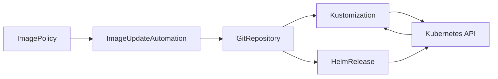

import { ConceptTemplate } from '@/features/kb/components/templates/ConceptTemplate'
import { Callout } from '@/features/kb/components/mdx/Callout'
import { ComparisonTable } from '@/features/kb/components/mdx/ComparisonTable'

export default function Layout({ children }) {
  return (
    <ConceptTemplate title="Flux">
      {children}
    </ConceptTemplate>
  )
}

**Flux** (v2) is a set of Kubernetes controllers — the **GitOps Toolkit** — that pull desired state from Git and reconcile it. You install source, kustomize, helm, notification, and image-automation controllers. There is no required central UI: Git and `flux` CLI (plus optional UIs) are the interface. Flux is what you choose when you want GitOps as **CRDs you can compose**, not as an application catalog product.

## 1. Deep Dive and Mechanics

**Sources.** `GitRepository`, `OCIRepository`, `Bucket`, `HelmRepository` define where bytes come from and how often to fetch. They verify signatures (cosign) when configured.

**Kustomization.** Applies a path from a source, with prune, health checks, decryption (SOPS), and dependsOn for ordering. This is the core reconcile loop.

**HelmRelease.** Installs/upgrades a chart with values from Git or ConfigMaps. Flux owns Helm's release secret so drift is visible.

**Image automation.** ImagePolicy + ImageUpdateAutomation bump tags or digests in Git when a new image appears — optional; many teams let CI open the bump PR instead.

**Multi-tenancy.** Tenants get a namespace, a restricted service account, and a Kustomization they may not escape. The platform cluster runs Flux; workload clusters can run their own or use a hub.

<Callout icon="info" title="Flux v1 is retired">
Anything still talking about "Flux helm-operator v1" is legacy. v2 is the toolkit CRDs. Do not mix mental models in an interview.
</Callout>

## 2. Mathematical / Theoretical Foundation

Same reconciler as Argo: desired D from Git, live L from the apiserver, apply toward D. **dependsOn** is a DAG of Kustomizations. A cycle blocks progress; a missing dependency stays pending.

**Eventual consistency.** Controllers requeue on failure with backoff. Correctness is "converges if D is valid," not "atomic multi-cluster commit." Cross-cluster atomicity does not exist; design for partial apply.

**Verification.** If the source requires signature and the commit is unsigned, D is undefined (fetch fails). That fail-closed path is the supply-chain control.

<ComparisonTable
  headers={['Concern', 'Flux', 'Argo CD']}
  rows={[
    ['Unit of deploy', 'Kustomization / HelmRelease', 'Application'],
    ['UI', 'Optional', 'Core product'],
    ['Composition', 'CRDs + kustomize', 'App of Apps / ApplicationSet'],
    ['Image bumps', 'Built-in automation', 'Usually external'],
  ]}
/>

## 3. Real-World Implementation

```yaml
apiVersion: kustomize.toolkit.fluxcd.io/v1
kind: Kustomization
metadata:
  name: checkout
  namespace: flux-system
spec:
  interval: 10m
  path: ./apps/checkout/prod
  prune: true
  sourceRef:
    kind: GitRepository
    name: gitops
  decryption:
    provider: sops
  healthChecks:
    - apiVersion: apps/v1
      kind: Deployment
      name: checkout
      namespace: checkout
```

Pair with a `GitRepository` that verifies GPG or cosign. Keep secrets as SOPS-encrypted files in Git so the cluster can decrypt with a sealed key, not a raw kube secret in the repo.

## 4. Visualizations



## 5. Interview Prep

**Q: Flux versus Argo CD?**
**A:** Flux is toolkit-shaped (CRDs, CLI, compose with other controllers). Argo is product-shaped (apps, UI, SSO, projects). Both are pull GitOps. Pick based on operator UX and existing skills.

**Q: How do you handle secrets?**
**A:** SOPS, Sealed Secrets, or External Secrets Operator. Never raw secrets in Git. Flux decryption is one integration, not the only option.

**Q: Can Flux do canaries?**
**A:** Not by itself. Flagger (from the same ecosystem) or Argo Rollouts sit beside Flux and own the progressive shift.

## 6. Production Use Cases

- **Platform clusters** that bootstrap themselves from a `flux-system` repo (including Flux's own controllers).
- **Multi-tenant** workload clusters with per-team namespaces and SOPS.
- **OCI-based GitOps** where the desired state is a signed OCI artifact, not a Git server the cluster can reach.

<Callout icon="tip" title="Health checks are part of desired state">
`prune: true` without health checks will delete the old Deployment before the new one is ready. Check the new workload, then prune.
</Callout>
