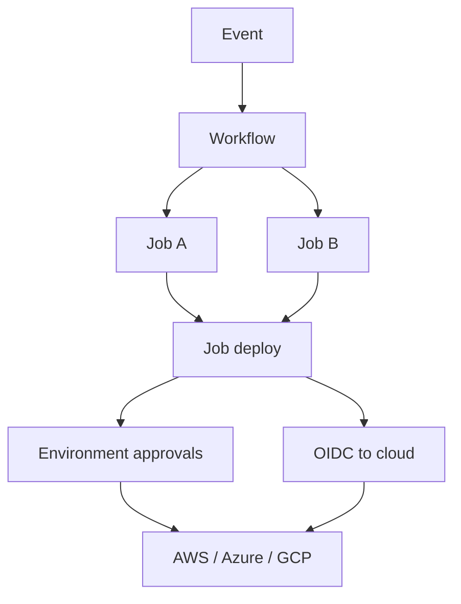

import { ConceptTemplate } from '@/features/kb/components/templates/ConceptTemplate'
import { Callout } from '@/features/kb/components/mdx/Callout'
import { ComparisonTable } from '@/features/kb/components/mdx/ComparisonTable'

export default function Layout({ children }) {
  return (
    <ConceptTemplate title="GitHub Actions">
      {children}
    </ConceptTemplate>
  )
}

**GitHub Actions** is CI/CD that lives in the same product as the Git host. A **workflow** is YAML under `.github/workflows`, triggered by events (push, pull_request, schedule, workflow_dispatch). **Jobs** run on GitHub-hosted VMs or self-hosted runners. **Steps** are either `run` scripts or **actions** (reusable units). Environments, OIDC, and reusable workflows turned it from "a CI toy" into the default pipeline for GitHub-centric teams.

## 1. Deep Dive and Mechanics

**Events and concurrency.** Triggers filter by branch and path. `concurrency` groups cancel stale runs so a force-push does not waste a farm. `pull_request` versus `pull_request_target` is the security cliff: the latter runs in the *base* repo context and can see secrets.

**Runners.** `ubuntu-latest` is a Microsoft-hosted VM. Larger runners and self-hosted exist for private nets and GPUs. Self-hosted ephemeral runners (one job, then destroy) are the only safe pattern for untrusted PR code.

**Actions.** `uses: owner/repo@ref`. A floating tag is a mutable pointer. Composite, JavaScript, and Docker actions differ in how they execute, not in the trust problem.

**Permissions.** Default `GITHUB_TOKEN` scopes are repo-settable. Least privilege is `permissions:` at workflow or job level. `id-token: write` is required for OIDC.

**Reusable workflows and composite actions.** Org-wide CI lives in a private actions repo. `workflow_call` is the template lock analogue of Azure's `extends`.

<Callout icon="error" title="pull_request_target plus checkout of the fork is RCE">
The workflow file comes from the base branch (trusted) but if you check out the PR SHA and run its install scripts, the attacker has your secrets. Do not mix those.
</Callout>

## 2. Mathematical / Theoretical Foundation

A workflow run is a DAG of jobs (`needs`). Matrix is a Cartesian product; cost multiplies. Expressions in the workflow language evaluate in a sandbox at the runner — still treat them as code, not as documentation.

**OIDC.** The runner presents a JWT with claims (repo, workflow, ref, environment). The cloud IdP maps claims → role. The security property is short-lived, audience-bound credentials. A stolen `GITHUB_TOKEN` is still powerful inside GitHub; OIDC does not replace job isolation.

**Cache keys.** Same as other CIs: hash of lockfile. Cache poisoning on public repos is a known class: a PR can write a cache the default branch later consumes unless you partition keys.

<ComparisonTable
  headers={['Piece', 'Role', 'Trust note']}
  rows={[
    ['Workflow YAML', 'Orchestration', 'Review like prod code'],
    ['Marketplace action', 'Reusable step', 'Pin to SHA'],
    ['GITHUB_TOKEN', 'Forge API', 'Least-privilege permissions'],
    ['OIDC token', 'Cloud auth', 'Claim-condition the role'],
  ]}
/>

## 3. Real-World Implementation

```yaml
name: release
on:
  push:
    tags: ["v*"]
permissions:
  contents: read
  id-token: write
jobs:
  deploy:
    runs-on: ubuntu-latest
    environment: production
    steps:
      - uses: actions/checkout@8ade135a41bc03ea155e62e844d188df1ea18608
      - uses: aws-actions/configure-aws-credentials@v4
        with:
          role-to-assume: arn:aws:iam::123456789012:role/gha-pay-prod
          aws-region: eu-west-1
      - run: ./scripts/deploy.sh
```

The AWS role's trust policy must require the exact repo and `environment: production`. Tag-based deploy still needs a gate: only create tags from a protected workflow on `main`.

## 4. Visualizations



## 5. Interview Prep

**Q: Why pin actions to a SHA?**
**A:** Tags move. A compromised maintainer or stolen token can retarget `v3` to malware. SHA is immutable. Dependabot can still propose SHA bumps.

**Q: Hosted versus self-hosted?**
**A:** Hosted is patch-managed and ephemeral. Self-hosted reaches private networks and special hardware — and is a standing execution foothold if not ephemeral and isolated.

**Q: How do you promote the same artifact?**
**A:** Build once, upload to Actions artifacts or a registry by digest, then a later job or workflow downloads that digest. Do not rebuild on the deploy job.

## 6. Production Use Cases

- **Default CI** for GitHub orgs: lint, test, required checks, merge queue.
- **OIDC deploy** to AWS/Azure/GCP without stored cloud keys.
- **Reusable org workflows** that lock scanning into every repo.

<Callout icon="tip" title="Set default token to read-only at the org">
Then grant write only on the jobs that need it. The number of "Actions pushed to main" incidents drops overnight.
</Callout>
