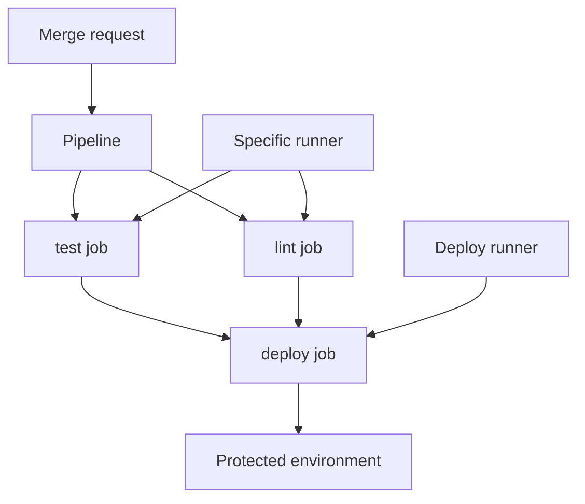

import { ConceptTemplate } from '@/features/kb/components/templates/ConceptTemplate'
import { Callout } from '@/features/kb/components/mdx/Callout'
import { ComparisonTable } from '@/features/kb/components/mdx/ComparisonTable'

export default function Layout({ children }) {
  return (
    <ConceptTemplate title="GitLab CI">
      {children}
    </ConceptTemplate>
  )
}

**GitLab CI** is the pipeline product inside GitLab. Configuration is `.gitlab-ci.yml` (plus `include`). **Runners** pick up jobs; SaaS provides shared runners, self-managed provides specific ones. Because the MR, the pipeline, the registry, and the environment live in one app, "is this change deployable?" is a single page. That integration is the reason teams accept GitLab's YAML dialect instead of Actions.

## 1. Deep Dive and Mechanics

**Jobs and stages.** Classic model: stages are an ordered partition. Modern model: `needs` builds a DAG so jobs can start when their dependencies finish, not when the whole stage finishes.

**Runners.** Register with a token; tag jobs (`k8s`, `gpu`, `windows`). The Kubernetes executor launches a pod per job. Privileged / Docker-in-Docker is the usual Kaniko-versus-DinD debate.

**Includes and CI catalog.** Remote includes and the CI/CD catalog are reusable pipelines. Pin to a SHA or version. `extends` and `!reference` compose YAML — override order is the common footgun.

**Environments and deployments.** `environment: production` plus protected environments restrict who can run the job. Review apps create per-MR environments and stop them on merge.

**Merge trains.** Speculative pipelines rebase MRs onto a train ref and retest so main stays green under load.

<Callout icon="warning" title="Protected variables are not a runner isolation story">
A protected variable is hidden from jobs on unprotected branches. A specific runner that also runs unprotected jobs can still be compromised and later steal a protected job. Split runner fleets by trust.
</Callout>

## 2. Mathematical / Theoretical Foundation

Jobs form a DAG G. Stage mode is a layered graph; `needs` is the general DAG. Cycle detection rejects the YAML. Critical path length is the wall time lower bound; width is the runner concurrency you must pay.

**Caching.** Keyed caches are per-runner or via a distributed cache (S3). Correctness of "cache the npm dir" assumes the key includes the lockfile hash. Poisoning on public projects is the same class as Actions.

**Merge train.** For MRs M1..Mk, the train builds M1 on main, then M2 on main+M1, and so on. If Mi fails, later jobs rebase. Serialisation cost is O(k) pipelines in the worst case; the payoff is fewer broken main tips.

<ComparisonTable
  headers={['Concept', 'GitLab CI', 'GitHub Actions']}
  rows={[
    ['File', '.gitlab-ci.yml', '.github/workflows/*.yml'],
    ['Reuse', 'include / catalog', 'Reusable workflows / actions'],
    ['DAG', 'needs', 'needs'],
    ['Deploy gate', 'Protected environments', 'Environments'],
  ]}
/>

## 3. Real-World Implementation

```yaml
include:
  - project: org/ci-templates
    ref: v3.2.1
    file: /node.yml
stages: [test, deploy]
test:
  extends: .node-test
  stage: test
deploy:
  stage: deploy
  environment:
    name: production
  needs: [test]
  rules:
    - if: $CI_COMMIT_BRANCH == "main"
  script:
    - ./scripts/deploy.sh
```

The `ref: v3.2.1` pin is load-bearing. `$CI_COMMIT_BRANCH` is a predefined variable (safe in YAML; do not interpolate untrusted MR titles into scripts without quoting).

## 4. Visualizations



## 5. Interview Prep

**Q: stages versus needs?**
**A:** Stages wait for the slowest job in the previous layer. `needs` starts a job when *its* dependencies finish. Use `needs` to cut idle time; keep stages as documentation if you want.

**Q: Shared runner for deploy?**
**A:** No. Deploy jobs belong on a tagged, protected, non-shared runner with the cloud role. Shared runners are a multi-tenant execute surface.

**Q: How do you pass an image digest to deploy?**
**A:** Build job writes a dotenv artifact or uses the registry digest; deploy job `needs` that job and pulls by digest. Do not retag `latest` as the promotion mechanism.

## 6. Production Use Cases

- **Self-hosted GitLab** where CI, registry, and MR approvals are one audit trail.
- **Review apps** for every MR using the Kubernetes agent.
- **Merge trains** on hot monorepos that otherwise flap main.

<Callout icon="tip" title="Protect the deploy runner token like a root password">
Anyone who registers a runner with that token can execute as that fleet. Rotate, scope, and never put the deploy token on a developer laptop leftover.
</Callout>
