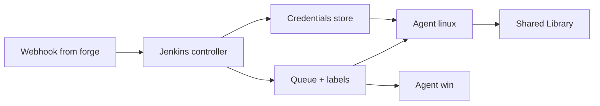

import { ConceptTemplate } from '@/features/kb/components/templates/ConceptTemplate'
import { Callout } from '@/features/kb/components/mdx/Callout'
import { ComparisonTable } from '@/features/kb/components/mdx/ComparisonTable'

export default function Layout({ children }) {
  return (
    <ConceptTemplate title="Jenkins">
      {children}
    </ConceptTemplate>
  )
}

**Jenkins** is an open-source automation server. A **controller** (formerly master) schedules work; **agents** execute it. Pipelines are Groovy **Jenkinsfiles** (declarative preferred, scripted still everywhere). Two thousand plugins connect it to every SCM, cloud, and ticket system invented since 2004. Flexibility is the reason it won; plugin sprawl and Groovy-as-YAML are the reasons teams leave for Actions, GitLab CI, or Tekton.

## 1. Deep Dive and Mechanics

**Controller versus agent.** The controller holds job config, credentials, and the UI. It should run almost no builds. Agents (permanent, Kubernetes pods, EC2 spot) do the work. A compromised controller is game over: it has every secret.

**Jenkinsfile.** Declarative: a `pipeline` block with `agent` and `stages`. Scripted: arbitrary Groovy. Shared Libraries (the Library annotation) are the reuse unit — and a code-exec supply chain.

**Multibranch and org folders.** Jenkins discovers branches and PRs from GitHub/Bitbucket/GitLab and creates jobs. The scan credentials determine what Jenkins can read.

**Credentials.** The credentials plugin stores secrets the controller injects into jobs. Folder-scoped credentials plus "authorize project" reduce the "any job can use the prod key" problem. They do not eliminate it.

**Plugin hell.** Updates are not a matrix-tested monorepo. Pin a Core + plugin BOM (Evergreen / your own) and treat the controller as a product you release.

<Callout icon="warning" title="The controller is a fortress, not a build node">
Running jobs on the built-in node (`agent any` on the controller) puts untrusted Groovy next to credentials.xml. Disable executors on the controller.
</Callout>

## 2. Mathematical / Theoretical Foundation

A Declarative pipeline is a constrained DAG of stages; `parallel` is a fork-join. Scripted Groovy is a Turing-complete program that *happens* to call pipeline steps — harder to reason about, easier to deadlock (un-cps, `node` allocations).

**CPS.** Pipeline Groovy is continuation-passed so the controller can serialise state and survive restart. That is why some Java APIs "do not work" in Jenkinsfile without `@NonCPS`.

**Queueing.** Jobs wait for an agent whose labels match. Starvation is a matching problem. Priority sorters and fair-sharing exist because a monorepo can lock the farm.

<ComparisonTable
  headers={['Aspect', 'Jenkins', 'GitHub Actions', 'Tekton']}
  rows={[
    ['Language', 'Groovy + plugins', 'YAML + actions', 'CRDs'],
    ['Extensibility', 'Highest', 'Marketplace', 'Tasks / catalogs'],
    ['Ops burden', 'High', 'Low if hosted', 'K8s-native'],
    ['Legacy connectors', 'Unmatched', 'Growing', 'Limited'],
  ]}
/>

## 3. Real-World Implementation

```groovy
pipeline {
  agent { label 'linux && docker' }
  options { timestamps(); disableConcurrentBuilds() }
  stages {
    stage('test') {
      steps {
        sh 'npm ci && npm test'
      }
    }
    stage('deploy') {
      when { branch 'main' }
      environment {
        CREDS = credentials('pay-prod-deploy')
      }
      steps {
        sh './scripts/deploy.sh'
      }
    }
  }
}
```

Keep this Declarative. Put shared deploy logic in a vetted Shared Library version, not copy-pasted `sh` blocks. Bind `pay-prod-deploy` to the folder that owns this job only.

## 4. Visualizations



## 5. Interview Prep

**Q: Why are companies still on Jenkins?**
**A:** Twenty years of jobs, air-gapped plugins, mainframe and SAP connectors, and a platform team that already exists. Migration cost, not affection.

**Q: Declarative versus scripted?**
**A:** Declarative is reviewable and toolable. Scripted is an escape hatch. New pipelines should be Declarative plus a thin Shared Library.

**Q: How do you secure it?**
**A:** No builds on controller, SSO + matrix auth, folder credentials, ephemeral Kubernetes agents, and a pinned plugin set with a CVE process. Treat Jenkins like prod, because it is.

## 6. Production Use Cases

- **Heterogeneous estates** that still build from SVN, Perforce, and Git in one farm.
- **Air-gapped** factories where a controller + agents is easier than SaaS.
- **Graduation path**: Jenkins builds the image; Argo or Spinnaker deploys it.

<Callout icon="tip" title="Version the controller like an application">
A JCasC (Configuration as Code) repo plus a container image of Core+plugins is how you stop "snowflake Jenkins." Click-ops on the Update Center is not a release process.
</Callout>
