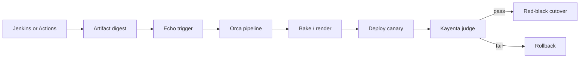

import { ConceptTemplate } from '@/features/kb/components/templates/ConceptTemplate'
import { Callout } from '@/features/kb/components/mdx/Callout'
import { ComparisonTable } from '@/features/kb/components/mdx/ComparisonTable'

export default function Layout({ children }) {
  return (
    <ConceptTemplate title="Spinnaker">
      {children}
    </ConceptTemplate>
  )
}

**Spinnaker** is an open-source **continuous delivery** platform born at Netflix. CI builds the artifact; Spinnaker **promotes** it through environments with stages: bake, deploy, canary, judge, rollback. It speaks AWS ASGs, Kubernetes, GCE, Cloud Foundry, and more through **cloud drivers**. Teams adopt it when deploy strategy is the product — red/black, rolling, canary with Kayenta — and they are willing to operate a cluster of Java microservices to get it.

## 1. Deep Dive and Mechanics

**Microservices.** Deck (UI), Gate (API), Orca (orchestration), Clouddriver (cloud accounts), Front50 (metadata), Echo (triggers), Igor (CI), Kayenta (canary analysis), Fiat (authz). You run a platform, not a binary.

**Pipelines.** A graph of stages. Triggers: Git, Docker tag, Jenkins, pub/sub, cron, other pipelines. Artifacts are first-class (Debian, Docker digest, AMI).

**Deployment strategies.** Red/black (Netflix language for blue-green), rolling push, highlander, canary. On Kubernetes, the Manifest deployer applies objects; traffic management may need a service mesh or ingress weights.

**Kayenta.** Automated canary: compare metrics (Datadog, Prometheus, Stackdriver) between baseline and canary using statistical tests. The judge returns pass/fail; the pipeline continues or rolls back.

**Managed delivery / Keel (optional).** Desired-state delivery on top of pipelines — closer to GitOps, less clicky stage graphs.

<Callout icon="info" title="Spinnaker is CD, not CI">
It will happily consume a Jenkins or Actions artifact. Rebuilding inside Spinnaker duplicates CI and breaks "the SHA we tested is the SHA we ship."
</Callout>

## 2. Mathematical / Theoretical Foundation

A pipeline is a DAG of stages with gates (manual judgment, Kayenta score). **Canary analysis** treats metrics as samples from baseline distribution B and canary distribution C. Kayenta's Mann-Whitney / effect-size style tests decide whether C is worse. False positives scale with the number of metrics you throw at the judge — more is not always better.

**Blast radius.** Red/black is a 0/100 cut. Canary is a weight w(t) that increases only if the judge passes. Expected users exposed given bad release probability p is much smaller under a slow canary — that is the whole point.

**Multi-cloud.** Clouddriver normalises "server group" across providers. The abstraction leaks; a Kubernetes ReplicaSet is not an ASG. Design pipelines per provider family.

<ComparisonTable
  headers={['Tool', 'Job', 'Canary', 'Ops weight']}
  rows={[
    ['Spinnaker', 'Multi-cloud CD', 'Kayenta', 'High'],
    ['Argo CD + Rollouts', 'K8s GitOps + progressive', 'Analysis templates', 'Medium'],
    ['Actions deploy job', 'Push CD', 'DIY', 'Low'],
    ['Flagger', 'K8s progressive', 'Metric queries', 'Low-medium'],
  ]}
/>

## 3. Real-World Implementation

```json
{
  "name": "checkout-prod",
  "stages": [
    {
      "type": "deployManifest",
      "account": "prod-k8s",
      "cloudProvider": "kubernetes",
      "manifests": [],
      "trafficManagement": {
        "enabled": true,
        "options": { "strategy": "redblack" }
      }
    },
    {
      "type": "manualJudgment",
      "instructions": "Soak 30m then continue"
    }
  ]
}
```

In practice you draw this in Deck or store it as JSON in a repo (pipeline-as-code). The artifact constraint should require a Docker digest produced by CI, not a moving `latest` tag.

## 4. Visualizations



## 5. Interview Prep

**Q: Spinnaker versus Argo CD?**
**A:** Spinnaker is a multi-cloud CD orchestrator with first-class canary judging. Argo CD is Kubernetes GitOps. Many Netflix-era shops still want Spinnaker's strategies; K8s-only shops usually pick Argo or Flux plus Rollouts/Flagger.

**Q: Why is it hard to operate?**
**A:** A dozen stateful JVM services, cloud credentials in Clouddriver, and upgrade coupling. Budget a platform team or use a managed offering.

**Q: Where does Kayenta fail?**
**A:** Weekend traffic too thin for significance, wrong metrics (CPU instead of checkout errors), and not holding the canary long enough. Statistics need sample size.

## 6. Production Use Cases

- **Netflix-style** ASG red/black across many AWS accounts.
- **Multi-cloud** promotion of the same artifact to GKE and EKS with one pipeline family.
- **Regulated canaries** where the Kayenta score is the evidence attached to the change ticket.

<Callout icon="tip" title="Version pipelines in Git">
Deck click-ops will diverge between staging and prod. Pipeline-as-code (or a generator) is the only way two environments stay comparable.
</Callout>
