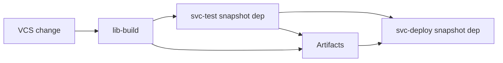

import { ConceptTemplate } from '@/features/kb/components/templates/ConceptTemplate'
import { Callout } from '@/features/kb/components/mdx/Callout'
import { ComparisonTable } from '@/features/kb/components/mdx/ComparisonTable'

export default function Layout({ children }) {
  return (
    <ConceptTemplate title="TeamCity">
      {children}
    </ConceptTemplate>
  )
}

**TeamCity** is JetBrains' build server. You model **projects** and **build configurations**, not free-form YAML jobs. **Snapshot dependencies** chain configurations so a deploy reuses the exact binaries a test configuration produced. The Kotlin DSL (or Kotlin script in the repo) versions that model. JVM, .NET, and Kotlin shops love the test UI; everyone else meets it when an enterprise already paid for JetBrains.

## 1. Deep Dive and Mechanics

**Build configurations.** A config is VCS roots + steps + artifact rules + triggers. Templates keep 50 services consistent. Parameters (typed, password) are first-class.

**Snapshot vs artifact dependencies.** Snapshot: "run B on the same source revision as A, and wait for A." Artifact: "download A's outputs." Together they implement "build once, promote."

**Build chains.** The UI shows the DAG. A change in a shared library can fan out to downstream configs automatically if the VCS roots and snapshot deps are set.

**Agents.** Pools, requirements (JDK, OS), cloud burst. The server is licensed by agent count — the economic constraint.

**Kotlin DSL.** `.teamcity` in the repo is the portable form. The UI can still edit; you must decide which side wins, like Bamboo Specs.

<Callout icon="info" title="TeamCity Cloud and On-Premises">
Same product idea. Cloud is JetBrains-hosted server plus your or their agents. On-Premises is the classic "we run the server" install next to the artifact cache.
</Callout>

## 2. Mathematical / Theoretical Foundation

Snapshot dependencies define a DAG of configurations. A **chain run** is a consistent cut: every node is built from the same VCS revision (or a declared dependency revision). That consistency is the theorem CI YAML files often fake with "download latest artifact."

**Test reporting.** TeamCity ingests surefire/trx output and computes failure mutes, investigations, and flaky-test statistics. Flake rate is failures / runs per test name — mute is a human override, not a fix.

**Licensing as capacity.** Agent count A caps width of the DAG. Critical path versus width is the same scheduling math as any CI; the license just makes the cap explicit.

<ComparisonTable
  headers={['Feature', 'TeamCity', 'Jenkins', 'GitHub Actions']}
  rows={[
    ['Reuse model', 'Templates + Kotlin DSL', 'Shared libraries', 'Reusable workflows'],
    ['Promote binaries', 'Snapshot + artifacts', 'Archive + copy', 'Artifacts / packages'],
    ['Test UX', 'Excellent', 'Plugins', 'Annotations / checks'],
    ['License', 'Per agent', 'OSS', 'Minutes / runners'],
  ]}
/>

## 3. Real-World Implementation

```kotlin
// .teamcity/settings.kts (simplified)
import jetbrains.buildServer.configs.kotlin.*

version = "2024.12"

project {
  buildType {
    id("Ledger_Test")
    name = "ledger-test"
    vcs { root(DslContext.settingsRoot) }
    steps { script { scriptContent = "npm ci && npm test" } }
    artifactRules = "dist => dist"
  }
}
```

Add a second build type `ledger-deploy` with a snapshot dependency on `Ledger_Test` and artifact dependency on `dist`. Deploy must not run `npm run build` again.

## 4. Visualizations



## 5. Interview Prep

**Q: Why TeamCity over Jenkins for a Java shop?**
**A:** Out-of-the-box test intelligence, snapshot chains, and Kotlin DSL that IntelliJ understands. Less plugin lottery. Cost is license and a slightly opinionated model.

**Q: Kotlin DSL versus UI?**
**A:** DSL in Git is reviewable. UI is faster for a one-off parameter. Pick DSL as source of truth and treat UI edits as bugs if they are not exported.

**Q: How do you isolate secrets?**
**A:** Typed password parameters, scoped to project, plus agent requirements so a "public PR" config cannot run on the deploy pool.

## 6. Production Use Cases

- **IntelliJ / Kotlin / .NET** monorepos with deep snapshot chains.
- **Enterprises** standardising on JetBrains IDE + TeamCity + YouTrack.
- **Composite builds** where a library change must rebuild a known downstream set.

<Callout icon="tip" title="Name configurations as promoteable products">
`ledger-test` and `ledger-deploy` with a snapshot link is readable in the chain UI. `job12` is how new hires ship the wrong artifact.
</Callout>
