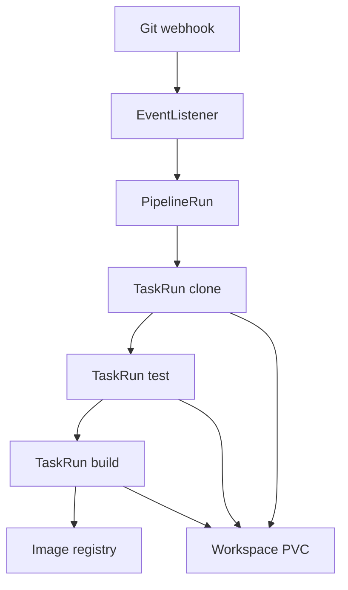

import { ConceptTemplate } from '@/features/kb/components/templates/ConceptTemplate'
import { Callout } from '@/features/kb/components/mdx/Callout'
import { ComparisonTable } from '@/features/kb/components/mdx/ComparisonTable'

export default function Layout({ children }) {
  return (
    <ConceptTemplate title="Tekton">
      {children}
    </ConceptTemplate>
  )
}

**Tekton** is a set of Kubernetes CRDs for running CI/CD. A **Task** is a sequence of steps (containers in one pod) with params, results, and workspaces. A **Pipeline** composes tasks. A **PipelineRun** is an execution. There is no required UI (Tekton Dashboard is optional). OpenShift Pipelines, some cloud build products, and in-house platforms are Tekton underneath. You choose it when **the cluster is the CI farm** and you want APIs, not a Jenkins controller.

## 1. Deep Dive and Mechanics

**Task / ClusterTask.** Reusable steps: git-clone, buildah, kaniko, go-test. Catalogs publish them. Pin by digest in production.

**Pipeline.** `tasks` with `runAfter` and `from` (results). Workspaces are PVCs or volume claims shared along the graph. Finally tasks run on failure for cleanup.

**PipelineRun / TaskRun.** Immutable-ish execution objects. Status holds step logs (via the log sidecar or a logging backend). TTL controllers garbage-collect old runs so etcd does not die.

**Triggers.** TriggerTemplate + EventListener + TriggerBinding: a webhook (GitHub) creates a PipelineRun. This is how you get "on push" without polling.

**Security.** Steps run as the service account on the PipelineRun. Pod security, no privilege, and isolated namespaces per tenant are mandatory. The pipeline SA that can push to prod is a cloud credential.

<Callout icon="warning" title="Tekton is a toolkit, not a product">
You still need authn, secret mapping, a YAML generator, log storage, and a UI if humans must debug. Budget for a platform layer or use OpenShift Pipelines / a vendor wrap.
</Callout>

## 2. Mathematical / Theoretical Foundation

A Pipeline is a DAG of Tasks. Each TaskRun is a pod; steps inside a Task are sequential containers sharing a network and workspaces. Parallelism is across TaskRuns, not across steps in one Task (unless you split tasks).

**Scheduling.** The Kubernetes scheduler places pods. CI burst is "a lot of pending pods." Resource requests that are honest prevent noisy-neighbor starvation; requests that are lies get evicted.

**Results.** A task result is a small string (digest, URL) written to a termination message / results API — not a blob. Blobs go to workspaces or an external registry. Mixing those up is a common design error.

<ComparisonTable
  headers={['System', 'Unit of work', 'Where it runs', 'Who operates it']}
  rows={[
    ['Tekton', 'Task / Pipeline CRDs', 'Cluster pods', 'You'],
    ['Jenkins', 'Job / Jenkinsfile', 'Agents', 'You'],
    ['GitHub Actions', 'Job', 'Hosted or runner', 'GitHub + you'],
    ['Drone', 'Container steps', 'Runner', 'You'],
  ]}
/>

## 3. Real-World Implementation

```yaml
apiVersion: tekton.dev/v1
kind: Pipeline
metadata:
  name: ledger-ci
spec:
  workspaces:
    - name: src
  tasks:
    - name: clone
      taskRef:
        name: git-clone
      workspaces:
        - name: output
          workspace: src
    - name: test
      runAfter: [clone]
      taskRef:
        name: npm-test
      workspaces:
        - name: source
          workspace: src
```

A PipelineRun supplies the git URL param and a PVC workspace. Triggers create that PipelineRun from a webhook so developers never `kubectl apply` a run by hand.

## 4. Visualizations



## 5. Interview Prep

**Q: Tekton versus Jenkins on Kubernetes?**
**A:** Jenkins on K8s still has a controller brain and Groovy. Tekton's brain is the apiserver. Easier HA story, poorer out-of-box UX. Jenkins Kubernetes plugin is "agents as pods"; Tekton is "the pipeline is pods."

**Q: How do you share cache?**
**A:** A PVC workspace, an image layer cache in the cluster registry, or an external cache (S3). Node-local cache dies when the pod moves.

**Q: Why do people wrap Tekton?**
**A:** Raw CRDs are verbose. Shipwright, Jenkins X (historical), OpenShift Pipelines, and in-house generators exist so app teams write 20 lines, not 200.

## 6. Production Use Cases

- **OpenShift** shops where Pipelines is the supported CI.
- **Platform teams** exposing "build this repo" as an API that creates PipelineRuns.
- **Air-gapped clusters** that already run everything else as CRDs.

<Callout icon="tip" title="Pin catalog Tasks like container images">
A ClusterTask that moved `main` is the same incident as an unpinned GitHub Action. Mirror Tasks into your org and bump on purpose.
</Callout>
