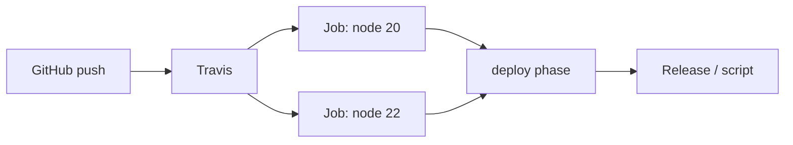

import { ConceptTemplate } from '@/features/kb/components/templates/ConceptTemplate'
import { Callout } from '@/features/kb/components/mdx/Callout'
import { ComparisonTable } from '@/features/kb/components/mdx/ComparisonTable'

export default function Layout({ children }) {
  return (
    <ConceptTemplate title="Travis CI">
      {children}
    </ConceptTemplate>
  )
}

**Travis CI** is the hosted CI that defined a generation of open source: add `.travis.yml`, enable the GitHub app, get Linux (and later macOS) builds on every push. It proved that CI as a file in the repo could scale to tens of thousands of projects. After the Idera acquisition, pricing and OSS policy changed; GitHub Actions absorbed the default-for-public-repos role. Travis remains in production for teams that never migrated, and as historical literacy for anyone reading old papers and READMEs.

## 1. Deep Dive and Mechanics

**Config.** `.travis.yml`: `language`, `matrix` / `jobs.include`, `script`, `deploy`. The matrix fans out language versions (Python 3.9 and 3.12) as separate jobs — the ancestor of Actions' strategy matrix.

**Build lifecycle.** `before_install` → `install` → `before_script` → `script` → `after_success` / `after_failure` → `before_deploy` → `deploy` → `after_script`. Phases are why old configs look like a state machine in a list.

**Infrastructure.** Linux containers, macOS VMs (historically for iOS/OSS), Windows later. Caching (`cache: directories`) is per-repo and branch-aware.

**OSS versus paid.** The original "free for public GitHub" deal ended in its generous form. New public projects should not assume a free Travis minute pool exists.

**`.travis.yml` as cultural artifact.** Thousands of academic repos still have one. Treat a green Travis badge on an unmaintained repo as a fossil, not a guarantee.

<Callout icon="info" title="travis-ci.org versus .com">
`.org` was the OSS cluster; `.com` the commercial one. They merged. Links and env var names in decade-old docs still confuse people. Use current Travis documentation, not a 2016 blog post.
</Callout>

## 2. Mathematical / Theoretical Foundation

A matrix of language versions is a Cartesian product of axes. Cost is product of sizes; wall time is max job plus queue. That product is why "test all Pythons × all DBs × all OSes" dies of minutes.

**Phase hooks** are a linear pipeline with optional skip. They are less general than a job DAG: you cannot start deploy before a parallel lint job unless you invent a stage with `jobs.include`.

**Trust.** Encrypted env vars (`travis encrypt`) bind to the repo. Fork PRs should not see them — the same rule every hosted CI relearned after secret-exfil incidents.

<ComparisonTable
  headers={['Era default', 'Config', 'Where it ran', 'Status in 2026']}
  rows={[
    ['Travis CI', '.travis.yml', 'Their VMs', 'Niche / legacy'],
    ['CircleCI', 'config.yml', 'Their cloud', 'Active'],
    ['GitHub Actions', 'workflow YAML', 'GitHub-hosted', 'Default on GitHub'],
    ['GitLab CI', 'gitlab-ci.yml', 'Shared runners', 'Default on GitLab'],
  ]}
/>

## 3. Real-World Implementation

```yaml
language: node_js
node_js:
  - 20
  - 22
cache: npm
script:
  - npm ci
  - npm test
deploy:
  provider: script
  script: bash scripts/deploy.sh
  on:
    branch: main
    tags: true
```

If you still run Travis, move deploy to a gated paid environment and pin OS images. For anything new on GitHub, write Actions instead and keep this file only as a migration map of phases → jobs.

## 4. Visualizations



## 5. Interview Prep

**Q: Why did Actions replace Travis for OSS?**
**A:** Same host as the code, generous free minutes for public repos, marketplace, and Microsoft's distribution. Travis's OSS policy and reliability hiccups after acquisition accelerated the move.

**Q: Should we keep Travis "as backup"?**
**A:** Two CIs that can both deploy is a split-brain risk. Keep a second CI only if it cannot produce production credentials.

**Q: What is still worth copying from Travis?**
**A:** The idea that CI config is a reviewed file in the repo, and that a language matrix belongs in that file. The phase names are not worth preserving.

## 6. Production Use Cases

- **Migration tails**: a few repos still billing Travis while the org standardises on Actions.
- **Historical builds** for papers and SDK samples that document Travis badges.
- **Non-GitHub** leftovers where a Travis plan was wired to Bitbucket or Assembla and nobody has funded a move.

<Callout icon="tip" title="Turn off deploy on the old system first">
When you migrate, revoke Travis's deploy keys on day one. A forgotten cron build that still has a PyPI password is a very 2018 incident that still happens.
</Callout>
