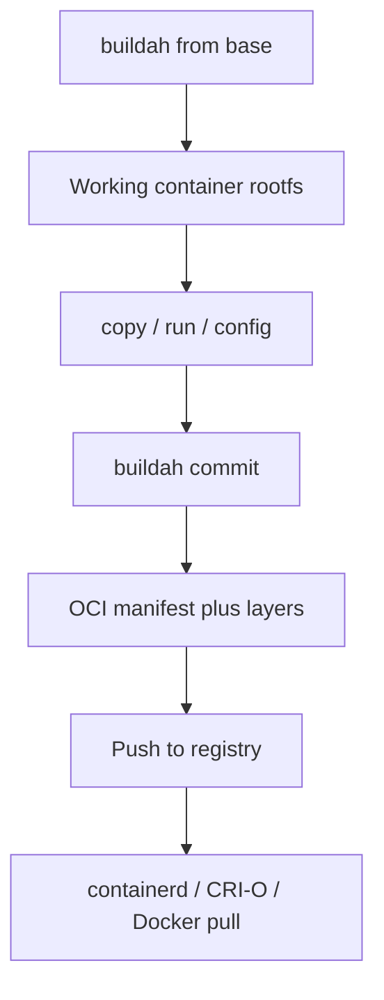

import { ConceptTemplate } from '@/features/kb/components/templates/ConceptTemplate'
import { Callout } from '@/features/kb/components/mdx/Callout'
import { ComparisonTable } from '@/features/kb/components/mdx/ComparisonTable'

export default function Layout({ children }) {
  return (
    <ConceptTemplate title="Buildah">
      {children}
    </ConceptTemplate>
  )
}

**Buildah** builds Open Container Initiative images without a long-lived root daemon. A CI job or a developer runs a single binary. That process mounts a working container filesystem, applies instructions, and commits layers. The result is a standard OCI image that Docker, Podman, containerd, and CRI-O can all pull.

## 1. Deep Dive and Mechanics

**Working containers, not a daemon.** Buildah keeps a *working container* — an unpacked rootfs plus metadata — under a storage graph (usually overlay plus containers/storage). Commands mutate that rootfs: add packages, copy files, set config. `buildah commit` writes a new image. There is no `dockerd` to talk to.

**Two fronts.** `buildah bud` (build-using-Dockerfile) reads a Dockerfile and produces layers the way Docker BuildKit does. The lower-level CLI (`from`, `run`, `copy`, `config`, `commit`) lets you script a build in bash with ordinary tools — mount the rootfs and run `dnf` or `make` against it.

**Rootless.** User namespaces map container-root to an unprivileged host uid. Overlay mounts in user space (fuse-overlayfs) or kernel overlay with idmapped mounts finish the illusion. CI can build images as a non-root runner, which kills the classic Docker-in-Docker privilege hole.

**Transport.** Push and pull speak the OCI distribution protocol: registry HTTP, manifests, blobs. You can also write `oci:./out` or `docker-archive` for air-gapped pipes.

<Callout icon="info" title="Same bytes as Docker">
An image committed by Buildah is not a special format. It is an OCI image. A digest produced here should run under containerd on a Kubernetes node without translation.
</Callout>

## 2. Mathematical / Theoretical Foundation

An image is a **content-addressed DAG**. Each layer blob is hashed (SHA-256). The config JSON hashes the layer list plus runtime fields (entrypoint, env, user). The manifest hashes the config and the layer descriptors. Changing one file changes that layer digest, which changes the config digest, which changes the manifest digest. Cache hits are digest equality, not filename equality.

**Isolation of the build step** is the same as a container: namespaces hide pid/net/mnt; cgroups cap CPU and memory so a runaway `go build` cannot starve the CI host.

<ComparisonTable
  headers={['Tool', 'Needs daemon', 'Typical role']}
  rows={[
    ['Buildah', 'No', 'CI and scripted OCI builds'],
    ['Docker BuildKit', 'Yes, or buildx driver', 'Developer laptop and many pipelines'],
    ['Podman build', 'No (calls Buildah)', 'Local Docker-compatible workflow'],
    ['Kaniko / BuildKit in K8s', 'In-cluster, no Docker socket', 'Unprivileged cluster builds'],
  ]}
/>

## 3. Real-World Implementation

```bash
#!/usr/bin/env bash
set -euo pipefail
ctr=$(buildah from alpine:3.20)
mnt=$(buildah mount "$ctr")
cp -a ./app "$mnt/usr/local/bin/app"
buildah config --cmd '["/usr/local/bin/app"]' --port 8080 "$ctr"
buildah commit "$ctr" registry.example.com/app:1.4.2
buildah unmount "$ctr"
buildah rm "$ctr"
buildah push registry.example.com/app:1.4.2
```

The script never talks to a socket at `/var/run/docker.sock`. In GitLab CI you run this as the `buildah` image with `CAP_SETUID` and user-namespace mappings, not as privileged Docker-in-Docker.

## 4. Visualizations



## 5. Interview Prep

**Q: Why do security teams prefer Buildah over Docker-in-Docker?**
**A:** Docker-in-Docker typically mounts the host Docker socket or runs privileged. A build compromise becomes host root. Buildah is a process; with user namespaces the blast radius is the CI user.

**Q: How does Buildah relate to Podman?**
**A:** Podman is the run/pod/compose front end. Image build in Podman is Buildah under the hood. They share containers/storage and the same image store.

**Q: Can Buildah reproduce Docker layer caching?**
**A:** `buildah bud` caches by instruction digest the same way. The low-level CLI does not invent cache for you — you decide when to commit intermediate images.

## 6. Production Use Cases

- **Hardened CI** on OpenShift and GitLab where the cluster forbids privileged Docker sockets.
- **Distroless or scratch images** assembled by mounting a rootfs and copying a single static binary.
- **Air-gapped factories** that commit to `oci:` directories and copy blobs onto USB or an internal registry.

<Callout icon="tip" title="Prefer bud in teams">
Scripted `from`/`commit` is powerful and easy to make non-reproducible. For shared repos, check in a Dockerfile and use `buildah bud` so the recipe is reviewable.
</Callout>
