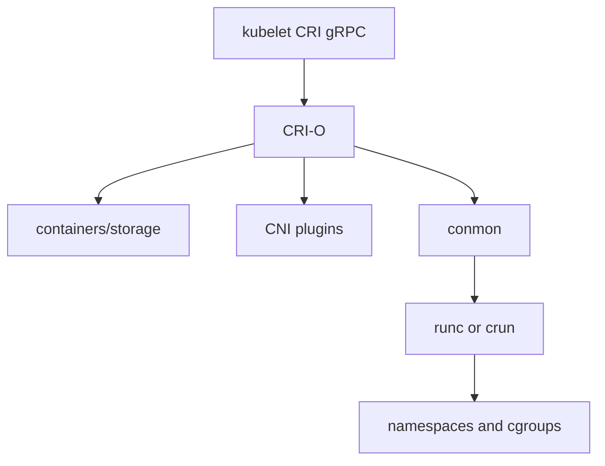

import { ConceptTemplate } from '@/features/kb/components/templates/ConceptTemplate'
import { Callout } from '@/features/kb/components/mdx/Callout'
import { ComparisonTable } from '@/features/kb/components/mdx/ComparisonTable'

export default function Layout({ children }) {
  return (
    <ConceptTemplate title="CRI-O">
      {children}
    </ConceptTemplate>
  )
}

**CRI-O** is a container runtime written to satisfy the Kubernetes Container Runtime Interface and then stop. It pulls OCI images, creates pod sandboxes, and execs `runc` or `crun`. It does not build images, run Compose files, or expose a Docker API. If a feature is not in CRI, CRI-O does not implement it.

## 1. Deep Dive and Mechanics

**One consumer.** kubelet opens a gRPC CRI socket. CRI-O answers `RunPodSandbox`, `CreateContainer`, `StartContainer`, exec, attach, and image pull. There is no second API for laptops.

**OCI all the way down.** Image pull follows the OCI distribution spec. Execution hands a runtime spec to a low-level runtime. Storage uses containers/storage (same family as Podman and Buildah), so images you build with Buildah land in a store CRI-O already understands on Red Hat nodes.

**conmon.** Each container is supervised by `conmon`, which holds the pty, forwards logs, and reports exit. That role is the cousin of containerd's shim.

**OpenShift.** Red Hat ships CRI-O as the only supported runtime. SELinux, cgroup v2, and signature policy (containers/image policy.json) are first-class.

**Swap versus containerd.** containerd also serves Docker and nerdctl. CRI-O's smaller surface is the security argument; containerd's ecosystem and snapshotter plugins are the flexibility argument.

<Callout icon="info" title="CRI is the contract">
kubelet does not know or care whether CRI-O or containerd is behind the socket. Node problems should be debugged with `crictl`, not `docker`.
</Callout>

## 2. Mathematical / Theoretical Foundation

**Attack surface.** Trusted computing base size tracks lines of code and extra APIs. Removing image-build, Swarm, and a Docker REST listener removes parsers that have historically hosted CVEs. This is reduction of the interface automaton, not a formal proof of safety.

**Pod sandbox.** Same math as containerd: one pause-like infra container owns the network namespace; N app containers join it. IPAM and CNI run at sandbox create time, once per pod, not once per container.

<ComparisonTable
  headers={['Runtime', 'Speaks CRI', 'Also used by Docker', 'Default home']}
  rows={[
    ['CRI-O', 'Yes', 'No', 'OpenShift'],
    ['containerd', 'Yes', 'Yes (backend)', 'Most public clouds'],
    ['Docker Engine', 'No (shim gone)', 'Yes', 'Dev machines, older nodes'],
  ]}
/>

## 3. Real-World Implementation

```toml
# /etc/crio/crio.conf.d/01-runtime.conf (excerpt)
[crio.runtime]
default_runtime = "crun"
cgroup_manager = "systemd"
log_level = "info"

[crio.runtime.runtimes.crun]
runtime_path = "/usr/bin/crun"
runtime_type = "oci"
```

Pin the pause image and registries in the same drop-in directory. Image signature policy lives in `/etc/containers/policy.json` and can refuse unsigned pulls.

## 4. Visualizations



## 5. Interview Prep

**Q: Why does OpenShift not just use containerd?**
**A:** Historical alignment with Podman/Buildah storage, SELinux defaults, and a policy of "only what CRI needs." Both are valid CRI implementations; the choice is ecosystem, not capability to run pods.

**Q: Can CRI-O run images built by Docker?**
**A:** Yes. Docker images are OCI images. CRI-O pulls the manifest and layers from any OCI registry.

**Q: How do you exec into a pod on a CRI-O node?**
**A:** `kubectl exec` goes kubelet to CRI to CRI-O to conmon. On the node, `crictl exec` is the escape hatch. There is no Docker socket.

## 6. Production Use Cases

- **OpenShift** clusters (the supported path).
- **Regulated Kubernetes** where the runtime must not expose a Docker API.
- **Mixed build/run** shops that build with Buildah and run with CRI-O against one storage graph.

<Callout icon="tip" title="Match crictl to the socket">
Point `crictl` at the CRI-O socket (often `/var/run/crio/crio.sock`). A leftover containerd socket will show an empty, confusing world.
</Callout>
