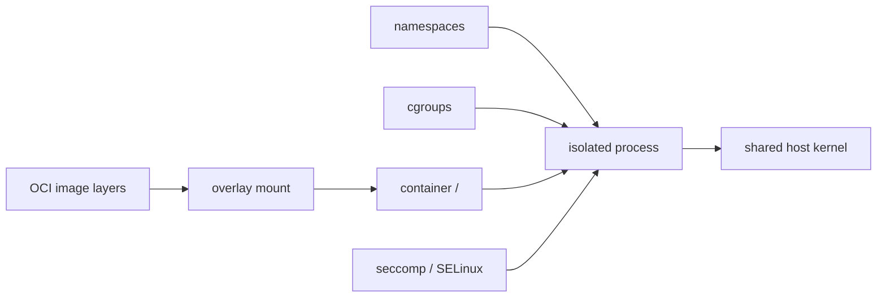

import { ConceptTemplate } from '@/features/kb/components/templates/ConceptTemplate'
import { Callout } from '@/features/kb/components/mdx/Callout'
import { ComparisonTable } from '@/features/kb/components/mdx/ComparisonTable'

export default function Layout({ children }) {
  return (
    <ConceptTemplate title="Containers">
      {children}
    </ConceptTemplate>
  )
}

A **container** is a regular process that the kernel has given a private view of the machine and a budget of CPU, memory, and PIDs. There is no guest kernel and no hardware hypervisor in the common path. The "machine" is an illusion built from namespaces, cgroups, a union filesystem, and a few security modules.

## 1. Deep Dive and Mechanics

**Namespaces (what you see).** PID, mount, network, UTS, IPC, user, and cgroup namespaces hide host processes, host mounts, host interfaces, and often host uids. Inside, the app is PID 1 on its own `/` with its own `eth0`.

**cgroups (what you use).** The runtime writes memory and CPU max files so a leak dies inside the group instead of taking the node.

**Rootfs.** Layers from an OCI image are stacked (overlay). `pivot_root` or `chroot` makes that stack the container's `/`. A thin writable upper layer holds runtime files; delete the container and the upper layer is gone.

**Security modules.** seccomp filters syscalls. AppArmor or SELinux label the process. Linux capabilities drop `CAP_SYS_ADMIN` and friends. User namespaces map container-root to an unprivileged host uid so "root in the container" is not root on the host.

**Not a VM.** All containers on a node share the host kernel. A kernel exploit is a host exploit. Windows images do not run on a Linux kernel without a VM (that is what Docker Desktop does on Mac and Windows).

<Callout icon="warning" title="Isolation is software, not hardware">
Treat containers as a packaging and density tool. For hostile multi-tenant compute, add gVisor, Kata, or real VMs. A shared kernel is the common failure mode in escape CVEs.
</Callout>

## 2. Mathematical / Theoretical Foundation

**Process model.** Start cost is `clone` plus mounts — milliseconds — versus booting a kernel (seconds to minutes). Memory overhead is the app plus a few megabytes of runtime metadata, not a full OS.

**Density.** If a VM needs 512 MiB of guest OS and a container needs 0, the same RAM holds many more replicas. The trade is a larger shared trusted computing base: one kernel for every tenant.

**Immutability.** The image is a content-addressed snapshot. The running container is that snapshot plus an ephemeral writable layer. Persistent state must leave the layer (volumes, remote disks, object storage).

<ComparisonTable
  headers={['Property', 'Virtual machine', 'Container']}
  rows={[
    ['Kernel', 'Guest kernel per VM', 'Shared host kernel'],
    ['Start time', 'Seconds to minutes', 'Milliseconds'],
    ['Disk size', 'Full OS image', 'App plus deps'],
    ['Isolation', 'Hardware / hypervisor', 'Namespaces plus LSM'],
  ]}
/>

## 3. Real-World Implementation

```bash
# Minimal "container" with kernel primitives (illustrative)
unshare --pid --net --mount --uts --ipc --fork --mount-proc \
  chroot ./rootfs /bin/sh
```

Production engines (runc) do the same steps with a config.json: namespaces, cgroups, seccomp, pivot_root, then `exec` the entrypoint. Docker and Kubernetes are UX and scheduling around that sequence.

## 4. Visualizations



## 5. Interview Prep

**Q: Is a container a lightweight VM?**
**A:** No. It is a process with isolation knobs. A VM virtualizes hardware and runs another kernel. Marketing says "lightweight VM"; the kernel says `clone`.

**Q: Why can you not run a Windows container on Linux?**
**A:** The binary and syscalls target a Windows kernel. Linux cannot execute that ABI. Desktop products hide a Linux or Windows VM to paper over it.

**Q: What persists after `docker rm`?**
**A:** Only data you mounted from outside the writable layer: named volumes, bind mounts, and remote disks. Image layers stay in the local store until pruned.

## 6. Production Use Cases

- **Packaging** a language runtime plus app so CI, staging, and prod boot the same bytes.
- **Bin-packing** many services per node in Kubernetes.
- **CI jobs** that need a clean rootfs without a VM per job.

<Callout icon="tip" title="Think process, then image">
Debug with `ps`, `/proc`, and cgroup files first. The image is just the filesystem you handed that process.
</Callout>
