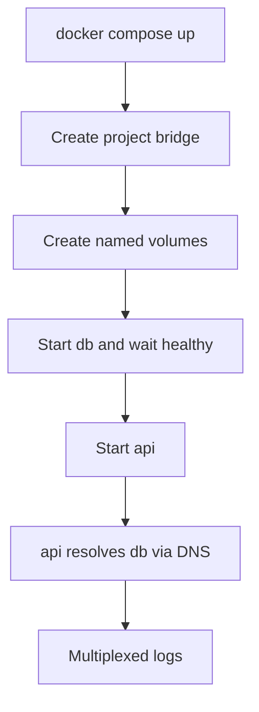

import { ConceptTemplate } from '@/features/kb/components/templates/ConceptTemplate'
import { Callout } from '@/features/kb/components/mdx/Callout'
import { ComparisonTable } from '@/features/kb/components/mdx/ComparisonTable'

export default function Layout({ children }) {
  return (
    <ConceptTemplate title="Docker Compose">
      {children}
    </ConceptTemplate>
  )
}

**Docker Compose** turns a pile of `docker run` flags into one file. You declare services, networks, and volumes. `docker compose up` builds or pulls images, creates a project network, starts containers in dependency order, and tails logs. It is an orchestration tool for *one machine* (or a tiny Swarm), not a cluster scheduler.

## 1. Deep Dive and Mechanics

**Compose Specification.** The modern file is `compose.yaml` (or `compose.yml`). The old `version: "3.8"` header is optional. Keys: `services`, `networks`, `volumes`, `secrets`, `configs`. Profiles hide optional services (debug sidecars, load generators).

**Project isolation.** Compose prefixes resources with a project name (directory name by default). Two checkouts on one host do not collide on container names or the default network.

**DNS.** Every service name is a DNS name on the project network. The API talks to `db:5432`, not a guessed `172.18.0.x`. That is why `depends_on` is about start order, not "database is ready" — add a healthcheck and `depends_on.condition: service_healthy` if you need readiness.

**Watch and bind mounts.** Dev workflows bind-mount source and run a file watcher. Compose does not hot-reload for you; your process does.

**Not Kubernetes.** There is no scheduler, no rolling update across nodes, no CrashLoop backoff that reschedules to another machine. `compose` can emit Kubernetes YAML via other tools, but the runtime model is still local containers.

<Callout icon="warning" title="depends_on is not readiness">
A Postgres container that has started is not a Postgres that accepts connections. Use healthchecks or an init container pattern, or the API will flap on every cold start.
</Callout>

## 2. Mathematical / Theoretical Foundation

**Graph of services.** `depends_on` is a DAG. Compose starts sinks first. Cycles are rejected or ignored depending on engine version — treat them as a spec error.

**Network scope.** A bridge network is a connected component. Service discovery is a local DNS mapping name to VIP or container IPs. Scale (`--scale api=3`) round-robins the service name across replica IPs.

<ComparisonTable
  headers={['Tool', 'Scope', 'State model']}
  rows={[
    ['Compose', 'One host', 'File plus running containers'],
    ['Swarm stack', 'Swarm cluster', 'Same file, replicated services'],
    ['Kubernetes', 'Many nodes', 'Controllers reconcile forever'],
    ['Nomad / others', 'Many nodes', 'Jobs, not Compose'],
  ]}
/>

## 3. Real-World Implementation

```yaml
name: shop
services:
  api:
    build: ./backend
    ports:
      - "8080:8080"
    environment:
      DATABASE_URL: postgres://shop:shop@db:5432/shop
    depends_on:
      db:
        condition: service_healthy
  db:
    image: postgres:16
    volumes:
      - pgdata:/var/lib/postgresql/data
    environment:
      POSTGRES_PASSWORD: shop
      POSTGRES_USER: shop
      POSTGRES_DB: shop
    healthcheck:
      test: ["CMD-SHELL", "pg_isready -U shop"]
      interval: 5s
      retries: 5
volumes:
  pgdata:
```

`docker compose up --build` is the onboarding command. Pin image digests in production-like laptops if you care about bit-for-bit replay.

## 4. Visualizations



## 5. Interview Prep

**Q: When do you stop using Compose and start using Kubernetes?**
**A:** When you need multi-node scheduling, rolling updates, RBAC, and a control plane. Compose is the inner loop; Kubernetes is the outer loop.

**Q: How do services find each other?**
**A:** Compose DNS on the project network. The hostname is the service key in the YAML file.

**Q: What is the difference between `docker compose` and `docker-compose`?**
**A:** The hyphen binary is the old Python tool. The space form is the Compose V2 plugin (Go) shipped with Docker. Use V2.

## 6. Production Use Cases

- **Local full-stack** (API, UI, DB, Redis, mail hog) from a README with one command.
- **Integration test fixtures** in CI on a single runner.
- **Small single-host deploys** (a VPS) where Kubernetes would be theatre.

<Callout icon="tip" title="Keep Compose out of the image">
The YAML is an operator document. Do not COPY it into the production image. The image should be one process; Compose wires many processes.
</Callout>
