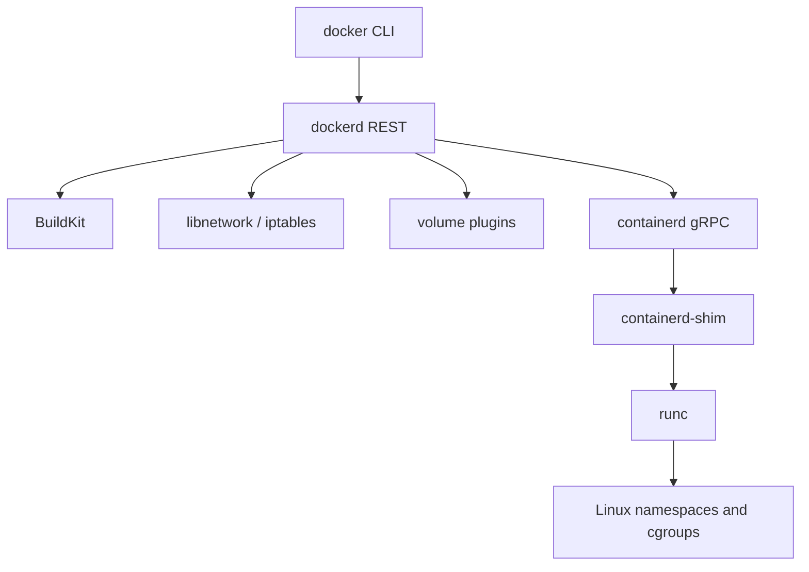

import { ConceptTemplate } from '@/features/kb/components/templates/ConceptTemplate'
import { Callout } from '@/features/kb/components/mdx/Callout'
import { ComparisonTable } from '@/features/kb/components/mdx/ComparisonTable'

export default function Layout({ children }) {
  return (
    <ConceptTemplate title="Docker Engine">
      {children}
    </ConceptTemplate>
  )
}

**Docker Engine** is the Linux server product that made containers a default developer skill. You type `docker run`. A daemon does the rest: pull, network, volumes, logs, and lifecycle. Under the hood the daemon is no longer a monolith — it is a stack with `dockerd` at the top and containerd plus runc at the bottom.

## 1. Deep Dive and Mechanics

**Client and daemon.** The CLI is a thin HTTP client. It talks to a Unix socket (`/var/run/docker.sock`) or a TCP endpoint. Anything that can write to that socket is root-equivalent on the host. That is why mounting the socket into a container is a privilege grant, not a convenience.

**dockerd responsibilities.** Image UX (tags, history), Docker-specific networks (bridge, overlay), named volumes, BuildKit dispatch, Swarm (if enabled), and the stable REST API that Compose and CI plugins already speak.

**containerd and runc.** Create/start/stop go to containerd. containerd calls runc to `clone` and `pivot_root`. Engine upgrades should not kill workloads because shims keep the parent pid.

**BuildKit.** `docker build` runs a BuildKit worker (in-process or `buildx` builder). Dockerfile instructions become LLB graphs with cache imports/exports. The Engine stores the resulting OCI image in containerd's namespace.

**Linux only.** On Mac and Windows, Docker Desktop runs Engine *inside* a Linux VM. Bind-mount performance and `host` networking behave like a VM, because they are.

<Callout icon="warning" title="The socket is root">
A job that mounts `/var/run/docker.sock` can start a privileged container and bind-mount the host `/`. Treat socket access like sudo.
</Callout>

## 2. Mathematical / Theoretical Foundation

**API as a trusted computing base.** The daemon's attack surface is every REST route plus the graph driver. Reducing who can connect (root-only socket, TLS mutual auth for TCP, no socket in CI) is access control on a single highly privileged process.

**Layer cache.** Each Dockerfile step hashes instruction text plus input file digests. Equality means reuse. A change at step k invalidates k and all successors — a prefix-stable chain.

<ComparisonTable
  headers={['Piece', 'Process', 'Privilege story']}
  rows={[
    ['docker CLI', 'User', 'Talks to socket'],
    ['dockerd', 'Root daemon', 'Networks, volumes, API'],
    ['containerd', 'Root daemon', 'Images and lifecycle'],
    ['runc', 'Short-lived', 'Kernel isolation setup'],
  ]}
/>

## 3. Real-World Implementation

```bash
docker info
docker run --rm -p 8080:80 nginx:1.27
# Remote daemon (TLS required in any real network)
export DOCKER_HOST=tcp://engine.internal:2376
export DOCKER_TLS_VERIFY=1
export DOCKER_CERT_PATH=$HOME/.docker/prod
docker ps
```

Install Engine from Docker's apt/yum repos on Linux servers. Do not confuse that package with Docker Desktop's VM.

## 4. Visualizations



## 5. Interview Prep

**Q: Docker Engine versus Docker Desktop?**
**A:** Engine is the Linux daemon and CLI. Desktop is a product that runs Engine in a VM and adds a GUI, Kubernetes option, and credential helpers for Mac/Windows.

**Q: Why is Kubernetes not using the Docker API anymore?**
**A:** kubelet needs CRI. Engine is a developer API on top of containerd. Talking to containerd directly drops a hop and a support matrix.

**Q: Is `docker build` the same as `dockerd` creating layers itself?**
**A:** Not anymore. BuildKit is the builder. Engine imports the resulting image into the local store.

## 6. Production Use Cases

- **Developer laptops** (often via Desktop) and **Linux CI runners** that still speak the Docker API.
- **Single-host production** with Compose or raw `docker run` and a systemd unit.
- **Legacy pipelines** that cannot yet move to Buildah or buildx-in-Kubernetes.

<Callout icon="tip" title="Prefer the Engine API over shelling docker">
SDKs talk the same REST as the CLI. In automation, the SDK handles timeouts and API versions; `docker` string soup does not.
</Callout>
