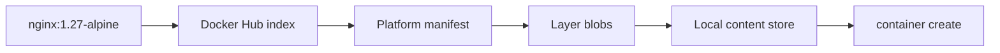

import { ConceptTemplate } from '@/features/kb/components/templates/ConceptTemplate'
import { Callout } from '@/features/kb/components/mdx/Callout'
import { ComparisonTable } from '@/features/kb/components/mdx/ComparisonTable'

export default function Layout({ children }) {
  return (
    <ConceptTemplate title="Docker Hub">
      {children}
    </ConceptTemplate>
  )
}

**Docker Hub** is the public registry the Docker CLI uses when you write `nginx` with no host prefix. The real name is `docker.io/library/nginx`. Hub stores manifests and layer blobs, serves official images, and hosts millions of community repositories. It is an artifact store plus a social namespace, not a build farm (Autobuild is optional and separate).

## 1. Deep Dive and Mechanics

**Name resolution.** `docker pull python:3.12` expands to `registry-1.docker.io` and the `library/python` repository. A user image `acme/api:1.2` is `docker.io/acme/api`. Any other registry needs an explicit host (`ghcr.io/...`, `public.ecr.aws/...`).

**Official images.** The `library/*` namespace is curated: Node, Temurin, Postgres, Alpine. They are still software — scan them — but they are the usual `FROM` line for a reason.

**Layers and mounts.** A pull fetches a manifest (or a multi-arch *index*), then only the blobs your snapshotter does not already have. Ten images based on the same Alpine share those blobs on disk.

**Rate limits and auth.** Anonymous pulls from Hub are throttled. Authenticated free accounts get a higher cap. CI that pulls `node` a thousand times a day will get 429s unless you cache or mirror.

**Content trust and provenance.** Optional signing (Notary / Docker Content Trust) and newer provenance attestations exist. Most teams still pin **digests** (`image@sha256:...`) rather than relying on Hub tags, which move.

<Callout icon="warning" title="latest is a moving pointer">
A tag is a mutable label on a manifest digest. `nginx:latest` on Monday is not `nginx:latest` on Friday. Production should pin digest or an immutable tag you control.
</Callout>

## 2. Mathematical / Theoretical Foundation

**Content addressing.** The only stable identifier is the manifest digest. Tags are a many-to-one map that Hub may rewrite on every push. Pull-by-digest is equality of hash; pull-by-tag is "whatever that name means now."

**Caching.** A pull-through cache (Harbor, registry mirror, BuildKit cache) stores blobs keyed by digest. Repeat pulls of the same digest cost only a manifest check.

<ComparisonTable
  headers={['Registry', 'Default for docker pull', 'Typical use']}
  rows={[
    ['Docker Hub', 'Yes', 'Public bases and OSS'],
    ['GHCR / GitLab / ECR', 'No', 'Private product images'],
    ['Harbor / Artifactory', 'No', 'Enterprise mirror plus scan'],
    ['localhost:5000', 'No', 'Air-gap and tests'],
  ]}
/>

## 3. Real-World Implementation

```bash
# See the expanded name and the digest you actually ran
docker pull nginx:1.27-alpine
docker image ls --digests nginx

# CI: log in to raise rate limits, then pin
echo "$HUB_TOKEN" | docker login -u "$HUB_USER" --password-stdin
docker pull nginx@sha256:aaaaaaaaaaaaaaaaaaaaaaaaaaaaaaaaaaaaaaaaaaaaaaaaaaaaaaaaaaaaaaaa
```

Do not put Hub passwords in the image. Use a pull secret or a node-level credential helper.

## 4. Visualizations



## 5. Interview Prep

**Q: What does `docker run nginx` actually pull?**
**A:** The official library image from Docker Hub, default tag `latest`, for your CPU architecture via the image index.

**Q: Why do CI jobs suddenly fail with toomanyrequests?**
**A:** Hub rate limits. Fix with login, a pull-through cache, or by mirroring base images to a private registry.

**Q: Official image means safe forever?**
**A:** No. It means a maintained Dockerfile and a known publisher. You still patch, scan, and pin digests.

## 6. Production Use Cases

- **Base images** (`FROM python:3.12-slim`) for almost every corporate Dockerfile.
- **Public distribution** of OSS images (`docker pull grafana/grafana`).
- **Something to mirror** — serious orgs copy Hub bases into ECR/ACR/Harbor so builds survive Hub outages and limits.

<Callout icon="tip" title="Mirror the bases you actually FROM">
A scheduled job that retags Alpine, distroless, and your language images into a private registry removes Hub from the critical path of every deploy.
</Callout>
