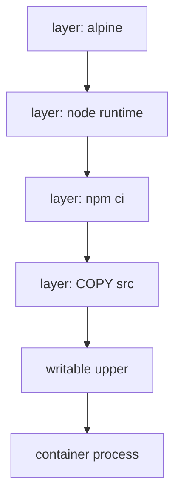

import { ConceptTemplate } from '@/features/kb/components/templates/ConceptTemplate'
import { Callout } from '@/features/kb/components/mdx/Callout'
import { ComparisonTable } from '@/features/kb/components/mdx/ComparisonTable'

export default function Layout({ children }) {
  return (
    <ConceptTemplate title="Docker Images and Layers">
      {children}
    </ConceptTemplate>
  )
}

A **Docker image** is a read-only recipe for a root filesystem plus runtime config (user, env, entrypoint). It is not a running process. A **container** is an instance: the image layers mounted read-only, a writable layer on top, and a process started in that mount. Think class versus object — except the "class" is a Merkle tree of tarballs.

## 1. Deep Dive and Mechanics

**Layers.** Each `RUN`, `COPY`, or `ADD` in a Dockerfile usually produces a layer: a tar diff against the parent. The snapshotter (overlayfs) stacks directories. A file in a higher layer hides the same path below. Deleting a file in a later `RUN` does not shrink lower layers; the bytes stay in the parent blob.

**Content addresses.** Every blob is SHA-256. The image config lists layer digests. The manifest points at the config and the layers. Retagging does not copy blobs; it adds a name to the same digest.

**Build cache.** The builder hashes the instruction and its inputs. If the hash matches a prior layer, that layer is reused. Cache invalidation **cascades**: a changed `COPY . .` rebuilds every later step. That is why you copy lockfiles and run `npm ci` *before* you copy application source.

**Writable layer.** Logs, `/tmp`, and bind-unmounted writes go to an ephemeral upper directory. `docker rm` deletes it. Data you care about must be a volume or a remote store.

**Multi-arch.** An *image index* lists per-platform manifests (amd64, arm64). The engine picks the one that matches the node.

<Callout icon="warning" title="Delete does not shrink a parent layer">
If one `RUN` downloads a 200 MB SDK and the next `RUN` deletes it, the image still contains those 200 MB. Combine download, build, and cleanup in one `RUN`, or use a multi-stage build.
</Callout>

## 2. Mathematical / Theoretical Foundation

**Merkle DAG.** Layer digest L_i = H(tar_i). Config digest C = H(config JSON including L_1..L_n). Manifest digest M = H(manifest including C and L_i descriptors). Equality of M means bit-identical image for that platform.

**Union mount complexity.** Lookup of a path walks layers from top to bottom until a file or a whiteout is found. Deep stacks add small constant factors; huge file counts hurt more than layer count.

<ComparisonTable
  headers={['Object', 'Mutable', 'Identity']}
  rows={[
    ['Layer blob', 'No', 'SHA-256 of tar'],
    ['Tag', 'Yes', 'Name on a digest'],
    ['Container upper', 'Yes', 'Dies with container'],
    ['Named volume', 'Yes', 'Independent lifecycle'],
  ]}
/>

## 3. Real-World Implementation

```dockerfile
FROM node:22-alpine
WORKDIR /app
COPY package.json package-lock.json ./
RUN npm ci --omit=dev
COPY src ./src
USER node
CMD ["node", "src/server.js"]
```

Lockfiles change rarely; `src` changes often. The `npm ci` layer stays cached across commits that only touch application code.

## 4. Visualizations



## 5. Interview Prep

**Q: Image versus container?**
**A:** Image is immutable layers plus config. Container is that stack plus a writable layer and one or more processes.

**Q: Why is my image still huge after I deleted files?**
**A:** Deletion is a whiteout in a new layer. Parent blobs still ship. Squash, multi-stage, or one `RUN` with cleanup.

**Q: Is a tag a version?**
**A:** Only by convention. The digest is the version. Tags move when someone pushes again.

## 6. Production Use Cases

- **CI artifacts**: build once, push digest, deploy the same digest everywhere.
- **Base-image reuse**: fifty services share one distroless or Alpine layer on each node.
- **Rollback**: point the Deployment at the previous digest; no rebuild required.

<Callout icon="tip" title="Copy the lockfile first">
The highest-leverage Dockerfile edit is still "dependencies before source." Everything else is polish.
</Callout>
