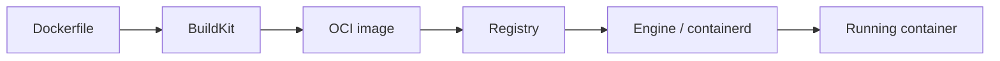

import { ConceptTemplate } from '@/features/kb/components/templates/ConceptTemplate'
import { Callout } from '@/features/kb/components/mdx/Callout'
import { ComparisonTable } from '@/features/kb/components/mdx/ComparisonTable'

export default function Layout({ children }) {
  return (
    <ConceptTemplate title="Docker">
      {children}
    </ConceptTemplate>
  )
}

**Docker** is the product name people use for three different things: a **CLI**, a **Linux engine**, and a **Desktop VM** that wraps the engine on Mac and Windows. In 2013 it wrapped cgroups and namespaces in `docker run` and `docker build`, added a layered image format, and put a public registry in front of it. The "works on my machine" problem became "ship the machine's userspace."

## 1. Deep Dive and Mechanics

**The bet.** Linux already had LXC. Docker made an *image* the unit of delivery: a reproducible rootfs plus metadata, cached in layers, pushed to a registry. The unit of execution is a container created from that image.

**The stack today.** CLI → `dockerd` → containerd → runc → kernel. Builds go through BuildKit. Images on disk are OCI. Hub is just the default registry hostname.

**OCI.** Fear of lock-in produced the Open Container Initiative. A "Docker image" is an OCI image. Podman, Buildah, nerdctl, and Kubernetes runtimes run the same bytes.

**Desktop versus Engine.** Engine is native on Linux. Desktop starts a Linux VM (Hyper-V, WSL2, HyperKit/Virtualization.framework) and runs Engine inside it. File shares and networking cross a VM boundary.

**What Docker is not.** It is not a cluster. Swarm exists but the industry's cluster is Kubernetes. Docker is the inner loop: build, run, push.

<Callout icon="info" title="Vocabulary split">
Say "Docker Engine" when you mean the daemon. Say "Docker Desktop" when you mean the Mac/Windows app. Say "OCI image" when the runtime might not be Docker at all.
</Callout>

## 2. Mathematical / Theoretical Foundation

**Reproducibility.** A pinned base digest plus a Dockerfile plus locked dependencies is a function from source to image digest. Unpinned `FROM image:latest` is not a function; it is a moving input.

**Isolation model.** Docker popularized process isolation, not hardware isolation. The security math is "shared kernel + dropped caps + seccomp," which is weaker than a hypervisor and cheaper to start.

<ComparisonTable
  headers={['Name', 'What it is', 'Where it runs']}
  rows={[
    ['Docker Engine', 'Linux daemon + API', 'Native Linux'],
    ['Docker Desktop', 'GUI + Linux VM + Engine', 'Mac and Windows'],
    ['Docker Hub', 'Public registry', 'docker.io'],
    ['OCI runtime', 'runc-class executor', 'Any compliant engine'],
  ]}
/>

## 3. Real-World Implementation

```bash
docker build -t registry.example.com/shop-api:1.4.2 .
docker push registry.example.com/shop-api:1.4.2
docker run --rm -p 8080:8080 registry.example.com/shop-api:1.4.2
```

That three-step loop — build, push, run — is the whole product thesis. Kubernetes later replaced the third step with a scheduler; it did not replace the image.

## 4. Visualizations



## 5. Interview Prep

**Q: Did Docker invent containers?**
**A:** No. FreeBSD jails, Solaris zones, and LXC came first. Docker invented a UX, a layered image, and a distribution story that reached developers.

**Q: Why did Kubernetes drop Docker as a runtime?**
**A:** It dropped the *Docker API shim*. It still runs OCI images, usually via containerd — the same runtime Docker already used.

**Q: Is Docker dead in production?**
**A:** The *image* and the *Dockerfile* are not. The *daemon on every node* often is; kubelet talks CRI instead.

## 6. Production Use Cases

- **Every team that ships a Dockerfile** — still the common build language.
- **Local inner loop** with Compose and Desktop.
- **Simple hosts** that run Engine under systemd without a cluster.

<Callout icon="tip" title="Pin what you ship">
The Docker skill that survives runtime churn is pinning digests and writing small images. The daemon brand on the node is replaceable.
</Callout>
