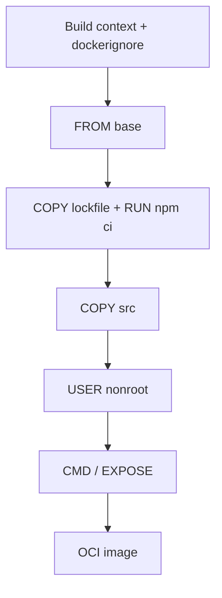

import { ConceptTemplate } from '@/features/kb/components/templates/ConceptTemplate'
import { Callout } from '@/features/kb/components/mdx/Callout'
import { ComparisonTable } from '@/features/kb/components/mdx/ComparisonTable'

export default function Layout({ children }) {
  return (
    <ConceptTemplate title="Dockerfile">
      {children}
    </ConceptTemplate>
  )
}

A **Dockerfile** is a text recipe. The builder starts from a base image, applies instructions in order, and records a new image. It is not a running container and it is not a shell script — though many instructions *invoke* a shell during the build.

## 1. Deep Dive and Mechanics

**FROM.** First instruction (except comments and syntax/parser directives). It chooses the parent layers. Prefer a pinned tag or digest and a slim or distroless variant.

**RUN versus CMD versus ENTRYPOINT.** `RUN` happens at *build* time and creates a layer. `CMD` is the default *start* argument. `ENTRYPOINT` is the stable executable; CLI args append to it. `docker run image bash` replaces `CMD` but not a locked `ENTRYPOINT` unless you override it.

**COPY versus ADD.** `COPY` copies local files. `ADD` can unpack archives and fetch URLs — surprising, so most style guides forbid `ADD` except for local tars you truly want unpacked.

**WORKDIR, USER, ENV, EXPOSE.** Directory, dropped privileges, environment, and *documentation* of a port. `EXPOSE` does not publish; `-p` does.

**Cache.** Each instruction is a cache key. Put the rarely changing steps first. Combine `RUN` lines when you would otherwise leave junk in an intermediate layer.

**.dockerignore.** The build context is a tarball sent to the daemon. Ignore `node_modules`, `.git`, and secrets or you leak them into the context (and sometimes into layers).

<Callout icon="tip" title="CMD versus ENTRYPOINT">
`CMD` is a default you expect developers to override. `ENTRYPOINT` is the binary you want always (plus a wrapper that execs). Many images use ENTRYPOINT for the app and CMD for default flags.
</Callout>

## 2. Mathematical / Theoretical Foundation

**Prefix cache.** Instructions I_1..I_n produce layers L_1..L_n. If I_1..I_k are unchanged and inputs match, L_1..L_k reuse. I_k+1 changing forces L_k+1..L_n to rebuild. Optimal order maximizes the expected unchanged prefix given your commit traffic.

**Least privilege.** The final `USER` is the uid of the running process. Remaining root in production expands the blast radius of an RCE.

<ComparisonTable
  headers={['Instruction', 'When it runs', 'Creates a layer?']}
  rows={[
    ['FROM', 'Build', 'Parent layers'],
    ['RUN', 'Build', 'Yes'],
    ['COPY / ADD', 'Build', 'Yes'],
    ['ENV / USER / WORKDIR', 'Build metadata', 'Usually yes, tiny'],
    ['CMD / ENTRYPOINT', 'Recorded for start', 'Config, not a fs diff'],
    ['EXPOSE', 'Documentation', 'Config only'],
  ]}
/>

## 3. Real-World Implementation

```dockerfile
# syntax=docker/dockerfile:1
FROM node:22-alpine
WORKDIR /usr/src/app
COPY package.json package-lock.json ./
RUN npm ci --omit=dev
COPY src ./src
USER node
EXPOSE 3000
CMD ["node", "src/server.js"]
```

Exec-form `CMD` (JSON array) skips a shell. That avoids signal-wrapping problems: SIGTERM reaches Node, not `sh`.

## 4. Visualizations



## 5. Interview Prep

**Q: Does EXPOSE publish a port?**
**A:** No. It is metadata for humans and for `-P` (publish all exposed). You still map ports at run time.

**Q: Why exec form for CMD?**
**A:** PID 1 should be your app so Kubernetes probes and `docker stop` deliver signals correctly. A shell as PID 1 often ignores SIGTERM.

**Q: How do you pass a secret into a build without baking it into a layer?**
**A:** BuildKit secret mounts (`RUN --mount=type=secret`) or multi-stage so the secret never lands in the final image. Never `ENV PASSWORD=...` in the Dockerfile.

## 6. Production Use Cases

- **Application images** for every language runtime.
- **Reproducible CI** — the same file on every agent.
- **Policy** — linters (Hadolint) and base-image gates run against this file in review.

<Callout icon="warning" title="The context is data">
If `.dockerignore` forgets `.env` or a private key, `docker build` uploads it. Assume reviewers can see the context list.
</Callout>
