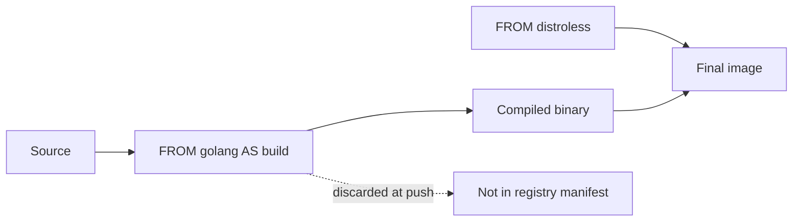

import { ConceptTemplate } from '@/features/kb/components/templates/ConceptTemplate'
import { Callout } from '@/features/kb/components/mdx/Callout'
import { ComparisonTable } from '@/features/kb/components/mdx/ComparisonTable'

export default function Layout({ children }) {
  return (
    <ConceptTemplate title="Multi-stage Builds">
      {children}
    </ConceptTemplate>
  )
}

A **multi-stage build** is a Dockerfile with more than one `FROM`. Early stages have compilers, headers, and test tools. The last stage starts from a small base and `COPY --from=...` only the bits you will run. The builder discards the compiler stages from the *pushed* image. You still need them during the build.

## 1. Deep Dive and Mechanics

**Named stages.** `FROM golang:1.23 AS build` labels a world. Later, `COPY --from=build /out/app /app` pulls a path from that world's final filesystem. You can also `COPY --from=0` by index, but names review better.

**Why it exists.** A Go or Rust toolchain image is hundreds of megabytes. The static binary is a few. Shipping `go` and `git` to production is waste and attack surface (shells, package managers, extra CVEs).

**Frontend builds.** Stage one: `node` image, `npm ci`, `npm run build`. Stage two: `nginx` or distroless, copy `dist/`. The Node toolchain never reaches prod.

**Cache.** Each stage has its own cache chain. Changing the final `COPY --from` only rebuilds the final stage if the source path's content changed. You can build a single target stage in CI (`docker build --target build`) to run tests without producing the runtime image.

**Not magic.** Secrets used in the build stage can still leak if you copy too much (`COPY --from=build / /` is a classic own-goal). Copy explicit paths.

<Callout icon="info" title="The final FROM is the image you ship">
Scanners and CVE counts apply to the last stage. A clean runtime stage is the point. Do not `FROM build` again at the end unless you like shipping gcc.
</Callout>

## 2. Mathematical / Theoretical Foundation

**Artifact extraction.** Let S_build be the filesystem after the compiler stage and A a chosen path set. The shipped image is Base_runtime ∪ A. Image size is roughly |Base_runtime| + |A|, not |S_build|. Attack surface tracks package count in the final rootfs, not the builder.

**Graph.** Stages form a DAG via `--from`. BuildKit can skip stages that are not ancestors of the requested target.

<ComparisonTable
  headers={['Approach', 'Final image contains', 'Typical size']}
  rows={[
    ['Single-stage Go', 'Toolchain plus binary', 'Hundreds of MB'],
    ['Multi-stage Go', 'Binary plus tiny libc or scratch', 'Tens of MB or less'],
    ['Single-stage Node', 'node_modules plus npm', 'Large'],
    ['Multi-stage SPA', 'Static files plus nginx', 'Small'],
  ]}
/>

## 3. Real-World Implementation

```dockerfile
# syntax=docker/dockerfile:1
FROM golang:1.23-bookworm AS build
WORKDIR /src
COPY go.mod go.sum ./
RUN go mod download
COPY . .
RUN CGO_ENABLED=0 go build -o /out/app ./cmd/app

FROM gcr.io/distroless/static-debian12
COPY --from=build /out/app /app
USER nonroot:nonroot
ENTRYPOINT ["/app"]
```

`CGO_ENABLED=0` plus distroless/static yields a single binary on a near-empty rootfs — no shell to `kubectl exec` into, which is a feature.

## 4. Visualizations



## 5. Interview Prep

**Q: Do intermediate stages still get pushed?**
**A:** Not as part of the final manifest. They may linger in the local build cache. The registry object for your tag is the last stage only.

**Q: When would you not use multi-stage?**
**A:** Interpreted apps that *must* ship the interpreter and site-packages (some Python services). You still might use a builder stage for wheels, then copy into a slim runtime.

**Q: How do you run tests?**
**A:** A `FROM build AS test` stage that `RUN go test`, invoked with `--target test` in CI. Failures fail the build; the runtime image is never tagged.

## 6. Production Use Cases

- **Go, Rust, C** binaries in scratch or distroless.
- **Frontend** static assets on nginx or a CDN upload stage.
- **Java** — build with JDK, run with JRE or a jlink runtime.

<Callout icon="tip" title="Copy files, not the world">
Name every `COPY --from` source path. A lazy copy of `/` re-imports the toolchain you just escaped.
</Callout>
