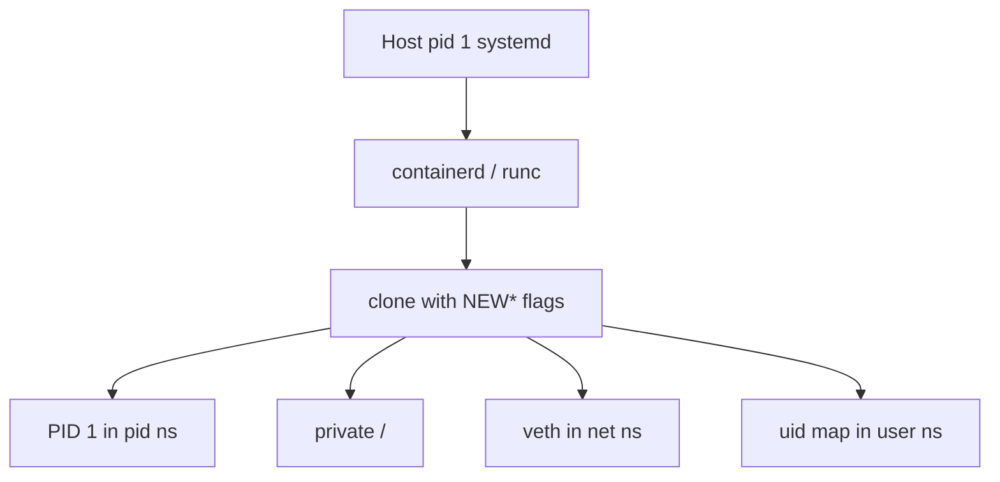

import { ConceptTemplate } from '@/features/kb/components/templates/ConceptTemplate'
import { Callout } from '@/features/kb/components/mdx/Callout'
import { ComparisonTable } from '@/features/kb/components/mdx/ComparisonTable'

export default function Layout({ children }) {
  return (
    <ConceptTemplate title="Linux Namespaces">
      {children}
    </ConceptTemplate>
  )
}

**Namespaces** change what a process can *see*. cgroups change what it can *use*. Together they are a container. After `clone` or `unshare` with the right flags, `ps` shows only your tree, `/` is a different mount tree, and `eth0` is a veth — even though one kernel is scheduling everyone.

## 1. Deep Dive and Mechanics

**PID.** The container's init is PID 1 *inside* the namespace. Host `ps` still shows a normal pid. Killing PID 1 in the namespace takes the container down (and zombies need a competent init).

**Mount.** A private mount tree plus `pivot_root` into the image. Host disks are invisible unless bind-mounted. Propagation flags (private, shared, slave) decide whether host remounts leak in.

**Network.** Own interfaces, routes, iptables. This is why `localhost` in a container is not the host.

**UTS.** Hostname and NIS domain. Kubernetes sets the hostname to the pod name.

**IPC.** System V shared memory and POSIX queues. Pods share IPC when you ask; otherwise two containers cannot shmem each other.

**User.** Maps a range of container uids to unprivileged host uids. Container-root becomes something like host uid 100000. This is the backbone of rootless Podman and Buildah.

**cgroup namespace.** Hides the rest of the cgroup tree so the process cannot easily walk siblings' accounting files.

<Callout icon="warning" title="User namespace is the hard one">
Without user namespaces, container-root is host-root if it can escape to a host mount. Rootless stacks exist because uid 0 inside a mapped namespace is not uid 0 on the host.
</Callout>

## 2. Mathematical / Theoretical Foundation

**Identifier translation.** A pid namespace is a bijection between a local pid and a host pid. Nesting composes maps. Tools like `nsenter` invert the map from the host side.

**Capability + uid.** Effective privilege is the tuple (host uid, capabilities, LSM label, seccomp). Namespaces alone do not drop capabilities; runtimes do that in the spec.

<ComparisonTable
  headers={['Namespace', 'Hides', 'Container effect']}
  rows={[
    ['pid', 'Other processes', 'Own PID 1'],
    ['mnt', 'Host mounts', 'Own rootfs'],
    ['net', 'Host interfaces', 'Own IP and localhost'],
    ['uts', 'Hostname', 'Pod name as hostname'],
    ['ipc', 'Host IPC objects', 'Private shmem'],
    ['user', 'Host uids', 'Rootless mapping'],
    ['cgroup', 'Sibling cgroups', 'Limited /sys/fs/cgroup view'],
  ]}
/>

## 3. Real-World Implementation

```bash
# See which namespaces a container's pid uses
pid=$(docker inspect api | jq .State.Pid)
ls -l /proc/$pid/ns
# Enter the network namespace and watch interfaces
nsenter --target "$pid" --net ip addr
```

runc's `config.json` lists the namespace set. Kubernetes adds a shared net/ipc/uts namespace across containers in a pod (the sandbox), and a private pid/mnt per container by default.

## 4. Visualizations



## 5. Interview Prep

**Q: Namespaces versus cgroups?**
**A:** Namespaces isolate identity and visibility. cgroups isolate resource amounts. You need both.

**Q: Why is the first process in a container PID 1?**
**A:** It is PID 1 *in that pid namespace*. It must reap children. A shell that does not handle signals is a bad PID 1.

**Q: What does a pod share?**
**A:** Network, IPC, and UTS namespaces (and volumes). PID and mount are usually per container, which is why a sidecar can share `localhost` with the app.

## 6. Production Use Cases

- **Every OCI container** — runc always sets a namespace set.
- **Rootless developer tools** — user namespaces for Podman/Buildah.
- **Kubernetes pods** — shared netns is the sidecar pattern.

<Callout icon="tip" title="Debug with nsenter">
When "it works on the host but not in the container," enter the net or mnt namespace before you blame DNS. The view is the bug.
</Callout>
