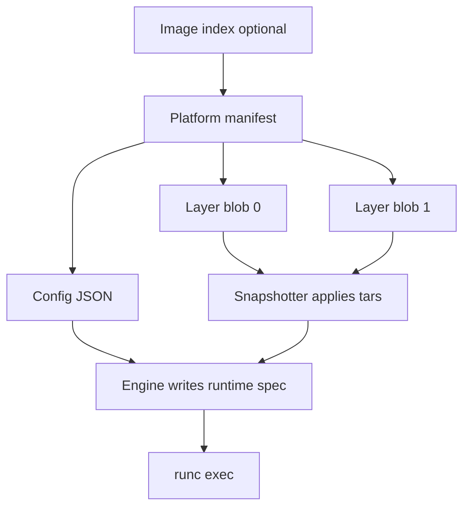

import { ConceptTemplate } from '@/features/kb/components/templates/ConceptTemplate'
import { Callout } from '@/features/kb/components/mdx/Callout'
import { ComparisonTable } from '@/features/kb/components/mdx/ComparisonTable'

export default function Layout({ children }) {
  return (
    <ConceptTemplate title="OCI Image Spec">
      {children}
    </ConceptTemplate>
  )
}

The **Open Container Initiative image spec** defines what "a container image" is on disk and in a registry. Docker donated its format so runtimes could interoperate. Buildah can build, Harbor can store, containerd can unpack, CRI-O can run — same bytes. There is a sibling **runtime spec** (the `config.json` runc consumes) and a **distribution spec** (HTTP pull/push).

## 1. Deep Dive and Mechanics

**Manifest.** A JSON document listing the config descriptor and an ordered list of layer descriptors. Each descriptor is a media type, a digest, and a size. The manifest itself has a digest; that is what you pin.

**Index (fat manifest).** Optional. Lists platform-specific manifests (os, architecture, variant). Clients pick one. `docker pull` on Apple Silicon prefers arm64.

**Config.** JSON: environment, working directory, user, entrypoint, cmd, volumes, labels, and the **rootfs.diff_ids** (uncompressed layer hashes). The runtime spec is derived from this plus user overrides (`docker run -e`).

**Layers.** Usually gzipped tarballs. Each is a diff. Whiteout files mark deletions. The snapshotter applies them in order to produce a rootfs.

**Media types.** `application/vnd.oci.image.manifest.v1+json` and friends. Docker schema 2 still appears in the wild; engines accept both and often rewrite to OCI on pull.

<Callout icon="info" title="Image spec versus runtime spec">
The image is inert. runc does not read the image spec; the engine unpacks layers and writes a runtime spec, then execs runc. Confusing the two documents is a common interview miss.
</Callout>

## 2. Mathematical / Theoretical Foundation

**Content addressing.** Identity is H(bytes). A registry is a map from digest to blob plus a mutable tag map. Two registries that store the same digest store the same object. Promotions should copy by digest, not by retagging `latest`.

**Merkle structure.** Change one file → new layer digest → new config (diff_ids changed) → new manifest digest. That cascade is why "I only changed a label" still produces a new image id if the config JSON changed.

<ComparisonTable
  headers={['Spec', 'Defines', 'Consumer']}
  rows={[
    ['Image spec', 'Manifest, config, layers', 'Builders and registries'],
    ['Distribution spec', 'HTTP pull/push, auth', 'Registries and clients'],
    ['Runtime spec', 'Namespaces, mounts, process', 'runc / crun'],
  ]}
/>

## 3. Real-World Implementation

```bash
# Peek at what you actually pulled (manifest digest)
skopeo inspect --raw docker://ghcr.io/example/app:1.4 | head
crane manifest ghcr.io/example/app:1.4
# Copy by digest between registries without Docker
skopeo copy \
  docker://docker.io/library/alpine@sha256:aaaaaaaaaaaaaaaaaaaaaaaaaaaaaaaaaaaaaaaaaaaaaaaaaaaaaaaaaaaaaaaa \
  docker://registry.internal/mirrors/alpine:3.20
```

`skopeo` and `crane` speak the distribution spec. They are the right tools when you do not want a daemon.

## 4. Visualizations



## 5. Interview Prep

**Q: Is a Docker image different from an OCI image?**
**A:** Historically yes; today the on-wire object is OCI (or a compatible Docker schema 2). Treat them as the same artifact class.

**Q: What should Kubernetes deploy, a tag or a digest?**
**A:** A digest. Tags move. The kubelet pulls whatever the tag means at pull time unless you pin.

**Q: Why an index and a manifest?**
**A:** Index = menu of platforms. Manifest = one platform's config plus layers. A single-arch image can skip the index.

## 6. Production Use Cases

- **Multi-arch releases** (amd64 + arm64) from one tag via an index.
- **Air-gap copies** with skopeo/crane between disconnected registries.
- **Policy** — admission controllers verify digest and signature (Cosign) against the spec's identity model.

<Callout icon="tip" title="Read the manifest once">
`crane manifest` on a mystery tag ends more incidents than another `docker pull`. You see the digest, the platform, and the layer count immediately.
</Callout>
