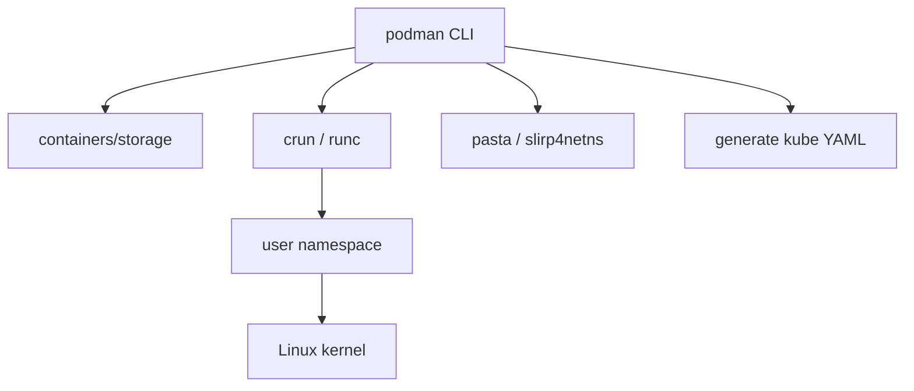

import { ConceptTemplate } from '@/features/kb/components/templates/ConceptTemplate'
import { Callout } from '@/features/kb/components/mdx/Callout'
import { ComparisonTable } from '@/features/kb/components/mdx/ComparisonTable'

export default function Layout({ children }) {
  return (
    <ConceptTemplate title="Podman">
      {children}
    </ConceptTemplate>
  )
}

**Podman** is a container engine without a privileged background daemon. `podman run` is a process that talks to the kernel (via runc/crun) and to containers/storage. The CLI aims to accept the same flags as Docker. The security story is **rootless**: your containers run as you.

## 1. Deep Dive and Mechanics

**No dockerd.** There is no all-powerful socket. Fork/exec creates the container. A local REST API can be started on demand (`podman system service`) for Compose compatibility, but it is not required and it does not have to be root.

**Rootless.** User namespaces map container uid 0 to your subordinate uid range (`/etc/subuid`). slirp4netns or pasta provides outbound networking without CAP_NET_ADMIN. fuse-overlayfs or kernel overlay with idmap provides the union fs.

**Pods.** A Podman pod is a shared network/uts/ipc group — the same idea as a Kubernetes pod. `podman generate kube` emits YAML you can apply to a cluster. `podman play kube` does the reverse for local tests.

**systemd.** `podman generate systemd` (and Quadlet `.container` units) make a container a first-class service on a Linux host — closer to how Fedora/RHEL want you to run things than a forever-on daemon.

**Build.** `podman build` is Buildah. Same store, same image.

<Callout icon="info" title="alias docker=podman">
It works for a surprising fraction of scripts. It fails where software assumes a root daemon, the default bridge IP, or Docker-specific Swarm APIs. Test, do not wish.
</Callout>

## 2. Mathematical / Theoretical Foundation

**Privilege reduction.** Docker's socket is equivalent to root. Podman rootless bounds compromise by the user namespace map: breakout still lands in an unprivileged host uid (plus whatever that user can write). Residual risk is the kernel and the uid map setup.

**Fork/exec versus client-server.** Lifecycle is a process tree, not a reconnectable daemon. systemd reaping replaces shim-after-daemon-restart semantics.

<ComparisonTable
  headers={['Concern', 'Docker Engine', 'Podman']}
  rows={[
    ['Daemon', 'dockerd as root', 'None required'],
    ['Rootless', 'Possible, secondary', 'Default story'],
    ['Pods', 'Compose groups', 'Native pod object'],
    ['Kubernetes YAML', 'Indirect', 'generate / play kube'],
    ['Build', 'BuildKit', 'Buildah'],
  ]}
/>

## 3. Real-World Implementation

```bash
podman pull alpine:3.20
podman run --rm -it alpine:3.20 uname -a
podman pod create --name web -p 8080:8080
podman run -d --pod web --name api myorg/api:1.4
podman generate kube web > web-pod.yaml
```

On RHEL, enable lingering so user services survive logout: `loginctl enable-linger $USER`.

## 4. Visualizations



## 5. Interview Prep

**Q: Why is daemonless considered safer?**
**A:** No always-on root process and no world-root socket. A compromised build or container is not automatically host root if you stayed rootless.

**Q: Can Kubernetes use Podman as the node runtime?**
**A:** Not as the CRI. Nodes use CRI-O or containerd. Podman is the laptop/server CLI that speaks the same image format and can emulate pods.

**Q: How do you replace Docker Compose?**
**A:** `podman compose` (Compose spec) or `podman play kube` if you already live in Kubernetes YAML.

## 6. Production Use Cases

- **RHEL / Fedora hosts** running Quadlet units instead of Docker.
- **Developer laptops** in organizations that ban Docker Desktop licensing or root daemons.
- **CI** alongside Buildah on unprivileged runners.

<Callout icon="tip" title="Check subuid">
Rootless fails in mysterious ways when `/etc/subuid` and `/etc/subgid` lack a range for the user. That file is the first thing to open.
</Callout>
