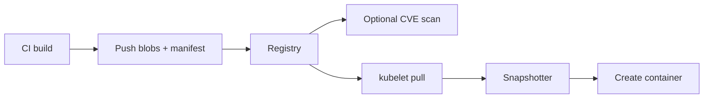

import { ConceptTemplate } from '@/features/kb/components/templates/ConceptTemplate'
import { Callout } from '@/features/kb/components/mdx/Callout'
import { ComparisonTable } from '@/features/kb/components/mdx/ComparisonTable'

export default function Layout({ children }) {
  return (
    <ConceptTemplate title="Container Registries">
      {children}
    </ConceptTemplate>
  )
}

A **container registry** hosts OCI images. CI pushes a manifest and blobs. Nodes pull them. The protocol is the OCI **distribution spec**: authenticated HTTP, content-addressed blobs, and a tag namespace. Docker Hub is one implementation. ECR, ACR, GCR/Artifact Registry, GHCR, Harbor, and a local `registry:2` are others.

## 1. Deep Dive and Mechanics

**Push.** The client uploads missing blobs (by digest), then uploads the config, then the manifest, then moves a tag pointer. If the blob already exists, the registry returns a mount or an exists response and you skip the bytes.

**Pull.** Resolve tag → manifest digest → config + layer descriptors → download missing blobs. Snapshotters may lazy-pull (stargz) so cold start does not wait for every layer.

**Auth.** Bearer tokens (Hub, GHCR) or cloud IAM (ECR password is a short-lived token from `get-login-password`). Kubernetes uses an `imagePullSecret` or a node/instance role.

**Private versus public.** Enterprises keep product images private and *mirror* public bases so builds do not depend on Hub rate limits or outages.

**Scanning and signing.** Registries often unzip layers and match packages to CVE feeds. Admission can require a Cosign signature and a clean scan before the digest is allowed on a cluster.

<Callout icon="warning" title="Tags are not access control">
A private repo with a predictable tag is still one leaked credential away from a pull. Prefer short-lived cloud identity and deny anonymous.
</Callout>

## 2. Mathematical / Theoretical Foundation

**Content-addressed store plus mutable names.** Blobs are immutable. Tags are a mutable index. Garbage collection deletes blobs not referenced by any manifest, subject to locks and last-pull time. Misconfigured GC is how people delete layers still needed by an untagged digest.

**Bandwidth.** Pull cost is roughly the sum of unique blob sizes not already on the node. Shared bases make the marginal cost of the Nth service small.

<ComparisonTable
  headers={['Product', 'Where it lives', 'Hook']}
  rows={[
    ['Docker Hub', 'Public SaaS', 'Default docker pull'],
    ['ECR / ACR / Artifact Registry', 'Cloud account', 'IAM to kube nodes'],
    ['Harbor / Artifactory', 'Self-hosted', 'Mirror, scan, replicate'],
    ['GHCR / GitLab', 'Next to git', 'CI OIDC publish'],
  ]}
/>

## 3. Real-World Implementation

```yaml
# Kubernetes pull from a private registry
apiVersion: v1
kind: Pod
metadata:
  name: api
spec:
  imagePullSecrets:
    - name: ecr-pull
  containers:
    - name: api
      image: 123456789012.dkr.ecr.us-east-1.amazonaws.com/shop-api@sha256:aaaaaaaaaaaaaaaaaaaaaaaaaaaaaaaaaaaaaaaaaaaaaaaaaaaaaaaaaaaaaaaa
```

On EKS, the better pattern is the node role plus the ECR credential provider so you do not rotate pull secrets.

## 4. Visualizations



## 5. Interview Prep

**Q: What does a registry store?**
**A:** Blobs (layers, config) keyed by digest, manifests, and a tag-to-digest map. It is not a git repo and not a VM image store.

**Q: Why pin digests in production?**
**A:** Tags move. A digest pull is bit-identical everywhere and is what scanners attested.

**Q: Hub versus ECR?**
**A:** Hub is public default and rate-limited. ECR is private, in-VPC pull, IAM-native. Most companies use both: Hub (or a mirror) for bases, ECR for their apps.

## 6. Production Use Cases

- **Every CD pipeline** that promotes an image through staging to prod.
- **Pull-through caches** at the edge so a hundred nodes do not hammer Hub.
- **Air-gapped** plants that replicate a Harbor to a factory floor.

<Callout icon="tip" title="Promote the digest">
Do not rebuild per environment. Push once, scan once, retag the same digest as `staging` and `prod`. Configuration belongs in ConfigMaps, not in a new image.
</Callout>
