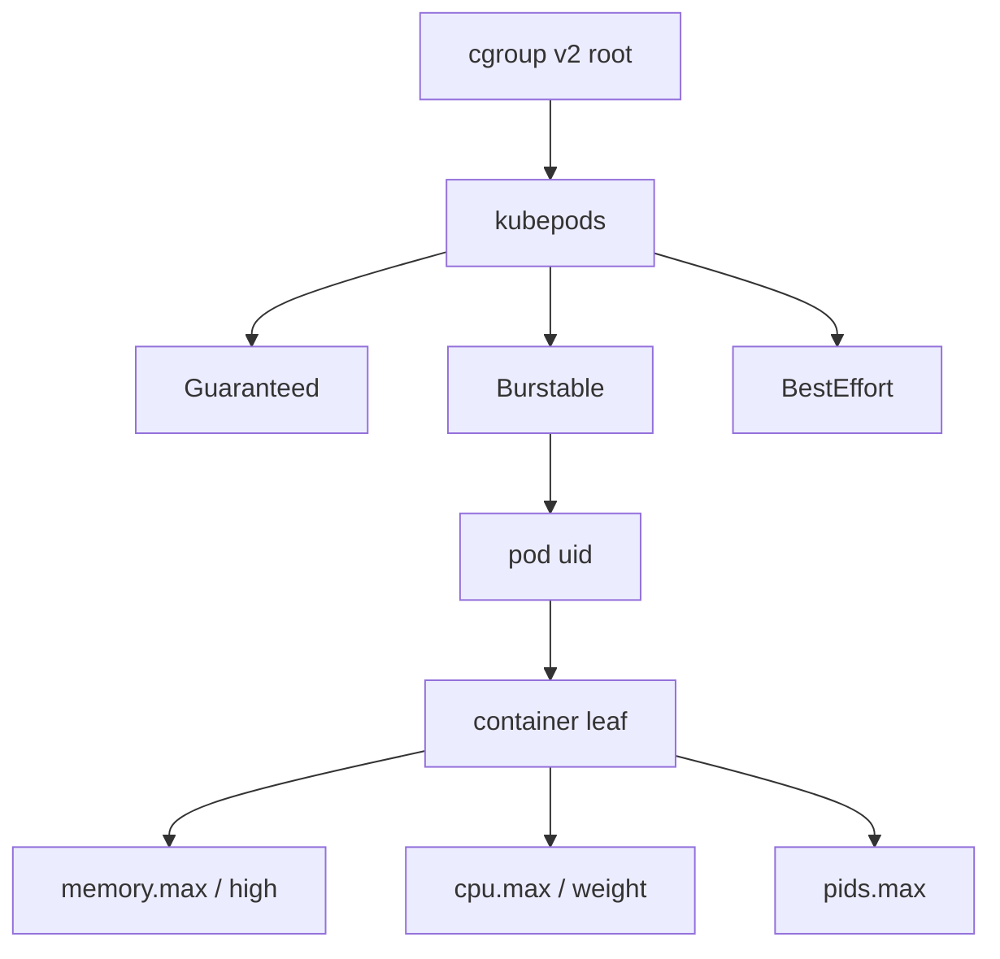

import { ConceptTemplate } from '@/features/kb/components/templates/ConceptTemplate'
import { Callout } from '@/features/kb/components/mdx/Callout'
import { ComparisonTable } from '@/features/kb/components/mdx/ComparisonTable'

export default function Layout({ children }) {
  return (
    <ConceptTemplate title="Control Groups (cgroups)">
      {children}
    </ConceptTemplate>
  )
}

**cgroups** are the kernel's resource accountants. Namespaces hide what a container can *see*. cgroups limit what it can *consume*. Without them, a leaky JVM on a shared node would eat RAM until the host OOM-killer picks a victim at random — often someone else's database.

## 1. Deep Dive and Mechanics

**Hierarchy.** Processes are placed in a tree of groups. Each controller (cpu, memory, io, pids, cpuset, hugetlb) attaches numbers to a group: how much it may use, and how much it has used. A fork inherits the parent's group. Container runtimes create a group per container (and often a parent group per pod) before `exec`.

**v1 versus v2.** v1 mounts each controller as its own hierarchy. A process can sit in different groups per controller — messy, and some combinations are illegal. **cgroup v2** is a single unified tree. Controllers are enabled per subtree. Kubernetes 1.25+ and modern systemd expect v2.

**Memory.** `memory.max` is a hard cap. Crossing it triggers reclaim, then the memcg OOM killer — only that cgroup dies. `memory.high` is a throttle that starts reclaim earlier so you get latency instead of a sudden kill. `memory.min` / `memory.low` protect working set under node pressure.

**CPU.** `cpu.max` is quota over a period (for example 50000 100000 means half a core). `cpu.weight` is relative shares when the node is saturated. Idle containers with high weight still cannot exceed quota.

**PIDs and I/O.** `pids.max` stops fork bombs. `io.max` and `io.weight` stop a noisy neighbor from saturating a disk.

<Callout icon="warning" title="Limits without requests still surprise you">
A container with no memory max can still be killed when the *node* is under pressure. Kubernetes Quality of Service (Guaranteed, Burstable, BestEffort) is just how requests and limits map onto these controllers.
</Callout>

## 2. Mathematical / Theoretical Foundation

**Work-conserving shares.** Let weight of group i be w_i. On a contended CPU, group i gets w_i / sum(w) of cycles, subject to quota. This is weighted fair queuing, not hard reservation.

**Admission.** Cluster autoscalers treat `requests` as reserved demand. Sum of requests on a node should stay at or below allocatable. Limits may exceed allocatable (overcommit). The risk is correlated bursts: many groups hitting `memory.max` at once still exhaust the node.

**OOM choice.** The memcg killer ranks by `oom_score` inside the group. Host OOM ranks across groups. Isolating the kill domain is the whole point of per-container memory controllers.

<ComparisonTable
  headers={['Knob', 'cgroup v2 file', 'Failure mode if ignored']}
  rows={[
    ['Hard memory cap', 'memory.max', 'Host-wide OOM, random victims'],
    ['CPU quota', 'cpu.max', 'Noisy neighbor steals cores'],
    ['PID cap', 'pids.max', 'Fork bomb exhausts kernel'],
    ['I/O max', 'io.max', 'Disk latency for every pod'],
  ]}
/>

## 3. Real-World Implementation

```bash
# Inspect a container's v2 group (systemd + containerd style)
CG=/sys/fs/cgroup/system.slice/containerd.service
# After you find the leaf (kubepods / cri-containerd-*.scope):
cat memory.current memory.peak memory.max
cat cpu.stat
cat pids.current pids.max
```

Kubernetes writes the same files via the CRI. A Pod spec with `resources.limits.memory: 512Mi` becomes `memory.max = 536870912` on that leaf cgroup.

## 4. Visualizations



## 5. Interview Prep

**Q: What happens when a container exceeds its memory limit?**
**A:** The kernel's memcg OOM killer terminates a process in *that* cgroup. Other pods keep running. The kubelet records an OOMKilled reason and the restart policy takes over.

**Q: Difference between CPU request and CPU limit?**
**A:** Request becomes weight (how you share idle and contended CPU). Limit becomes quota (hard ceiling even if the node is idle).

**Q: Why did Kubernetes push cgroup v2?**
**A:** One hierarchy, safer delegation to user namespaces, and features like `memory.high` that v1 could not express cleanly. Also systemd and runc standardized on v2.

## 6. Production Use Cases

- **Multi-tenant nodes** in Kubernetes, batch farms, and CI runners.
- **Database sidecars** capped so a backup job cannot evict the primary.
- **Node-pressure experiments** — raise `memory.high` to watch reclaim before you set a hard max in production.

<Callout icon="tip" title="Always set a PID limit">
Most teams remember memory and forget pids. A stuck connection pool that forks per request will take the node down without touching `memory.max`.
</Callout>
