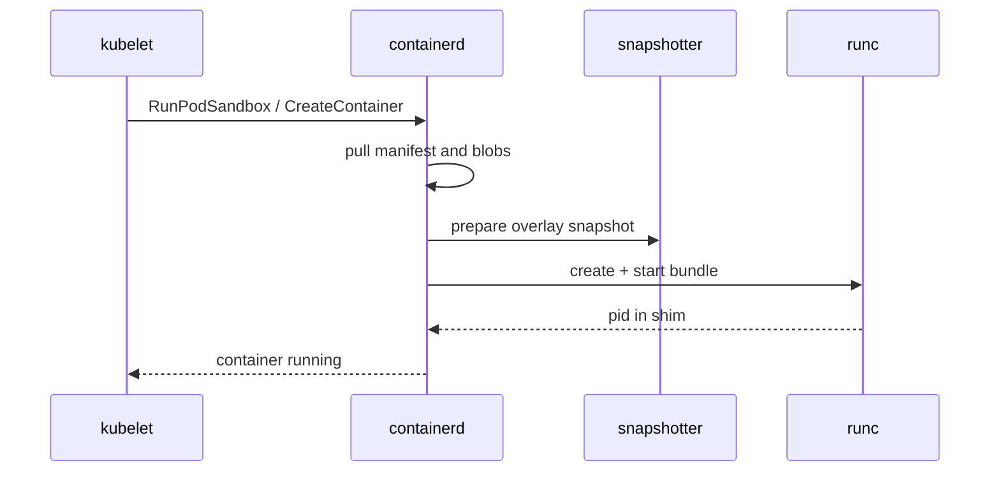

import { ConceptTemplate } from '@/features/kb/components/templates/ConceptTemplate'
import { Callout } from '@/features/kb/components/mdx/Callout'
import { ComparisonTable } from '@/features/kb/components/mdx/ComparisonTable'

export default function Layout({ children }) {
  return (
    <ConceptTemplate title="containerd">
      {children}
    </ConceptTemplate>
  )
}

**containerd** is the industry-standard *high-level* runtime. It does not parse Dockerfiles and it is not a developer CLI. It pulls images, unpacks layers into snapshots, creates a bundle, and asks a low-level OCI runtime (usually `runc`) to start the process. Docker Engine and the Kubernetes kubelet both speak to it.

## 1. Deep Dive and Mechanics

**Split from Docker.** Docker donated containerd to the CNCF so image run could be reused. `dockerd` still handles UX, BuildKit, Swarm, and Docker networks. The actual create/start/stop path is containerd over gRPC on a local socket.

**CRI plugin.** Kubernetes talks the Container Runtime Interface. containerd's CRI plugin maps Pods to a *pause* (sandbox) container plus app containers that share that sandbox's network namespace. kubelet never needs Docker.

**Shims.** Each container gets a `containerd-shim` that outlives a containerd restart. The shim holds the parent of `runc`, so `dockerd` or kubelet bouncing does not SIGKILL every workload.

**Snapshotters.** overlayfs is the default: each layer is a directory; a container mount is an overlay of those directories plus a writable upper. Alternatives include stargz (lazy pull), erofs, and block-device snapshotters for Kata or confidential VMs.

**Content store.** Blobs live in a content-addressed store keyed by digest. A garbage collector deletes unreferenced blobs after image delete.

<Callout icon="info" title="ctr versus crictl versus nerdctl">
`ctr` is a debug client for containerd. `crictl` speaks CRI (what kubelet sees). `nerdctl` aims at Docker-like UX on raw containerd. Use the one that matches the API you are debugging.
</Callout>

## 2. Mathematical / Theoretical Foundation

**Lease and GC.** Images, snapshots, and content have reference counts. A snapshot is live if a container or a child snapshot points at it. GC is mark-and-sweep on that DAG. A stuck lease (a failed pull) can pin gigabytes until you delete it.

**Sandbox model.** A pod is one network namespace, one IPC/UTS pair, N app processes. The pause container holds the namespaces open so app containers can join via `setns`. That is why "a pod is not a container" is mechanically true.

<ComparisonTable
  headers={['Layer', 'Example', 'Job']}
  rows={[
    ['Orchestrator', 'kubelet via CRI', 'Desired pod spec'],
    ['High-level runtime', 'containerd', 'Image, snapshot, lifecycle'],
    ['Low-level runtime', 'runc / crun', 'clone, cgroup, pivot_root'],
    ['Kernel', 'namespaces + cgroups', 'Isolation and limits'],
  ]}
/>

## 3. Real-World Implementation

```toml
# /etc/containerd/config.toml (excerpt)
version = 2
[plugins."io.containerd.grpc.v1.cri"]
  sandbox_image = "registry.k8s.io/pause:3.10"
  [plugins."io.containerd.grpc.v1.cri".containerd]
    default_runtime_name = "runc"
    [plugins."io.containerd.grpc.v1.cri".containerd.runtimes.runc]
      runtime_type = "io.containerd.runc.v2"
      [plugins."io.containerd.grpc.v1.cri".containerd.runtimes.runc.options]
        SystemdCgroup = true
```

`SystemdCgroup = true` is required on cgroup v2 nodes so kubelet CPU/memory limits land in the right slice.

## 4. Visualizations



## 5. Interview Prep

**Q: Why did Kubernetes deprecate dockershim?**
**A:** kubelet spoke a Docker-specific API. Docker itself already called containerd. The shim was a compatibility tax. Talking CRI to containerd or CRI-O is the native path.

**Q: If containerd restarts, do containers die?**
**A:** No, if shims are healthy. containerd reconnects to existing shims and rebuilds in-memory state from the metadata DB.

**Q: What does containerd not do?**
**A:** Dockerfile builds, Compose files, Swarm routing mesh, and opinionated developer UX. Those stay in Docker, BuildKit, or nerdctl.

## 6. Production Use Cases

- **Default runtime** on EKS, GKE, AKS, and most kubeadm nodes.
- **Docker Engine backend** on Linux servers that still expose the Docker API.
- **Edge / IoT** images where you want a small daemon without the full Docker stack.

<Callout icon="tip" title="Debug with the right client">
On a Kubernetes node, `crictl ps` and `crictl inspect` match kubelet's view. `docker ps` may be empty even while pods are healthy — Docker is not in the path.
</Callout>
