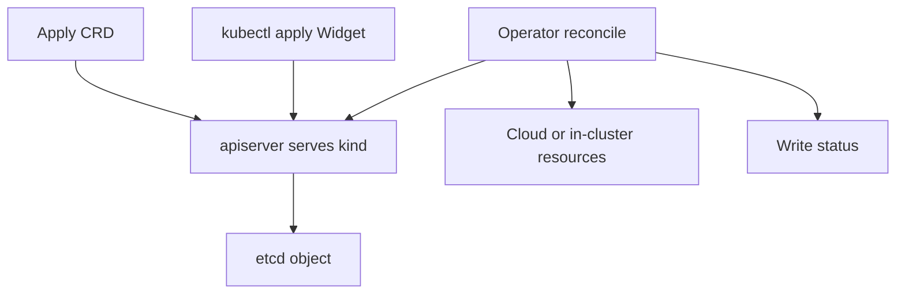

import { ConceptTemplate } from '@/features/kb/components/templates/ConceptTemplate'
import { Callout } from '@/features/kb/components/mdx/Callout'
import { ComparisonTable } from '@/features/kb/components/mdx/ComparisonTable'

export default function Layout({ children }) {
  return (
    <ConceptTemplate title="Custom Resource Definitions">
      {children}
    </ConceptTemplate>
  )
}

A **Custom Resource Definition (CRD)** teaches the API server a new noun. After you apply a CRD named `databases.dba.example.com`, `kubectl get databases` works and etcd stores those objects. A CRD is a schema and a storage contract. **Behavior** comes from a controller (an Operator) that watches the kind and talks to the world.

## 1. Deep Dive and Mechanics

**Group, version, kind.** `apiVersion: dba.example.com/v1` plus `kind: Database`. You can serve two versions (v1alpha1, v1) with conversion webhooks if the shape changes.

**Validation.** `openAPIV3Schema` is the gate. Bad YAML never lands in etcd. Use CEL `x-kubernetes-validations` for cross-field rules.

**Scope.** Namespaced (usual) or Cluster (like Node). Cluster-scoped CRDs are powerful and easy to lock up with RBAC mistakes.

**Subresources.** `/status` and `/scale` let the controller write status without fighting the user on spec. Printer columns make `kubectl get` usable.

**No CRD, no Operator.** Applying YAML for a kind that has no controller just stores JSON. Nothing provisions a database. The CRD is the type; the Operator is the runtime.

<Callout icon="warning" title="Deleting a CRD deletes the data">
Remove the CRD and the API server garbage-collects all custom resources of that kind. Treat CRD uninstall like dropping a table.
</Callout>

## 2. Mathematical / Theoretical Foundation

**Extensibility without forks.** The API is a typed document store. CRDs add types at runtime. Controllers implement the state machine: spec is the input word, status is the accepted configuration.

**Versioning.** Conversion is a function V_i → V_j that must round-trip for stored versions. Break that and `kubectl get` on the old version corrupts objects.

<ComparisonTable
  headers={['Piece', 'Stores state', 'Runs logic']}
  rows={[
    ['CRD', 'Yes — schema + objects', 'No'],
    ['Built-in kind', 'Yes', 'controller-manager'],
    ['Operator', 'Status via API', 'Yes — your code'],
    ['Admission webhook', 'No', 'Validate or mutate writes'],
  ]}
/>

## 3. Real-World Implementation

```yaml
apiVersion: apiextensions.k8s.io/v1
kind: CustomResourceDefinition
metadata:
  name: widgets.example.com
spec:
  group: example.com
  names:
    kind: Widget
    plural: widgets
    singular: widget
  scope: Namespaced
  versions:
    - name: v1
      served: true
      storage: true
      schema:
        openAPIV3Schema:
          type: object
          properties:
            spec:
              type: object
              required: [size]
              properties:
                size:
                  type: integer
                  minimum: 1
            status:
              type: object
              properties:
                ready:
                  type: boolean
```

A controller written with controller-runtime then `Get`s Widgets and writes `status.ready`.

## 4. Visualizations



## 5. Interview Prep

**Q: CRD versus Operator?**
**A:** CRD is the type in the API. Operator is the program that acts. You can have a CRD with no operator (a CRD-backed config object). You should not have an operator with nowhere to store desired state.

**Q: Why not just use ConfigMaps?**
**A:** No schema, no status subresource, no `kubectl get widgets`, no conversion. CRDs are types; ConfigMaps are bags of strings.

**Q: What is aggregated API versus CRD?**
**A:** Aggregated APIs are extension API servers (metrics.k8s.io). Heavier. CRDs live inside kube-apiserver and are the default extension path.

## 6. Production Use Cases

- **Database and message-bus operators** (CloudNativePG, Strimzi).
- **Platform types** (`Application`, `Tenant`) that wrap Deployments for an internal PaaS.
- **Cloud resources** (Crossplane XRDs) so infra is just YAML.

<Callout icon="tip" title="Ship CRDs in the same chart as the operator">
Version skew — new controller, old schema — is the usual outage. Helm or an OLM bundle should move them together.
</Callout>
