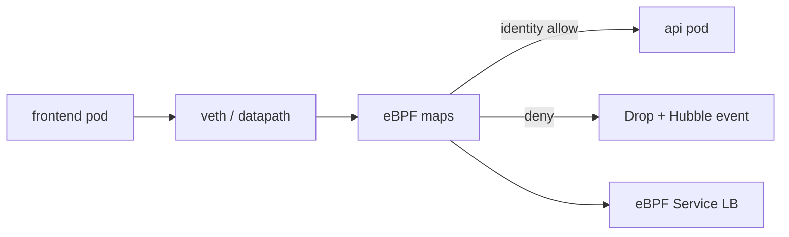

import { ConceptTemplate } from '@/features/kb/components/templates/ConceptTemplate'
import { Callout } from '@/features/kb/components/mdx/Callout'
import { ComparisonTable } from '@/features/kb/components/mdx/ComparisonTable'

export default function Layout({ children }) {
  return (
    <ConceptTemplate title="Cilium">
      {children}
    </ConceptTemplate>
  )
}

**Cilium** is a Container Network Interface plugin and a security/observability layer. Instead of programming thousands of iptables rules, it loads **eBPF** programs into the kernel. Those programs forward pod traffic, enforce NetworkPolicies (including HTTP-aware rules), and export flow logs through Hubble. It is how many large clusters keep east-west traffic fast and inspectable.

## 1. Deep Dive and Mechanics

**CNI.** On pod create, the Cilium agent (a DaemonSet) attaches an endpoint: a veth or a more advanced datapath (native routing, Geneve/VXLAN overlay, or IPvlan). It allocates an IP from a node CIDR or from kube-ipam.

**eBPF datapath.** Hooks at TC, XDP, and socket level classify packets by **identity** (a numeric label derived from Kubernetes labels), not just by IP. Identities stay stable when pods churn and IPs recycle.

**Policy.** CiliumNetworkPolicy can match L3/L4 (cidr, port, protocol) and L7 (HTTP method and path, Kafka topics, gRPC). Denied flows drop in the kernel; they never reach the app.

**kube-proxy replacement.** Cilium can implement Services with eBPF instead of iptables DNAT. That removes O(N rules) updates on every Endpoint change — the classic kube-proxy CPU cliff.

**Hubble.** Flow events from eBPF maps stream to a relay and UI. You answer "who talked to the payments API" without a sidecar mesh, though Cilium also has a service-mesh mode.

<Callout icon="warning" title="Kernel and datapath matter">
eBPF features depend on kernel version. Cloud node images must be new enough. Mixing Cilium with another CNI on the same nodes is not a weekend project.
</Callout>

## 2. Mathematical / Theoretical Foundation

**iptables cost.** A linear chain of rules is O(R) per packet in the worst case. R grows with pods × policies × services. eBPF uses hashed maps: lookup is amortized constant. That is why Cilium's kube-proxy replacement exists.

**Identity versus IP.** IPs are ephemeral. Policy that keys on identity I(labels) remains correct across reschedules. The agent maintains a bijection from label sets to identity integers and programs maps accordingly.

<ComparisonTable
  headers={['CNI style', 'Datapath', 'Policy depth']}
  rows={[
    ['Flannel', 'Overlay, simple', 'Usually none'],
    ['Calico iptables', 'Routing + iptables', 'L3/L4'],
    ['Cilium eBPF', 'In-kernel maps', 'L3-L7 + Hubble'],
    ['Service mesh sidecar', 'Userspace proxy', 'L7, mTLS'],
  ]}
/>

## 3. Real-World Implementation

```yaml
apiVersion: cilium.io/v2
kind: CiliumNetworkPolicy
metadata:
  name: api-from-frontend
  namespace: shop
spec:
  endpointSelector:
    matchLabels:
      app: api
  ingress:
    - fromEndpoints:
        - matchLabels:
            app: frontend
      toPorts:
        - ports:
            - port: "8080"
              protocol: TCP
          rules:
            http:
              - method: GET
                path: "/api/catalog.*"
```

This allows only GET on catalog paths from pods labeled frontend. A POST from the same source is dropped in the kernel.

## 4. Visualizations



## 5. Interview Prep

**Q: Why eBPF instead of iptables?**
**A:** Scale and programmability. Map lookups stay fast as the cluster grows, and you can inspect HTTP without a userspace proxy per pod.

**Q: Does Cilium replace a service mesh?**
**A:** For many L7 policy and observability needs, yes. If you need full mTLS mesh features and a particular sidecar ecosystem, you may still run Istio — sometimes on top of Cilium.

**Q: What is an identity?**
**A:** A cluster-scoped integer Cilium assigns to a set of security-relevant labels. Policies select identities, not raw IPs.

## 6. Production Use Cases

- **Large Kubernetes** where kube-proxy iptables melts.
- **Zero-trust in-cluster** L7 policies without sidecars.
- **Forensics** via Hubble during incidents.

<Callout icon="tip" title="Start with kube-proxy replacement off">
Bring up connectivity and NetworkPolicy first. Turn on the eBPF kube-proxy replacement after you have Hubble and a rollback plan.
</Callout>
