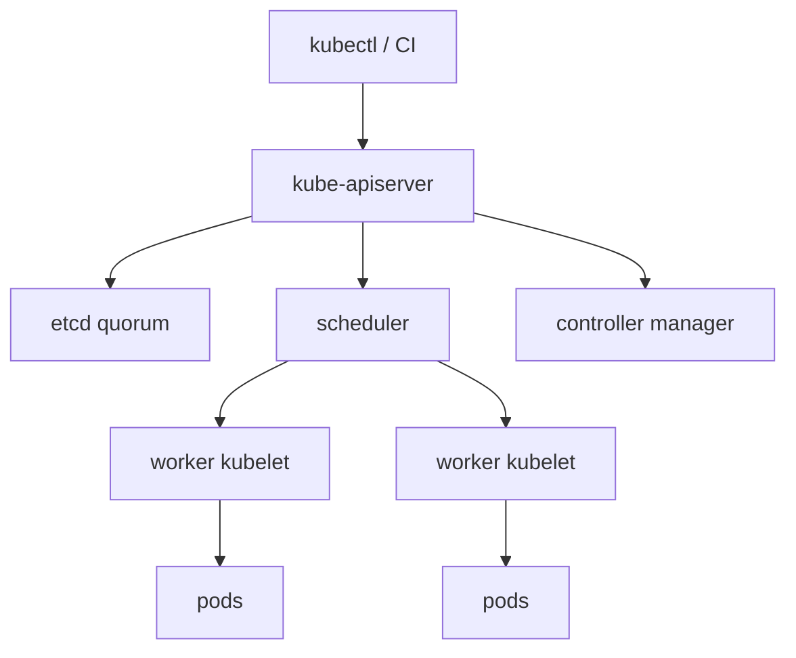

import { ConceptTemplate } from '@/features/kb/components/templates/ConceptTemplate'
import { Callout } from '@/features/kb/components/mdx/Callout'
import { ComparisonTable } from '@/features/kb/components/mdx/ComparisonTable'

export default function Layout({ children }) {
  return (
    <ConceptTemplate title="Kubernetes Clusters">
      {children}
    </ConceptTemplate>
  )
}

A **Kubernetes cluster** is a set of machines that expose one API. You do not SSH to "box 7" to start a process. You POST a Pod or Deployment to the API. The control plane records the desired state; workers run it. The hardware becomes a pool.

## 1. Deep Dive and Mechanics

**Control plane.** kube-apiserver, etcd, scheduler, controller-manager (and often a cloud-controller-manager). These decide *what should run where*. They usually do not run your app containers.

**Workers.** kubelet, a CRI runtime (containerd or CRI-O), kube-proxy or an eBPF replacement, and a CNI plugin. kubelet watches assigned pods and makes the node match.

**Addons.** CoreDNS, a CNI, metrics-server, ingress or a gateway, and a CSI driver for disks. A "cluster" people can use is more than kubeadm's two binaries.

**HA.** Production control planes run 3 or 5 API/etcd members across failure domains. etcd needs quorum (majority). Two masters is a split-brain footgun.

**Tenancy.** Namespaces, RBAC, ResourceQuotas, and NetworkPolicies carve the pool. Hard multi-tenant (hostile customers) usually means multiple clusters or strong sandboxing, not one happy namespace.

<Callout icon="warning" title="etcd is the cluster">
If etcd is gone and you lack a snapshot, the API's memory of Deployments and Secrets is gone. Nodes may keep running stale pods, but you cannot change or recover control. Back up etcd (or use a managed control plane).
</Callout>

## 2. Mathematical / Theoretical Foundation

**Quorum.** For 2f+1 etcd members, you tolerate f failures. Three members tolerate one lost AZ. Five tolerate two, at higher write latency.

**Bin packing.** The scheduler is an online placement algorithm: filter nodes (fit, taints, affinity), score, bind. Density versus disruption is a constant operations trade.

<ComparisonTable
  headers={['Plane', 'Examples', 'If it dies']}
  rows={[
    ['Control plane', 'API, etcd, scheduler', 'No new decisions; running pods linger'],
    ['Data plane', 'kubelet, runtime, CNI', 'Workloads on that node fail'],
    ['Managed CP', 'EKS / GKE / AKS masters', 'Vendor SLAs; you still own nodes'],
  ]}
/>

## 3. Real-World Implementation

```bash
# kubeadm-shaped mental model
kubectl get nodes -o wide
kubectl get --raw /readyz?verbose
kubectl -n kube-system get pods
# Managed: you never SSH to a master; still check node and addon health
```

Create clusters with kubeadm, kops, Cluster API, or a cloud provider. The API you learn is the same; the boring HA work is what you buy when you choose EKS/GKE/AKS.

## 4. Visualizations



## 5. Interview Prep

**Q: What is a cluster, really?**
**A:** A consistent store (etcd), an API, controllers that reconcile, and agents on nodes that run pods. Everything else is an addon.

**Q: Why odd numbers of control-plane nodes?**
**A:** etcd quorum. Even counts do not improve tolerance and make majority harder.

**Q: One big cluster or many small?**
**A:** Blast radius, RBAC complexity, and upgrade risk argue for many. Efficiency and a single mesh argue for few. Most orgs do both: a few prod clusters per region, not one global megacluster.

## 6. Production Use Cases

- **Managed Kubernetes** as the default production compute fabric.
- **On-prem kubeadm / OpenShift** when data cannot leave the building.
- **Ephemeral CI clusters** (Kind, k3d) that still teach the same API.

<Callout icon="tip" title="Treat nodes as cattle">
If replacing a node is scary, you have state on the node. Push state to PVs or external stores so the cluster can shed machines.
</Callout>
