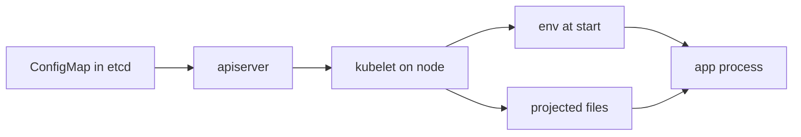

import { ConceptTemplate } from '@/features/kb/components/templates/ConceptTemplate'
import { Callout } from '@/features/kb/components/mdx/Callout'
import { ComparisonTable } from '@/features/kb/components/mdx/ComparisonTable'

export default function Layout({ children }) {
  return (
    <ConceptTemplate title="ConfigMaps">
      {children}
    </ConceptTemplate>
  )
}

A **ConfigMap** stores non-confidential configuration: log levels, feature flags, nginx snippets, the hostname of an in-cluster Service. The Twelve-Factor rule is "config in the environment." Kubernetes' version of that is an API object you mount or explode into env vars, so the *image* stays the same from staging to prod.

## 1. Deep Dive and Mechanics

**Object.** `data` holds UTF-8 keys; `binaryData` holds base64. Max size is about 1 MiB per object (etcd object size). Split or use a volume from git/CI if you are stuffing huge files.

**Env injection.** `envFrom.configMapRef` dumps every key into the process environment. `valueFrom.configMapKeyRef` picks one key. Env vars are fixed at container *start*. Editing the ConfigMap does not change a running process's environ.

**Volume mount.** Each key becomes a file. kubelet keeps the files updated (best effort, eventually). Apps that `inotify` their config can reload. Apps that only read at boot still need a rollout.

**Immutable ConfigMaps.** `immutable: true` skips kubelet watches — useful for large, static blobs and for reducing API load.

**Not Secrets.** ConfigMaps are not encrypted at rest by default in a way that makes them safe for passwords. Anyone who can `get configmaps` can read them. Tokens go in Secrets (and then still need encryption and tight RBAC).

<Callout icon="warning" title="Env vars do not hot-reload">
Teams edit a ConfigMap, see the volume file change, and wonder why the JVM still has the old LOG_LEVEL. That value was copied into the process at start. Roll the Deployment (or hash the ConfigMap into an annotation) to pick it up.
</Callout>

## 2. Mathematical / Theoretical Foundation

**Decoupling.** Image digest I is a function of code. Config C is a function of environment. The running process is interpret(I, C). Promoting I without rebuilding when C changes is the point.

**Update propagation.** Volume projection is an eventually consistent cache on the node. There is no transactional "all pods saw v2." Rolling updates plus a checksum annotation give you a controlled cutover.

<ComparisonTable
  headers={['Mechanism', 'Hot reload', 'Use when']}
  rows={[
    ['env / envFrom', 'No', 'Simple flags, 12-factor apps'],
    ['Volume mount', 'If the app watches files', 'nginx.conf, agent YAML'],
    ['Immutable ConfigMap', 'N/A — replace object', 'Large static files'],
    ['Secret', 'Same mount/env rules', 'Credentials only'],
  ]}
/>

## 3. Real-World Implementation

```yaml
apiVersion: v1
kind: ConfigMap
metadata:
  name: api-config
  namespace: shop
data:
  LOG_LEVEL: info
  CACHE_ENDPOINT: redis.shop.svc.cluster.local:6379
---
apiVersion: apps/v1
kind: Deployment
metadata:
  name: api
spec:
  template:
    spec:
      containers:
        - name: api
          image: registry.example.com/api:1.4.2
          envFrom:
            - configMapRef:
                name: api-config
          volumeMounts:
            - name: nginx
              mountPath: /etc/nginx/conf.d
      volumes:
        - name: nginx
          configMap:
            name: api-nginx
```

A common pattern is to annotate the pod template with a hash of the ConfigMap so `kubectl apply` of a new config triggers a rollout.

## 4. Visualizations



## 5. Interview Prep

**Q: Why not bake config into the image?**
**A:** You would rebuild and retag for every environment. That breaks "same digest everywhere" and slows CD.

**Q: ConfigMap versus Secret?**
**A:** Sensitivity and extra knobs (tmpfs, encryption at rest, avoid logs). Same injection mechanics. Never put a password in a ConfigMap.

**Q: Will changing a ConfigMap restart pods?**
**A:** Not by itself. Volumes update; env does not. Use a checksum annotation or a controller (Reloader) if you want an automatic rollout.

## 6. Production Use Cases

- **Per-env endpoints** (staging Redis versus prod Redis) with one image digest.
- **Config files** for sidecars (logging agents, nginx).
- **Feature flags** that are not secret and can live in git as YAML.

<Callout icon="tip" title="Keep ConfigMaps in git">
Apply them from the same repo as the Deployment. Drift between a clicky UI edit and git is how staging lies to you.
</Callout>
