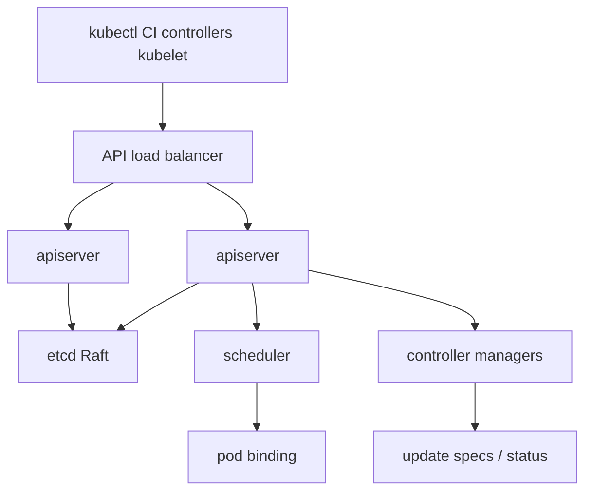

import { ConceptTemplate } from '@/features/kb/components/templates/ConceptTemplate'
import { Callout } from '@/features/kb/components/mdx/Callout'
import { ComparisonTable } from '@/features/kb/components/mdx/ComparisonTable'

export default function Layout({ children }) {
  return (
    <ConceptTemplate title="Control Plane">
      {children}
    </ConceptTemplate>
  )
}

The **control plane** is every component that *decides* and *remembers*, as opposed to the data plane that *runs pods*. You talk only to the API server. Everything else — kubectl, kubelet, controllers, admission webhooks — is a client of that server. State lives in etcd.

## 1. Deep Dive and Mechanics

**kube-apiserver.** REST, authn, authz, admission, and the watch machinery. It is the only component that talks to etcd. Horizontal scale by running several API servers behind a load balancer; they are stateless front ends.

**etcd.** Consistent key-value store. Every object is a key. Watches are how controllers and kubelets notice change. Write latency here is cluster latency.

**kube-scheduler.** Watches unscheduled pods (empty `nodeName`), filters and scores nodes, binds. Plugins implement affinity, taints, topology spread.

**kube-controller-manager.** A process hosting many control loops: Deployment, ReplicaSet, Node, Job, EndpointSlice, Token, and more. Each loop reads desired versus actual and writes to the API.

**cloud-controller-manager.** Cloud-specific loops: node addresses from the IaaS, load-balancer Services, route tables. Split out so core Kubernetes does not import every cloud SDK.

**Managed planes.** EKS, GKE, and AKS operate this set for you. You still run workers, CNI choices, and addons. You do not SSH to a master.

<Callout icon="info" title="All roads lead to the apiserver">
Controllers do not call kubelet. They create or update API objects. kubelet watches the API. That indirection is why the system can recover from any one helper dying.
</Callout>

## 2. Mathematical / Theoretical Foundation

**Reconciliation.** For each object, a controller implements "drive actual toward spec." In control theory this is a digital feedback loop with the API as the plant's interface. There is no central orchestrator script.

**Consistency.** etcd's Raft gives linearizable writes. The API's resourceVersion is a watch cursor. Controllers that skip resourceVersion checks overwrite each other (lost update).

<ComparisonTable
  headers={['Component', 'Statefulness', 'Role']}
  rows={[
    ['kube-apiserver', 'Stateless', 'Front door, admission'],
    ['etcd', 'Stateful quorum', 'Source of truth'],
    ['scheduler', 'Stateless (leaders)', 'Bind pods to nodes'],
    ['controller-manager', 'Leader elected', 'Reconcile built-in kinds'],
  ]}
/>

## 3. Real-World Implementation

```bash
kubectl get componentstatuses  # legacy; prefer:
kubectl get --raw /livez
kubectl get --raw /readyz?verbose
kubectl -n kube-system get leases
```

On HA kubeadm, you will see stacked etcd on control-plane nodes or an external etcd ring. Certificates, `--advertise-address`, and the load balancer DNS name are the usual breakages.

## 4. Visualizations



## 5. Interview Prep

**Q: What happens if the control plane is down?**
**A:** Running pods keep running until the node needs a decision (new pod, probe-driven restart still local). You cannot deploy, scale, or schedule. Ingress that depends on the API (some controllers) may also degrade.

**Q: Why not let the scheduler talk to etcd?**
**A:** One writer/reader of etcd keeps authz, admission, and audit in one place. The API is the choke point on purpose.

**Q: Managed versus self-managed plane?**
**A:** Managed trades etcd restore drills for vendor lock-in and addon opinions. Self-managed is for regulated or on-prem where you must own the binaries.

## 6. Production Use Cases

- **Every Kubernetes cluster** — there is no cluster without a plane.
- **Multi-AZ HA** for production APIs.
- **Cluster API** management clusters whose only job is to spawn other clusters' planes.

<Callout icon="tip" title="Watch leases">
Leader election lives in Lease objects. If two controllers think they are leader, start with those leases and the clocks, not with folklore.
</Callout>
