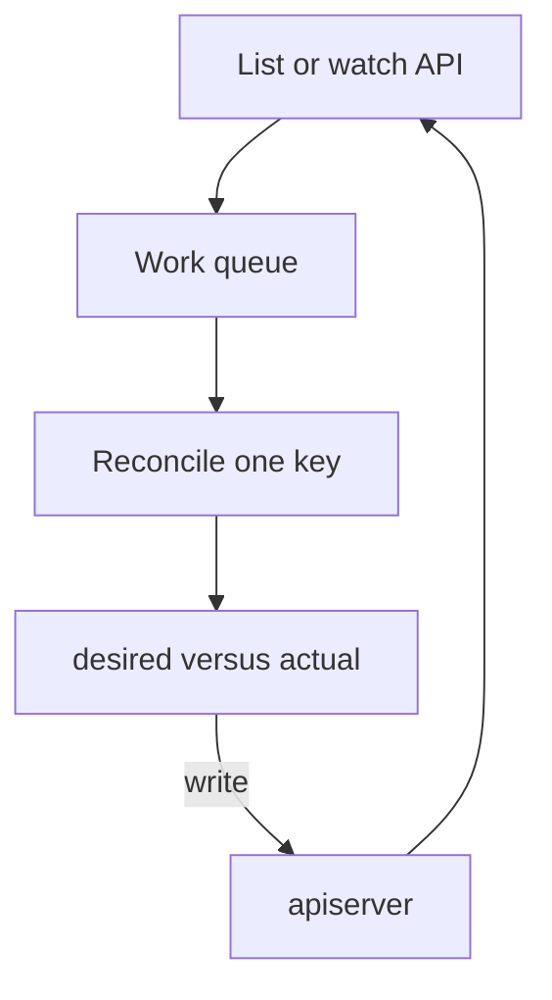

import { ConceptTemplate } from '@/features/kb/components/templates/ConceptTemplate'
import { Callout } from '@/features/kb/components/mdx/Callout'
import { ComparisonTable } from '@/features/kb/components/mdx/ComparisonTable'

export default function Layout({ children }) {
  return (
    <ConceptTemplate title="Controller Manager">
      {children}
    </ConceptTemplate>
  )
}

**kube-controller-manager** is a bag of controllers in one binary. Kubernetes is declarative: you write spec. These loops compare spec to live status and write the difference back through the API — create a Pod, evict a node, rotate a ServiceAccount token. The process never SSHes to a node.

## 1. Deep Dive and Mechanics

**Reconciliation loop.** Watch or list+watch a kind. For each object: compute actions that move actual toward desired; update status. Then do it again. Forever.

**Built-in examples.**
- **ReplicaSet** — create or delete pods to match `replicas`.
- **Deployment** — manage ReplicaSets and rolling updates.
- **Node** — taint NotReady, trigger eviction when a node disappears.
- **Job** — create pods until `completions` succeed.
- **EndpointSlice** — keep service backends in sync with ready pods.
- **Garbage collector** — delete dependents when an owner is deleted.
- **Namespace** — tear down all namespaced objects on namespace delete.

**Leader election.** Only one manager should run a given loop. HA replicas compete on a Lease. The others idle.

**Cloud split.** Node lifecycle that needs the IaaS API moved to cloud-controller-manager so the core binary stays cloud-agnostic.

**You can write more.** Operators are extra controllers. They do not live in this binary; they are Deployments that speak the same API.

<Callout icon="info" title="Controllers are clients">
If the API server rejects a write (admission, quota, RBAC), the controller retries. The manager is not a privileged back door around policy.
</Callout>

## 2. Mathematical / Theoretical Foundation

**Level-triggered versus edge-triggered.** Kubernetes is mostly level-triggered: even if you miss an event, the next resync sees the object is still wrong and fixes it. That is why "at least once" watches are enough.

**Idempotence.** Create-if-not-exists must tolerate already-exists. The loop may crash mid-way and restart. Designs that assume "I run once" break.

**Concurrency.** Per-object work queues plus rate limiters keep a hot namespace from starving the cluster. Burst + QPS are the knobs you turn when the manager lags.

<ComparisonTable
  headers={['Loop', 'Desired', 'Actuates']}
  rows={[
    ['ReplicaSet', 'N matching pods', 'Create or delete pods'],
    ['Deployment', 'Rollout strategy', 'ReplicaSets'],
    ['Job', 'N successful pods', 'Pods + backoff'],
    ['Node', 'Healthy membership', 'Taints, evictions'],
  ]}
/>

## 3. Real-World Implementation

```bash
# Who is leader?
kubectl -n kube-system get lease kube-controller-manager -o yaml
# Controllers can be disabled on self-hosted planes
# --controllers=-nodelifecycle,bootstrapsigner
```

When a Deployment "does nothing," check the manager logs and the ReplicaSet events before you blame kubelet. Many outages are a stuck loop (quota, invalid selector, or a webhook timeout).

## 4. Visualizations



## 5. Interview Prep

**Q: What is a controller in one sentence?**
**A:** A loop that makes the world match a spec stored in the API.

**Q: Why is kube-controller-manager one process?**
**A:** Operational simplicity and shared caches. You can still disable individual controllers with flags.

**Q: How is this different from an Operator?**
**A:** Same pattern, different kinds. Operators reconcile CRDs you define. The manager reconciles built-in kinds.

## 6. Production Use Cases

- **Self-healing replica counts** after node loss.
- **Rolling Deployments** without a human for-loop.
- **Namespace teardown** that actually finishes (GC + namespace controller).

<Callout icon="tip" title="Read events on the child object">
The Deployment is fine; the ReplicaSet is failing to create pods. Controllers leave breadcrumbs on the object they could not fix.
</Callout>
