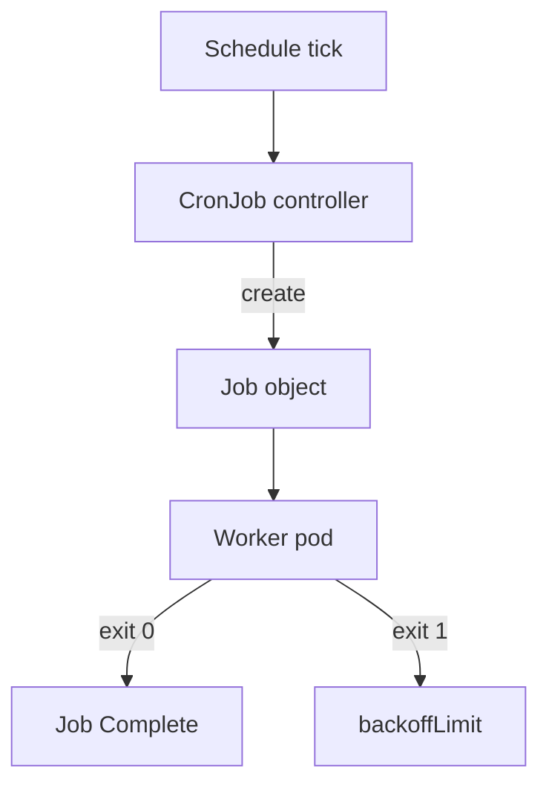

import { ConceptTemplate } from '@/features/kb/components/templates/ConceptTemplate'
import { Callout } from '@/features/kb/components/mdx/Callout'
import { ComparisonTable } from '@/features/kb/components/mdx/ComparisonTable'

export default function Layout({ children }) {
  return (
    <ConceptTemplate title="CronJobs">
      {children}
    </ConceptTemplate>
  )
}

A **CronJob** is a time trigger for a **Job**. Deployments run forever. Jobs run until they succeed (or hit backoff). CronJobs say "create a Job at 02:00 every day." The schedule is classic cron (and optionally a timezone). The work is still a pod with a restart policy of OnFailure or Never.

## 1. Deep Dive and Mechanics

**Schedule.** Five (or six, with seconds in some versions) cron fields. `0 2 * * *` is 02:00 every day in the CronJob's time zone (`spec.timeZone` when the feature is on; otherwise the controller's local zone — pin it).

**Controller.** The CronJob controller wakes, sees a missed or due schedule, and creates a Job from `jobTemplate`. The Job controller creates pods. Success is pod exit 0.

**concurrencyPolicy.** `Allow` (default) lets runs overlap. `Forbid` skips if the last Job is still running. `Replace` deletes the running Job and starts a new one. Backups almost always want `Forbid`.

**startingDeadlineSeconds.** If the controller was down across a schedule, should it still fire? A deadline of 0 or a small number prevents "catch-up storms" of 30 Jobs after an outage.

**History.** `successfulJobsHistoryLimit` and `failedJobsHistoryLimit` keep old Jobs (and their pods) for logs. Set them or you drown the namespace.

<Callout icon="warning" title="CronJobs are not exactly-once">
A controller restart can create a Job twice around the same minute, or skip one. Make the work idempotent (upsert, object-store overwrite, lock in the database).
</Callout>

## 2. Mathematical / Theoretical Foundation

**Discrete events.** A schedule is a set of instants S. The controller maps each s in S to at most one Job name (timestamped). Clock skew and leader failover mean the mapping is at-least-once / at-most-once-ish, not a distributed transaction.

**Overlap.** If runtime T exceeds period P and policy is Allow, you get floor(T/P)+1 concurrent Jobs. That is how a slow ETL knocks over the database.

<ComparisonTable
  headers={['Object', 'Duration', 'Trigger']}
  rows={[
    ['Deployment', 'Forever', 'Desired replicas'],
    ['Job', 'Until N successes', 'Create the Job'],
    ['CronJob', 'Creates Jobs', 'Cron schedule'],
    ['host crontab', 'Until exit', 'One node clock'],
  ]}
/>

## 3. Real-World Implementation

```yaml
apiVersion: batch/v1
kind: CronJob
metadata:
  name: nightly-backup
  namespace: shop
spec:
  schedule: "15 2 * * *"
  timeZone: "UTC"
  concurrencyPolicy: Forbid
  startingDeadlineSeconds: 300
  successfulJobsHistoryLimit: 3
  failedJobsHistoryLimit: 7
  jobTemplate:
    spec:
      backoffLimit: 2
      template:
        spec:
          restartPolicy: OnFailure
          containers:
            - name: backup
              image: registry.example.com/backup:1.2.0
              args: ["--dest", "s3://backups/shop"]
```

Give the Job a ServiceAccount that can only write that bucket. Do not reuse the API's role.

## 4. Visualizations



## 5. Interview Prep

**Q: CronJob versus a Deployment with an in-process scheduler?**
**A:** CronJob gives you cluster-level history, retries, and a spare node if one dies mid-run. In-process cron dies with the replica and duplicates if you scale to two.

**Q: What does Forbid do?**
**A:** If the previous Job is still Active, this tick is skipped. Use it when two backups must not run together.

**Q: Why did 24 Jobs appear after the control plane was down?**
**A:** Catch-up without a starting deadline. Set `startingDeadlineSeconds` and make the job safe to skip.

## 6. Production Use Cases

- **Database dumps** to object storage.
- **Report generation** and data warehouse loads.
- **Janitors** — expire unused objects, compact indexes, rotate tokens.

<Callout icon="tip" title="Name the time zone">
A CronJob that fires in the controller's zone will drift when you move the control plane or a vendor changes a machine image. Set `timeZone: UTC`.
</Callout>
