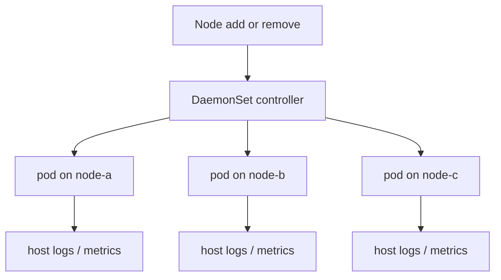

import { ConceptTemplate } from '@/features/kb/components/templates/ConceptTemplate'
import { Callout } from '@/features/kb/components/mdx/Callout'
import { ComparisonTable } from '@/features/kb/components/mdx/ComparisonTable'

export default function Layout({ children }) {
  return (
    <ConceptTemplate title="DaemonSets">
      {children}
    </ConceptTemplate>
  )
}

A **DaemonSet** places a copy of a pod on every node that matches its selectors (and tolerations). Scale is "number of nodes," not a replica integer you type. When the cluster autoscaler adds a node, the DaemonSet controller adds a pod before that node is a useful citizen. When a node leaves, the pod is gone with it.

## 1. Deep Dive and Mechanics

**Placement.** The controller creates a pod with a node binding (or a node affinity) for each eligible node. You do not set `replicas`. Node selectors, affinity, and taints/tolerations decide eligibility. Control-plane nodes are tainted; log agents often tolerate those taints, user apps do not.

**Updates.** `RollingUpdate` (default, with `maxUnavailable` / `maxSurge` on newer versions) or `OnDelete`. Rolling a CNI DaemonSet is how you cause a self-inflicted partition — surge and surge-aware disruption budgets matter.

**hostPath and privileges.** Most DaemonSets mount host paths (`/var/log/pods`, `/sys`) or use `hostNetwork`. That is the point and the risk. RBAC and PSS/PSA should treat them as cluster infrastructure.

**Not for apps.** If you want N replicas of an API, that is a Deployment. A DaemonSet of nginx would give you one extra copy per node, including ones you did not want, and no horizontal "3 replicas" knob.

<Callout icon="warning" title="DaemonSets ignore replica math">
Setting a replica count on a DaemonSet is not a thing. If you need "one per node plus a spare," you have the wrong controller — or you want a DaemonSet plus a Deployment.
</Callout>

## 2. Mathematical / Theoretical Foundation

**Coverage.** Let N be the set of nodes matching the predicate P (ready, selector, tolerations). The desired pod set is isomorphic to N. The controller maintains |pods| = |N| and a 1-1 assignment.

**Disruption.** If `maxUnavailable` is 1 on a 200-node CNI DaemonSet, upgrades take 200 steps. If it is 10%, you risk a connectivity hole on 20 nodes at once. The product of blast radius and duration is the planning object.

<ComparisonTable
  headers={['Controller', 'How many pods', 'Typical payload']}
  rows={[
    ['Deployment', 'spec.replicas', 'Stateless API'],
    ['StatefulSet', 'ordinal 0..N-1', 'Databases'],
    ['DaemonSet', 'one per matching node', 'Agents, CNI, CSI'],
    ['Job', 'until completions', 'Batch'],
  ]}
/>

## 3. Real-World Implementation

```yaml
apiVersion: apps/v1
kind: DaemonSet
metadata:
  name: node-exporter
  namespace: observability
spec:
  selector:
    matchLabels:
      app: node-exporter
  updateStrategy:
    type: RollingUpdate
    rollingUpdate:
      maxUnavailable: 1
  template:
    metadata:
      labels:
        app: node-exporter
    spec:
      hostNetwork: true
      tolerations:
        - operator: Exists
      containers:
        - name: exporter
          image: prom/node-exporter:v1.8.2
          ports:
            - containerPort: 9100
              hostPort: 9100
```

`tolerations: Exists` places the agent on tainted masters too. Drop that if you do not want it there.

## 4. Visualizations



## 5. Interview Prep

**Q: Why not a Deployment with replica count equal to the node count?**
**A:** The scheduler would pack pods, not spread one-per-node (unless you fight it with anti-affinity). Autoscaling would drift. DaemonSet is the first-class "coverage" abstraction.

**Q: How do you run a DaemonSet only on GPU nodes?**
**A:** Node selector or affinity on `nvidia.com/gpu` (or your label). Nodes without the label are ineligible.

**Q: What happens during node drain?**
**A:** The DaemonSet pod is evicted like any pod unless you add a drain exception. Some agents should stay until the last second; others should go first. Order your drain.

## 6. Production Use Cases

- **Log shippers** (Fluent Bit, Promtail) reading `/var/log/pods`.
- **Metrics** (node-exporter, cadvisor-adjacent agents).
- **CNI and CSI node plugins** (Cilium, Calico, ebs-node).

<Callout icon="tip" title="Give agents a memory limit">
A log agent without a limit will take the node during a log storm. It is still a container; cgroups still apply.
</Callout>
