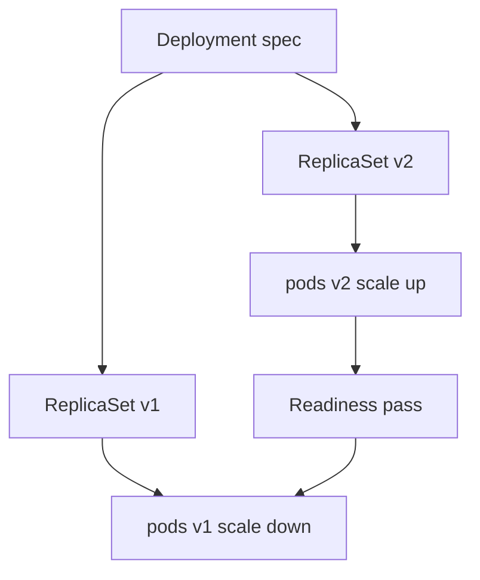

import { ConceptTemplate } from '@/features/kb/components/templates/ConceptTemplate'
import { Callout } from '@/features/kb/components/mdx/Callout'
import { ComparisonTable } from '@/features/kb/components/mdx/ComparisonTable'

export default function Layout({ children }) {
  return (
    <ConceptTemplate title="Kubernetes Deployments">
      {children}
    </ConceptTemplate>
  )
}

A **Deployment** is how you run a stateless app on Kubernetes. You declare a pod template and a replica count. The Deployment owns **ReplicaSets**; each ReplicaSet owns pods. When you change the image, a new ReplicaSet appears and a rolling update moves traffic from old pods to new ones. Rollback is scaling the old ReplicaSet back up.

## 1. Deep Dive and Mechanics

**Ownership chain.** Deployment → ReplicaSet → Pod. You almost never create a ReplicaSet by hand. The RS hash in the pod name is the template hash.

**RollingUpdate (default).** `maxUnavailable` and `maxSurge` bound how many pods you may go under or over `replicas` during the cut. Example: 10 replicas, 25% surge, 25% unavailable → up to 3 extra and 3 down at a time. New pods must pass **readiness** before the old ones are killed.

**Recreate.** Kill all, then start new. Downtime. Used when two versions cannot share a volume or a schema.

**Probes.** Liveness restarts a stuck process. Readiness removes a pod from Endpoints so the roll does not send users to a cold JVM. Without readiness, rolling updates are a lie.

**Rollbacks and history.** `revisionHistoryLimit` keeps old ReplicaSets at 0. `kubectl rollout undo` points the Deployment at the previous template. The image layers are still in the registry; you are not rebuilding.

<Callout icon="warning" title="Readiness is part of the rollout">
If every new pod is Ready immediately but the app still 500s for 30 seconds, you shipped a rolling outage. Probe the dependency path you care about, not just `/`.
</Callout>

## 2. Mathematical / Theoretical Foundation

**Progress.** A rollout is a state machine: progressing, complete, failed (progressDeadlineSeconds). The controller will not sit forever if new pods never become Ready.

**Availability bound.** During RollingUpdate, running-and-ready stays at least replicas - maxUnavailable (when the math is integer-ceiled as the API specifies). Surge spends spare node capacity for speed.

**Self-heal.** ReplicaSet reconciliation is "count matching pods, create or delete the difference." Node death is just a count drop.

<ComparisonTable
  headers={['Controller', 'Identity of pods', 'Update story']}
  rows={[
    ['Deployment', 'Interchangeable', 'Rolling or Recreate'],
    ['StatefulSet', 'Stable names and disks', 'Ordered roll'],
    ['DaemonSet', 'Tied to a node', 'Per-node roll'],
    ['ReplicaSet', 'Interchangeable', 'No rollout strategy'],
  ]}
/>

## 3. Real-World Implementation

```yaml
apiVersion: apps/v1
kind: Deployment
metadata:
  name: api
  namespace: shop
spec:
  replicas: 4
  revisionHistoryLimit: 5
  strategy:
    type: RollingUpdate
    rollingUpdate:
      maxUnavailable: 1
      maxSurge: 1
  selector:
    matchLabels:
      app: api
  template:
    metadata:
      labels:
        app: api
    spec:
      containers:
        - name: api
          image: registry.example.com/api:1.4.2
          ports:
            - containerPort: 8080
          readinessProbe:
            httpGet:
              path: /healthz
              port: 8080
            periodSeconds: 5
          resources:
            requests:
              cpu: "100m"
              memory: 256Mi
            limits:
              memory: 256Mi
```

Bump the tag (or digest), `kubectl apply`, watch `kubectl rollout status`. Pin a digest in prod.

## 4. Visualizations



## 5. Interview Prep

**Q: Why not manage pods directly?**
**A:** Pods are mortal. You want a replica count, a roll, and a rollback. That is a controller, not a pile of YAML pods.

**Q: Deployment versus ReplicaSet?**
**A:** ReplicaSet only keeps a count for one template. Deployment adds rolling strategy and history across templates.

**Q: How do you do a canary?**
**A:** Two Deployments (stable + canary) behind one Service or an Ingress/mesh with weights. A single Deployment rolling update is not a canary — it is a gradual replace.

## 6. Production Use Cases

- **Stateless HTTP APIs** and workers that can die any time.
- **Web frontends** (after the build's static assets are in the image or on a CDN).
- **Most operators** (the Operator pod itself is a Deployment).

<Callout icon="tip" title="Match selector and template labels">
An immutable selector that does not match the template is a Deployment that can never adopt pods. Set them once, carefully, and do not "fix" the selector later.
</Callout>
