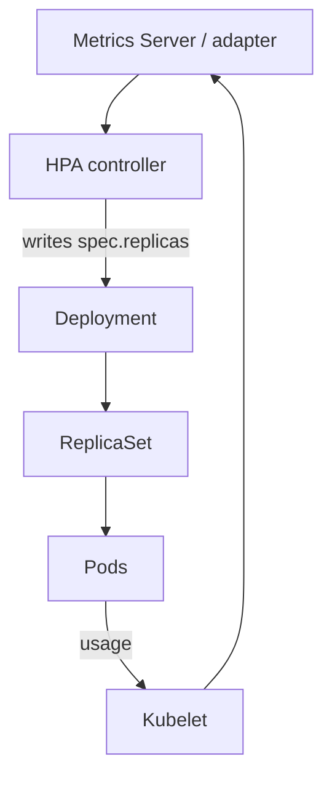

import { ConceptTemplate } from '@/features/kb/components/templates/ConceptTemplate'
import { Callout } from '@/features/kb/components/mdx/Callout'
import { ComparisonTable } from '@/features/kb/components/mdx/ComparisonTable'

export default function Layout({ children }) {
  return (
    <ConceptTemplate title="Horizontal Pod Autoscaler">
      {children}
    </ConceptTemplate>
  )
}

The **Horizontal Pod Autoscaler (HPA)** watches a workload and writes its `replicas` field. You set a target — usually average CPU as a percent of the request, or a custom metric such as queue depth. The controller polls the Metrics API, computes a desired count, and the Deployment or StatefulSet creates or deletes pods.

## 1. Deep Dive and Mechanics

**Metrics path.** kubelet exposes cAdvisor stats. Metrics Server aggregates them into the Resource Metrics API. HPA reads that API. Custom and external metrics come from adapters (Prometheus Adapter, KEDA-style scalers) on other API groups.

**Stabilization.** Scale-up is usually eager. Scale-down waits (`behavior.scaleDown.stabilizationWindowSeconds`) so a brief lull does not thrash. You can cap velocity (pods or percent per window).

**Readiness.** Unready pods should not count as serving capacity. If new pods take a minute to warm, a naive HPA overshoots, then undershoots. Startup probes and a scale-up stabilization window tame that.

**Limits.** `minReplicas` and `maxReplicas` are hard clamps. Cluster capacity is a softer clamp: pending pods do not lower the metric, so HPA may sit at max while pods queue.

**HPA plus VPA.** Both can fight. Common pattern: VPA in recommendation mode for request sizing, HPA for replica count. Autoscaling both dimensions on the same metric needs care.

<Callout icon="warning" title="CPU target is percent of request">
If you request 100m and the target is 70 percent, one pod is "full" at 70m. Inflated requests make HPA think the fleet is idle. Deflated requests make it scale forever and OOM.
</Callout>

## 2. Mathematical / Theoretical Foundation

**Ratio control.** For a resource metric:

`desired = ceil(currentReplicas * currentMetric / targetMetric)`

Ten pods at 90 percent CPU against a 70 percent target become `ceil(10 * 90/70) = 13`. Multiple metrics take the max desired.

**Tolerance.** A default tolerance band (about 10 percent) avoids flip-flop when the ratio is near 1. That is a dead zone around the setpoint, like a thermostat.

**Feedback delay.** Metric scrape interval plus pod start time plus readiness is the plant delay. Aggressive scale-down windows oscillate. Treat HPA as a sampled discrete controller, not an instant function.

<ComparisonTable
  headers={['Autoscaler', 'What it changes', 'Trigger']}
  rows={[
    ['HPA', 'Replica count', 'CPU, memory, custom, external'],
    ['VPA', 'Requests and limits', 'Historical usage'],
    ['Cluster Autoscaler / Karpenter', 'Nodes', 'Pending pods'],
    ['KEDA', 'Replicas via ScaledObject', 'Events and queues'],
  ]}
/>

## 3. Real-World Implementation

```yaml
apiVersion: autoscaling/v2
kind: HorizontalPodAutoscaler
metadata:
  name: api
  namespace: shop
spec:
  scaleTargetRef:
    apiVersion: apps/v1
    kind: Deployment
    name: api
  minReplicas: 3
  maxReplicas: 20
  metrics:
    - type: Resource
      resource:
        name: cpu
        target:
          type: Utilization
          averageUtilization: 70
    - type: External
      external:
        metric:
          name: sqs_messages_visible
        target:
          type: AverageValue
          averageValue: "30"
  behavior:
    scaleDown:
      stabilizationWindowSeconds: 300
      policies:
        - type: Percent
          value: 25
          periodSeconds: 60
```

Confirm Metrics Server is healthy (`kubectl top pods`) before debugging HPA. A missing metric leaves the HPA stuck.

## 4. Visualizations



## 5. Interview Prep

**Q: Why will HPA not scale my Deployment?**
**A:** No resource requests, Metrics Server down, wrong `scaleTargetRef`, or the current ratio is already inside tolerance. `kubectl describe hpa` says which.

**Q: HPA versus Cluster Autoscaler?**
**A:** HPA adds pods. If nodes are full, those pods Pending. Cluster Autoscaler or Karpenter adds nodes. You usually need both.

**Q: Can HPA scale to zero?**
**A:** Native HPA min is typically 1 unless you use a provider that allows 0, or KEDA. Scale-to-zero needs a signal that can wake the first replica.

## 6. Production Use Cases

- **HTTP APIs** on CPU or request-per-second custom metrics.
- **Queue workers** on SQS/Pub-Sub depth so backlog hours stay bounded.
- **Business-hour baselines** with minReplicas raised before a launch, HPA handling the spike.

<Callout icon="tip" title="Load-test the metric you scale on">
If you scale on CPU but the bottleneck is a connection pool, you will add pods that all stall. Scale on the saturation signal that actually hurts users.
</Callout>
