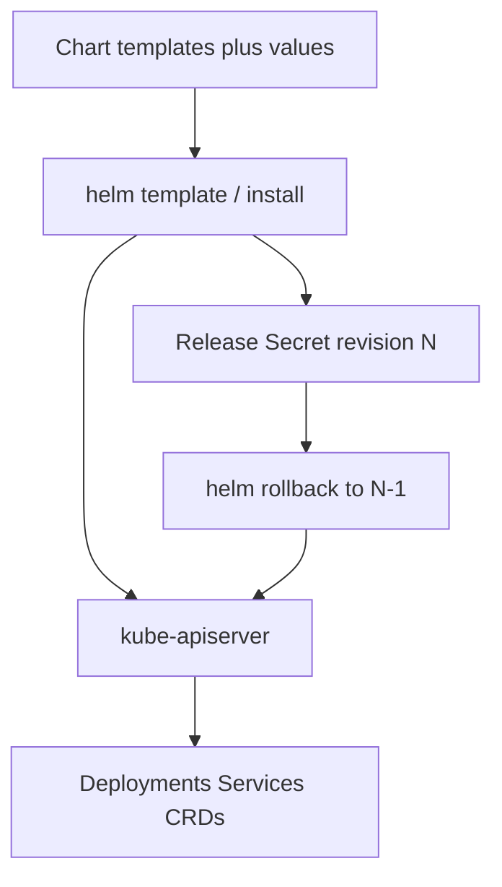

import { ConceptTemplate } from '@/features/kb/components/templates/ConceptTemplate'
import { Callout } from '@/features/kb/components/mdx/Callout'
import { ComparisonTable } from '@/features/kb/components/mdx/ComparisonTable'

export default function Layout({ children }) {
  return (
    <ConceptTemplate title="Helm">
      {children}
    </ConceptTemplate>
  )
}

**Helm** packages Kubernetes YAML as a **chart**: templates plus default values. `helm install` renders those templates, applies the objects, and records a **release**. Upgrade and rollback operate on that release, not on fifteen loose files you hope you re-applied in the right order.

## 1. Deep Dive and Mechanics

**Chart layout.** `Chart.yaml` names the package. `values.yaml` holds knobs. `templates/` is Go text/template over YAML. Helpers in `_helpers.tpl` keep labels and names consistent. Dependencies in `charts/` or `Chart.yaml` pull subcharts (a database next to an API).

**Render then apply.** Helm merges chart defaults, `-f` files, and `--set` flags, runs the templates, then talks to the API server. What lands in the cluster is ordinary Kubernetes objects. There is no Helm runtime in the datapath.

**Release secret.** Helm 3 stores release history as a Secret (or ConfigMap) in the release namespace. Each revision is a snapshot of the last-applied manifest set. `helm rollback` reapplies an older snapshot.

**Hooks.** Annotated Jobs run before/after install or upgrade: migrate a schema, then start the new Deployment. Hooks that hang block the release.

**OCI and repos.** Classic chart repos are HTTP indexes. OCI registries store charts as artifacts next to images. Pin versions; floating `latest` is how prod drifts.

<Callout icon="warning" title="Templates are not typed YAML">
A missing indent or a range that emits nothing can produce invalid manifests or silent omissions. `helm template` and `helm lint` in CI catch that before the cluster does.
</Callout>

## 2. Mathematical / Theoretical Foundation

**Three-way merge.** Helm 3 diffs last-applied, live, and newly rendered. If a human edited a live field that the chart also owns, the next upgrade may overwrite it. If the chart dropped a field, Helm may prune it. Treat the chart as the owner of those objects.

**Release as a transaction-ish unit.** Install is not a distributed transaction. Some objects may apply before a later one fails. Hooks and `atomic` upgrades reduce the mess; they do not give you ACID across the API.

<ComparisonTable
  headers={['Tool', 'Mechanism', 'Best for']}
  rows={[
    ['Helm', 'Go templates plus release history', 'Third-party apps, versioned packages'],
    ['Kustomize', 'Patches on raw YAML', 'Your own services, overlay per env'],
    ['Operators', 'Control loops on CRDs', 'Day-2 stateful lifecycle'],
    ['plain kubectl', 'Static files', 'Tiny, frozen manifests'],
  ]}
/>

## 3. Real-World Implementation

```yaml
# values-prod.yaml
replicaCount: 4
image:
  repository: registry.example.com/api
  tag: "1.4.2"
resources:
  requests:
    cpu: "200m"
    memory: 256Mi
```

```bash
helm repo add bitnami https://charts.bitnami.com/bitnami
helm upgrade --install api ./charts/api \
  --namespace shop --create-namespace \
  -f values-prod.yaml \
  --atomic --timeout 5m
helm history api -n shop
helm rollback api 2 -n shop
```

```gotemplate
# templates/deployment.yaml excerpt
apiVersion: apps/v1
kind: Deployment
metadata:
  name: {{ include "api.fullname" . }}
spec:
  replicas: {{ .Values.replicaCount }}
  template:
    spec:
      containers:
        - name: api
          image: "{{ .Values.image.repository }}:{{ .Values.image.tag }}"
```

CI should `helm template` and policy-check the rendered YAML. Do not `--set` secrets on the CLI; they land in shell history.

## 4. Visualizations



## 5. Interview Prep

**Q: Helm 2 versus Helm 3?**
**A:** Helm 2 needed Tiller in-cluster (a privileged server). Helm 3 is a client that uses your kubeconfig and stores releases as Secrets. Nobody should still run Tiller.

**Q: When do you pick Kustomize over Helm?**
**A:** When the YAML is yours and you want patches, not a programming language inside manifests. Use Helm when you consume or publish a versioned package.

**Q: Why did an upgrade wipe a manual kubectl edit?**
**A:** The chart owns that field. The three-way merge put the rendered value back. Either move the knob into values or stop editing live objects.

## 6. Production Use Cases

- **Off-the-shelf software**: Prometheus, cert-manager, ingress-nginx, as pinned chart versions.
- **Internal platform charts**: one chart, many teams, values per service.
- **GitOps**: Argo CD or Flux renders a chart and applies the result; the Git SHA is the audit trail.

<Callout icon="tip" title="Pin the chart and the image">
A floating chart version plus a floating image tag is two moving parts. Lock both. Review `helm diff upgrade` in the PR.
</Callout>
