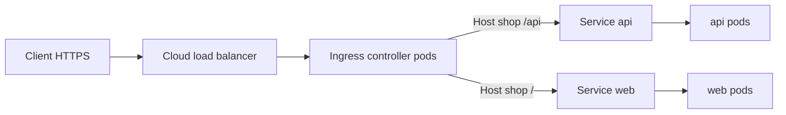

import { ConceptTemplate } from '@/features/kb/components/templates/ConceptTemplate'
import { Callout } from '@/features/kb/components/mdx/Callout'
import { ComparisonTable } from '@/features/kb/components/mdx/ComparisonTable'

export default function Layout({ children }) {
  return (
    <ConceptTemplate title="Kubernetes Ingress">
      {children}
    </ConceptTemplate>
  )
}

An **Ingress** is a set of HTTP rules: host, path, backend Service. By itself it does nothing. An **Ingress controller** (NGINX, HAProxy, Traefik, a cloud ALB controller) watches those objects and programs a proxy. You pay for one (or a few) edge load balancers instead of a cloud LB per Service.

## 1. Deep Dive and Mechanics

**Object versus implementation.** `kind: Ingress` is portable config. The controller you install decides features: regex paths, timeouts, auth, WAF. Annotations are vendor dialect. Two clusters with different controllers will not behave the same.

**Path types.** `Exact`, `Prefix`, and `ImplementationSpecific`. Prefix `/shop` matches `/shop` and `/shop/cart`. It does not match `/shopping`. Misreading Prefix is a common outage.

**TLS.** `spec.tls` points at a Secret of type `kubernetes.io/tls`. The controller terminates TLS at the edge and usually talks HTTP to in-cluster Services. cert-manager can mint the Secret from Let's Encrypt.

**Default backend.** Unmatched hosts/paths go to a default Service or a 404 from the controller. Set it on purpose so you do not leak an accidental admin app.

**Gateway API.** The successor API (Gateway, HTTPRoute) splits infra and app ownership. New designs should prefer it; Ingress remains everywhere in production.

<Callout icon="info" title="One LB, many hosts">
A typical pattern is one LoadBalancer Service in front of the controller, then many Ingress objects for `api.example.com` and `shop.example.com`. That is the cost win versus ten `type: LoadBalancer` Services.
</Callout>

## 2. Mathematical / Theoretical Foundation

**Longest-match routing.** Controllers build a lookup from Host header plus path. Ambiguous overlaps are implementation-defined. Treat the rule set as a priority map, not a bag of equals.

**L4 versus L7.** A LoadBalancer Service forwards TCP. Ingress inspects HTTP. You get host-based multiplexing on 443 and path-based fan-out. gRPC and WebSockets work only if the controller's HTTP mode supports them.

<ComparisonTable
  headers={['Expose how', 'Layer', 'Cost shape']}
  rows={[
    ['ClusterIP', 'Internal L4', 'Free, in-cluster only'],
    ['NodePort', 'L4 on nodes', 'DIY firewall'],
    ['LoadBalancer Service', 'L4 per Service', 'One cloud LB each'],
    ['Ingress / Gateway', 'L7 HTTP', 'Shared edge'],
  ]}
/>

## 3. Real-World Implementation

```yaml
apiVersion: networking.k8s.io/v1
kind: Ingress
metadata:
  name: shop
  namespace: shop
  annotations:
    cert-manager.io/cluster-issuer: letsencrypt-prod
spec:
  ingressClassName: nginx
  tls:
    - hosts:
        - shop.example.com
      secretName: shop-tls
  rules:
    - host: shop.example.com
      http:
        paths:
          - path: /api
            pathType: Prefix
            backend:
              service:
                name: api
                port:
                  number: 8080
          - path: /
            pathType: Prefix
            backend:
              service:
                name: web
                port:
                  number: 80
```

Install the controller first (`ingress-nginx` or the cloud one). `ingressClassName` must match that controller's class or the object is ignored.

## 4. Visualizations



## 5. Interview Prep

**Q: Why is my Ingress pending / unused?**
**A:** No controller, wrong class, or the controller cannot provision an external address. The Ingress status stays empty until a controller claims it.

**Q: Ingress versus Gateway API?**
**A:** Ingress is one object mixing infra and app. Gateway API splits Gateway (platform) from Routes (app) and supports more protocols. Interviews still expect Ingress fluency.

**Q: Where should TLS live?**
**A:** At the edge for most apps. End-to-end TLS to pods is extra (mesh or backend TLS). Do not ship your only private key inside the app image.

## 6. Production Use Cases

- **Multi-tenant HTTP** on one cluster: many hosts, one controller.
- **Blue/green at the path** by flipping a backend Service name (or using a mesh for weights).
- **Central TLS** with cert-manager and a cluster issuer.

<Callout icon="tip" title="Pin the IngressClass">
If two controllers watch the same objects, they fight. Set `ingressClassName` everywhere and disable default-catch-all on the one you do not want.
</Callout>
