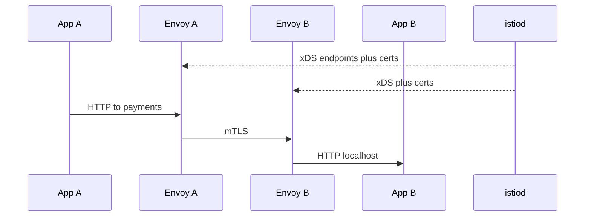

import { ConceptTemplate } from '@/features/kb/components/templates/ConceptTemplate'
import { Callout } from '@/features/kb/components/mdx/Callout'
import { ComparisonTable } from '@/features/kb/components/mdx/ComparisonTable'

export default function Layout({ children }) {
  return (
    <ConceptTemplate title="Istio">
      {children}
    </ConceptTemplate>
  )
}

**Istio** is a service mesh for Kubernetes (and VMs). It injects an **Envoy** sidecar into pods, intercepts inbound and outbound TCP, and applies policy from a control plane (**istiod**). The app still dials `http://payments`. Retries, timeouts, mTLS, and golden-signal metrics happen in the proxy.

## 1. Deep Dive and Mechanics

**Data plane.** iptables or eBPF redirect pod traffic to Envoy. Envoy terminates or originates mTLS, load-balances to endpoints from istiod's xDS, and emits access logs and spans. Ambient mode (ztunnel + waypoint) is the sidecar-optional path for some meshes.

**Control plane.** istiod serves discovery, converts VirtualService / DestinationRule / PeerAuthentication into Envoy config, and acts as a CA for workload certificates. It is not on the request path after config push.

**Traffic APIs.** VirtualService matches HTTP and shifts weight (90/10 canary). DestinationRule sets pools, outlier detection, and TLS mode. Gateway configures the mesh edge. AuthorizationPolicy is L7 RBAC on the sidecar.

**Injection.** A namespace label `istio-injection=enabled` plus a mutating webhook adds the sidecar and an init (or native redirect). Pods started before injection stay out of the mesh until restarted.

**Cost.** Two containers per pod: CPU, memory, and a cold-start tax. Large clusters feel this in node count and in Envoy config size (watch cardinality).

<Callout icon="warning" title="Sidecar is a second failure domain">
A wedged Envoy fails the pod even if the app is healthy. Budget resources for the proxy. Do not inject into DaemonSets that already own the node datapath unless you know why.
</Callout>

## 2. Mathematical / Theoretical Foundation

**xDS eventual consistency.** Config push is not a two-phase commit across 5,000 Envoys. A canary weight of 10 percent is "approximately 10 percent of requests after all proxies ACK." Design rollouts that tolerate a mixed generation.

**Identity.** SPIFFE IDs bind a cert to a ServiceAccount. Authorization is "this identity may call that host:port / method," not "this source IP is trusted." IPs recycle; identities should not.

<ComparisonTable
  headers={['Mesh', 'Proxy', 'Ops weight']}
  rows={[
    ['Istio', 'Envoy sidecar or ambient', 'Feature-rich, heavier'],
    ['Linkerd', 'Rust micro-proxy', 'Opinionated, lighter'],
    ['Cilium mesh', 'eBPF plus optional Envoy', 'CNI-centric'],
    ['No mesh', 'App libraries', 'Per-language, inconsistent'],
  ]}
/>

## 3. Real-World Implementation

```yaml
apiVersion: networking.istio.io/v1beta1
kind: VirtualService
metadata:
  name: api
  namespace: shop
spec:
  hosts:
    - api
  http:
    - match:
        - headers:
            x-canary:
              exact: "true"
      route:
        - destination:
            host: api
            subset: v2
    - route:
        - destination:
            host: api
            subset: v1
          weight: 95
        - destination:
            host: api
            subset: v2
          weight: 5
---
apiVersion: networking.istio.io/v1beta1
kind: DestinationRule
metadata:
  name: api
  namespace: shop
spec:
  host: api
  trafficPolicy:
    tls:
      mode: ISTIO_MUTUAL
    outlierDetection:
      consecutive5xxErrors: 7
      interval: 10s
      baseEjectionTime: 30s
  subsets:
    - name: v1
      labels:
        version: v1
    - name: v2
      labels:
        version: v2
```

PeerAuthentication `STRICT` in a namespace fails open-to-mesh traffic that is still plaintext. Roll `PERMISSIVE` first.

## 4. Visualizations



## 5. Interview Prep

**Q: Why not just use an Ingress for canaries?**
**A:** Ingress shapes north-south. Mesh shapes east-west (and can also do north-south via Gateway). Service-to-service retries and mTLS are not Ingress jobs.

**Q: What breaks when you enable STRICT mTLS?**
**A:** Anything that talks to a pod IP without a sidecar, health checks from a non-mesh probe if misconfigured, and legacy clients. Job pods and CronJobs need injection too.

**Q: Istio versus Linkerd?**
**A:** Istio exposes more knobs (and more ways to misconfigure). Linkerd aims for safe defaults and a smaller proxy. Pick from team skill and required features, not blog benchmarks alone.

## 6. Production Use Cases

- **Regulated east-west encryption** without rewriting every service.
- **Weighted canaries** and fault injection in staging.
- **Uniform telemetry** (RED metrics, traces) across polyglot fleets.

<Callout icon="tip" title="Start with a namespace, not the cluster">
Inject one namespace, prove mTLS and dashboards, then expand. Cluster-wide injection on day one is how you discover every hostNetwork special case at once.
</Callout>
