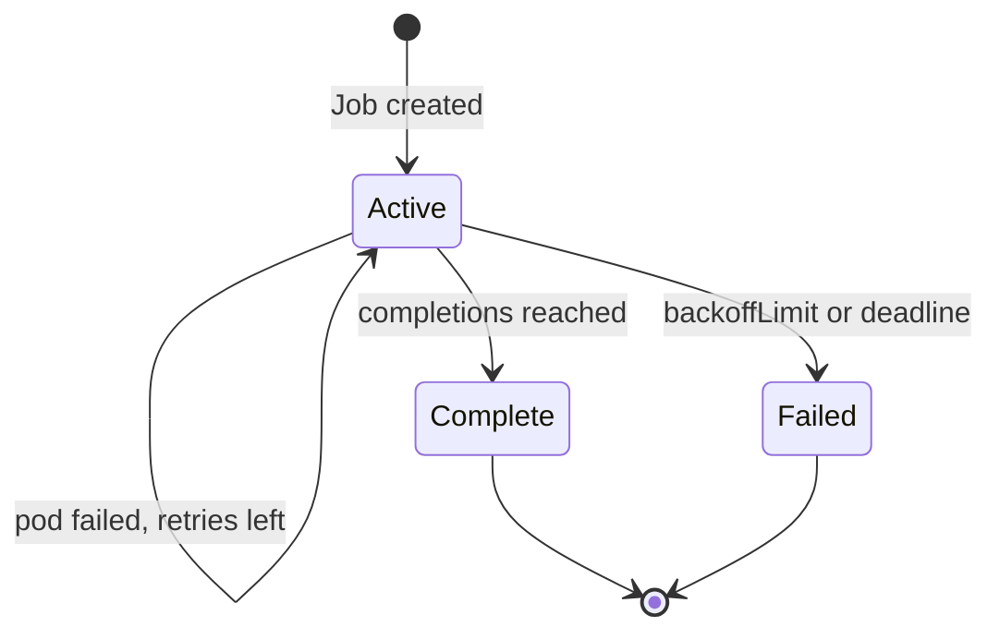

import { ConceptTemplate } from '@/features/kb/components/templates/ConceptTemplate'
import { Callout } from '@/features/kb/components/mdx/Callout'
import { ComparisonTable } from '@/features/kb/components/mdx/ComparisonTable'

export default function Layout({ children }) {
  return (
    <ConceptTemplate title="Kubernetes Jobs">
      {children}
    </ConceptTemplate>
  )
}

A **Job** runs pods until a success count is met. Exit 0 is completion. A Deployment treats exit as failure and starts another forever. Use a Job for migrations, batch reports, and one-shot workers. Use a **CronJob** when that Job should fire on a schedule.

## 1. Deep Dive and Mechanics

**Completions and parallelism.** `completions` is how many successful pods you want. `parallelism` is how many may run at once. Indexed Jobs (`completionMode: Indexed`) give each pod an index from 0 to completions-1 so you can shard a work queue without an external coordinator.

**Backoff.** Failed pods retry up to `backoffLimit`. Delay grows. After the limit, the Job is Failed. `activeDeadlineSeconds` kills the whole Job if it runs too long.

**Restart policy.** Job pods use `Never` or `OnFailure`, not `Always`. The Job controller creates replacement pods; the kubelet does not loop a completed success.

**Cleanup.** Finished pods stick around for logs. `ttlSecondsAfterFinished` deletes the Job (and its pods) so the API does not fill with last month's migrations.

**Idempotency.** A retry must be safe. Two pods can run after a node freeze. Design the work item as compare-and-set, not "increment the balance."

<Callout icon="warning" title="Do not run a web server as a Job">
If the process never exits, the Job never completes. If it exits 0 after bind, Kubernetes will not keep it up. That is a Deployment.
</Callout>

## 2. Mathematical / Theoretical Foundation

**Barrier count.** The controller tracks successful, failed, and active. It creates pods while `successful < completions` and `active < parallelism`, subject to backoff. This is a simple token bucket of work slots, not a DAG scheduler (that is Argo Workflows / Tekton).

**At-least-once.** Node death after the work committed but before the kubelet reports success yields a duplicate. Exactly-once needs an external idempotency key.

<ComparisonTable
  headers={['Workload', 'Success looks like', 'Typical use']}
  rows={[
    ['Job', 'N pods exit 0', 'Batch, migrate'],
    ['CronJob', 'Job per schedule tick', 'Nightly ETL'],
    ['Deployment', 'N pods stay Ready', 'Servers'],
    ['Workflow CRDs', 'DAG of steps', 'Pipelines'],
  ]}
/>

## 3. Real-World Implementation

```yaml
apiVersion: batch/v1
kind: Job
metadata:
  name: migrate-2026-09
  namespace: shop
spec:
  ttlSecondsAfterFinished: 86400
  backoffLimit: 3
  activeDeadlineSeconds: 600
  template:
    spec:
      restartPolicy: Never
      serviceAccountName: migrator
      containers:
        - name: migrate
          image: registry.example.com/api:1.4.2
          command: ["/app/migrate", "up"]
          envFrom:
            - secretRef:
                name: db
```

```yaml
# Indexed batch: 8 shards
apiVersion: batch/v1
kind: Job
metadata:
  name: resize-images
spec:
  completions: 8
  parallelism: 4
  completionMode: Indexed
  template:
    spec:
      restartPolicy: Never
      containers:
        - name: worker
          image: registry.example.com/resize:1.0.0
          env:
            - name: JOB_COMPLETION_INDEX
              valueFrom:
                fieldRef:
                  fieldPath: metadata.annotations['batch.kubernetes.io/job-completion-index']
```

Gate production deploys on Job success (Helm hook or CI `kubectl wait --for=condition=complete`).

## 4. Visualizations



## 5. Interview Prep

**Q: Job versus CronJob?**
**A:** CronJob is a controller that creates Jobs from a schedule. The Job still does the work. Timezone and `concurrencyPolicy` (Forbid / Allow / Replace) live on the CronJob.

**Q: Why did my Job spawn extra pods?**
**A:** Failures retry. Parallelism greater than 1 plus a non-indexed job can also overlap. Check `backoffLimit` and whether the process is idempotent.

**Q: How do you run a migration before a rollout?**
**A:** A Job (Helm pre-upgrade hook or a pipeline step) that must Complete, then the Deployment image bump. Never hide a destructive migrate in a container `command` that also starts the server.

## 6. Production Use Cases

- **Schema migrations** before an API rollout.
- **Indexed image/video transcode** shards.
- **One-off admin** (backfill, reindex) with a tight deadline and TTL.

<Callout icon="tip" title="Resource requests on Jobs">
A hungry batch Job without requests will evict or starve APIs on the same node. Give it a request and, if needed, a PriorityClass below serving traffic.
</Callout>
