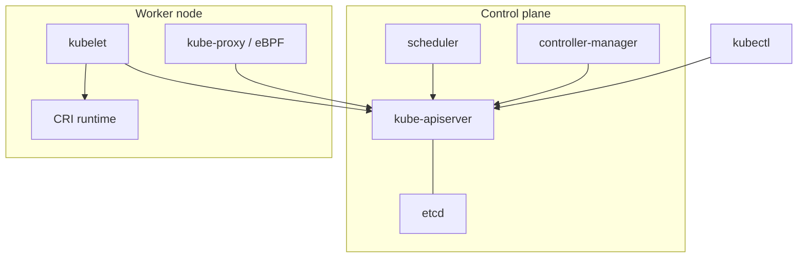

import { ConceptTemplate } from '@/features/kb/components/templates/ConceptTemplate'
import { Callout } from '@/features/kb/components/mdx/Callout'
import { ComparisonTable } from '@/features/kb/components/mdx/ComparisonTable'

export default function Layout({ children }) {
  return (
    <ConceptTemplate title="Kubernetes Architecture">
      {children}
    </ConceptTemplate>
  )
}

**Kubernetes** is a declarative control system for containers across machines. You write desired state (a Deployment with 3 replicas). Controllers and kubelets continuously close the gap to actual state. The architecture split is **control plane** (decide, store) versus **worker nodes** (run, route).

## 1. Deep Dive and Mechanics

**Control plane.** kube-apiserver is the only public write path. etcd stores objects. kube-scheduler binds free pods to nodes. kube-controller-manager runs built-in loops (ReplicaSet, Job, EndpointSlice, Node, …). cloud-controller-manager talks to the IaaS for node metadata and LoadBalancers.

**Worker.** kubelet syncs pods via CRI (containerd, CRI-O). kube-proxy (or eBPF) implements Services. A CNI plugin gives each pod an IP and routes or encapsulates east-west traffic. CSI attaches disks.

**Declarative, not a script.** Nobody SSHs to start container 47. You apply objects. If a node dies, the Node and ReplicaSet controllers notice a count drop and create a new pod; the scheduler places it; kubelet starts it.

**Extension points.** CRDs + controllers (Operators), admission webhooks, aggregated APIs, Device Plugins, CNI, CSI, CRI. The core stays small; policy and storage vendors plug in.

**Managed Kubernetes.** EKS, GKE, AKS operate the plane. You still choose CNI, node OS, addons, and how you apply YAML.

<Callout icon="info" title="The API is the bus">
Controllers never call kubelet. They write Pod objects. kubelet never calls the scheduler. Watches on the API replace a mesh of RPCs. That is why one component can restart without a distributed lock across the fleet.
</Callout>

## 2. Mathematical / Theoretical Foundation

**Reconciliation.** Each controller implements `f(spec, status) → API writes` until spec and status agree. This is a discrete feedback loop. There is no global transaction; conflicts use resourceVersion.

**Separation of concerns.** Scheduling is bin-packing plus constraints (NP-hard in the general form; Kubernetes uses plugins and heuristics). Consensus is isolated in etcd (Raft). The node agent is an eventual executor.

<ComparisonTable
  headers={['Plane', 'Examples', 'Failure if down']}
  rows={[
    ['Control', 'apiserver, etcd, scheduler, CCM', 'No new binds / no API'],
    ['Data / node', 'kubelet, CRI, CNI, kube-proxy', 'Pods on that node suffer'],
    ['Addons', 'CoreDNS, Ingress, metrics', 'DNS or ingress breaks'],
  ]}
/>

## 3. Real-World Implementation

```text
# Mental model of a create-Deployment
kubectl apply
  → apiserver (authn/authz/admission) → etcd
  → Deployment controller → ReplicaSet
  → ReplicaSet controller → Pods (unscheduled)
  → scheduler binds nodeName
  → kubelet on that node → CRI → containers
  → EndpointSlice + kube-proxy → Service traffic
```

```bash
kubectl get componentstatuses  # legacy; prefer:
kubectl get --raw=/readyz?verbose
kubectl get nodes -o wide
kubectl -n kube-system get deploy,ds
```

Interview diagrams should show the watch arrows, not a single "master starts containers" box.

## 4. Visualizations



## 5. Interview Prep

**Q: What happens if etcd dies but pods are running?**
**A:** Existing containers keep running. You cannot schedule, scale, or persist new intent. kubelet heartbeats fail when the API is gone; eviction behavior depends on timeouts.

**Q: Why not let the scheduler talk to kubelet?**
**A:** Then every new node agent protocol is a compatibility matrix. Binding is just a Pod status/field write. kubelet already watches Pods.

**Q: Control plane on workers?**
**A:** Possible (k3s, tiny clusters). Production HA keeps etcd on dedicated nodes so a noisy neighbor cannot stall Raft.

## 6. Production Use Cases

- **Multi-AZ HA** with 3 API/etcd members and workers in each zone.
- **Managed plane + self-managed nodes** for GPU or regulated OS images.
- **Platform teams** exposing only namespaces and quotas; users never see etcd.

<Callout icon="tip" title="Draw watches, not a call graph">
If your architecture sketch is a spider of RPCs, you have not internalized Kubernetes. Sketch objects in etcd and loops that watch them.
</Callout>
