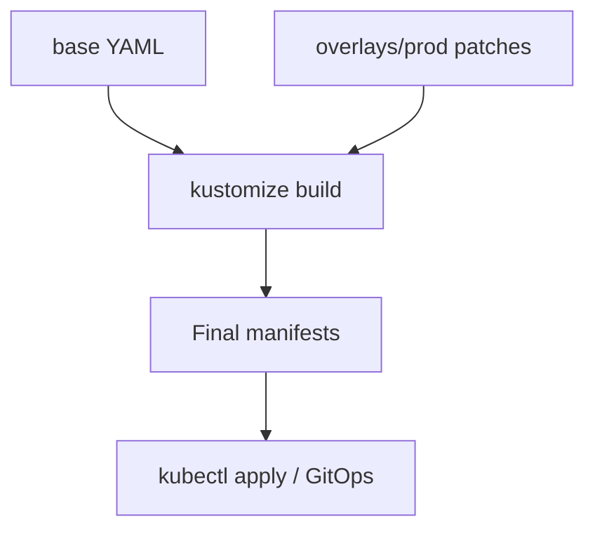

import { ConceptTemplate } from '@/features/kb/components/templates/ConceptTemplate'
import { Callout } from '@/features/kb/components/mdx/Callout'
import { ComparisonTable } from '@/features/kb/components/mdx/ComparisonTable'

export default function Layout({ children }) {
  return (
    <ConceptTemplate title="Kustomize">
      {children}
    </ConceptTemplate>
  )
}

**Kustomize** customizes Kubernetes YAML without a template language. You keep a **base** of real manifests and **overlays** that patch replicas, images, or labels per environment. `kubectl apply -k` (or `kustomize build`) merges them in memory and applies the result. Linters and policy engines can still parse every file as YAML.

## 1. Deep Dive and Mechanics

**kustomization.yaml.** Lists `resources` (files or remote), `namespace`, `namePrefix`, `commonLabels`, `images` (rewrite a container image), `replicas`, `configMapGenerator`, and `secretGenerator`. Generators hash names so a ConfigMap change forces a pod rollout.

**Patches.** Strategic merge patch (YAML that looks like the object) or JSON 6902 patch (op/path/value). Overlays reference the base with `resources: - ../../base`.

**No Helm engine.** You cannot `if`/`range` a Deployment into existence. Conditional objects mean another overlay or a component. That constraint is the point: the base always applies.

**Composition.** `components/` reuse a patch set (add a sidecar) across overlays. `helmCharts` can render a chart as a resource, then patch it — a hybrid some platforms use.

**GitOps.** Flux and Argo CD natively kustomize a path. The PR is a patch file, not a values dump.

<Callout icon="info" title="Every file stays valid YAML">
A reviewer can open `base/deployment.yaml` in a YAML schema-aware editor. Helm templates are strings until render. That is the philosophical split.
</Callout>

## 2. Mathematical / Theoretical Foundation

**Patch algebra.** Strategic merge has typed merge keys (container name, port). Last overlay wins on conflicts unless you use JSON patch replace. The build is a deterministic fold: base ▹ patch1 ▹ patch2.

**ConfigMap name hash.** The generator appends a suffix of the content hash. The Deployment's envFrom reference is rewritten. Equality of hash ⇒ no rollout; inequality ⇒ new object ⇒ rollout. Cache invalidation as a name.

<ComparisonTable
  headers={['Tool', 'Abstraction', 'Weakness']}
  rows={[
    ['Kustomize', 'Patches on YAML', 'Awkward conditionals'],
    ['Helm', 'Go templates plus values', 'Unreadable until render'],
    ['Jsonnet / CUE', 'Code that emits YAML', 'Team learning curve'],
    ['plain dirs', 'Copy-paste', 'Drift'],
  ]}
/>

## 3. Real-World Implementation

```yaml
# base/kustomization.yaml
apiVersion: kustomize.config.k8s.io/v1beta1
kind: Kustomization
resources:
  - deployment.yaml
  - service.yaml
```

```yaml
# overlays/prod/kustomization.yaml
apiVersion: kustomize.config.k8s.io/v1beta1
kind: Kustomization
namespace: shop
resources:
  - ../../base
images:
  - name: registry.example.com/api
    newTag: "1.4.2"
replicas:
  - name: api
    count: 4
patches:
  - path: resources-patch.yaml
    target:
      kind: Deployment
      name: api
```

```bash
kubectl apply -k overlays/prod
kustomize build overlays/prod | kubeconform
```

CI should build the overlay and validate; never apply an overlay you have not rendered in the pipeline log.

## 4. Visualizations



## 5. Interview Prep

**Q: Helm or Kustomize?**
**A:** Helm for third-party versioned packages. Kustomize for first-party services with env overlays. Many shops use both.

**Q: How do you change only the image tag?**
**A:** `images:` in the overlay, or a CI that edits that field. Avoid a second copy of the whole Deployment.

**Q: Why did my ConfigMap change not restart pods?**
**A:** You edited a hand-named ConfigMap. Use `configMapGenerator` so the name hash changes and the Deployment reference updates.

## 6. Production Use Cases

- **dev / staging / prod** overlays on one base.
- **Regional forks**: extra patch for EU storage class or node affinity.
- **GitOps apps** where the path `clusters/prod/shop` is the contract.

<Callout icon="tip" title="Keep bases deployable">
If base cannot `kubectl apply` in a kind cluster, overlays become untestable. Base should be a working minimum, not a Swiss-cheese template.
</Callout>
