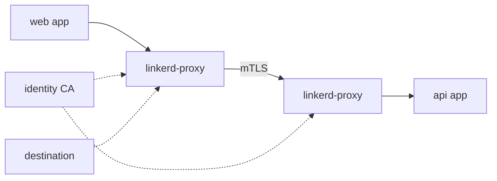

import { ConceptTemplate } from '@/features/kb/components/templates/ConceptTemplate'
import { Callout } from '@/features/kb/components/mdx/Callout'
import { ComparisonTable } from '@/features/kb/components/mdx/ComparisonTable'

export default function Layout({ children }) {
  return (
    <ConceptTemplate title="Linkerd">
      {children}
    </ConceptTemplate>
  )
}

**Linkerd** is a Kubernetes service mesh built around **linkerd2-proxy**, a Rust proxy designed for the sidecar job only. You install the control plane, annotate a namespace, and restart pods. Mutual TLS, retries (when you opt in), and latency metrics appear without an Envoy config dialect.

## 1. Deep Dive and Mechanics

**Micro-proxy.** The proxy is memory-safe, small, and scoped: HTTP/1, HTTP/2, gRPC, and opaque TCP. It is not a general L7 kitchen sink. That limits surprise features and CPU.

**Control plane.** Destination, identity (CA), and policy services. The destination service tells proxies which endpoints implement a Service. Identity issues short-lived certs (rotated on the order of a day) bound to the workload.

**Injection.** A mutating webhook adds the proxy container. Meshed pods get `linkerd.io/inject: enabled`. The proxy listens on localhost ports and uses iptables or an equivalent redirect.

**Policy.** Server and HTTPRoute-style policy (and older ServiceProfiles) define what is allowed and which routes get timeouts. Defaults aim to be safe: mTLS on, extras off until you ask.

**Viz.** An optional extension (tap, dashboard, metrics) for golden signals. You can scrape Prometheus without the full UI.

<Callout icon="info" title="mTLS is the default product">
Linkerd's pitch is "secure the mesh first, add traffic tricks later." If you need Istio-scale VirtualService graphs on day one, you may be shopping the wrong mesh — or over-scoping the problem.
</Callout>

## 2. Mathematical / Theoretical Foundation

**Identity over IP.** Certificates name a ServiceAccount (SPIFFE-like URI). Authorization is "this identity may connect to that Server." Pod IPs recycle; the cert TTL is short so a stolen key dies.

**Overhead.** Extra latency is a proxy hop plus crypto. The design target is sub-millisecond p99 added latency and tens of MB of RAM per pod, not zero. Measure on your payload sizes (large gRPC streams differ from tiny JSON).

<ComparisonTable
  headers={['Mesh', 'Proxy', 'Default posture']}
  rows={[
    ['Linkerd', 'Rust micro-proxy', 'mTLS on, small API'],
    ['Istio', 'Envoy', 'Large feature surface'],
    ['Cilium', 'eBPF plus optional Envoy', 'CNI + optional mesh'],
  ]}
/>

## 3. Real-World Implementation

```bash
linkerd check --pre
linkerd install --crds | kubectl apply -f -
linkerd install | kubectl apply -f -
linkerd check
kubectl annotate ns shop linkerd.io/inject=enabled
kubectl -n shop rollout restart deploy
linkerd -n shop viz stat deploy
```

```yaml
apiVersion: policy.linkerd.io/v1beta1
kind: Server
metadata:
  name: api
  namespace: shop
spec:
  podSelector:
    matchLabels:
      app: api
  port: 8080
  proxyProtocol: HTTP
---
apiVersion: policy.linkerd.io/v1beta1
kind: MeshTLSAuthentication
metadata:
  name: api-from-web
  namespace: shop
spec:
  identityRefs:
    - kind: ServiceAccount
      name: web
      namespace: shop
```

Pair Servers with authorization so only the frontend identity can call the API port.

## 4. Visualizations



## 5. Interview Prep

**Q: Why Rust for the proxy?**
**A:** Memory safety without a GC pause on the request path, and a chance to keep the binary small. It is an engineering bet, not a proof that C++ Envoy is "unsafe" in practice.

**Q: Linkerd versus Istio for canaries?**
**A:** Linkerd traffic splits exist (TrafficSplit / Gateway API) but the ecosystem is thinner. Istio's VirtualService weights are the common interview answer for complex L7 shaping.

**Q: What is a meshed versus unmeshed call?**
**A:** Unmeshed clients speak plaintext to the pod IP. With default deny / Server policy, those calls fail. Plan the injection order.

## 6. Production Use Cases

- **mTLS for PCI/HIPAA** east-west without app changes.
- **Golden signals** per deploy when you lack a consistent metrics library.
- **Smaller clusters** where an Envoy-per-pod bill is the blocker.

<Callout icon="tip" title="Run linkerd check in CI after upgrades">
Control plane / proxy version skew is the usual break. The CLI's check is the supported compatibility matrix.
</Callout>
