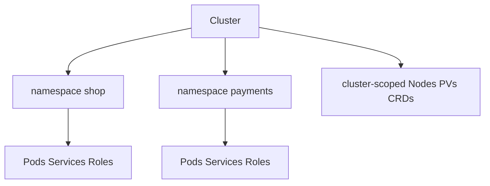

import { ConceptTemplate } from '@/features/kb/components/templates/ConceptTemplate'
import { Callout } from '@/features/kb/components/mdx/Callout'
import { ComparisonTable } from '@/features/kb/components/mdx/ComparisonTable'

export default function Layout({ children }) {
  return (
    <ConceptTemplate title="Kubernetes Namespaces">
      {children}
    </ConceptTemplate>
  )
}

A Kubernetes **Namespace** is a scope in the API and in etcd, not a kernel isolation primitive. Names of namespaced objects (Pods, Services, Roles) must be unique inside one namespace, not cluster-wide. Cluster-scoped objects (Nodes, PVs, ClusterRoles) ignore this boundary.

## 1. Deep Dive and Mechanics

**Default set.** `default` (user workloads if you are sloppy), `kube-system` (plane addons), `kube-public`, `kube-node-lease`. Do not dump apps into `kube-system`.

**DNS.** A Service `api` in `shop` is `api.shop.svc.cluster.local`. Short name `api` only works for clients in the same namespace. Cross-namespace calls need the FQDN (or an ExternalName / mesh policy).

**RBAC and quotas.** RoleBindings are namespaced. ResourceQuota and LimitRange attach here. NetworkPolicy is namespaced too; it does not automatically isolate two namespaces until you write policies.

**Soft multi-tenancy.** Namespaces plus RBAC plus quotas plus policies are "soft" tenancy. A cluster-admin or a hostPath mount can still escape. Hard tenancy is separate clusters or a hardened multi-tenant distro.

**Deletion.** Deleting a namespace is a cascading delete of its namespaced objects. Finalizers can stick a namespace in Terminating forever (a CRD webhook that is gone).

<Callout icon="warning" title="Namespaces are not a firewall">
Pods in `frontend` can still TCP to pods in `payments` unless NetworkPolicy (or mesh auth) says otherwise. The API wall is not the network wall.
</Callout>

## 2. Mathematical / Theoretical Foundation

**Two-level naming.** The identity of a namespaced object is the pair (namespace, name) plus group/kind. etcd keys include that prefix. Cluster-scoped objects have a single name.

**Quota as a reservation.** ResourceQuota is a sum constraint: Σ requests ≤ hard. Admission rejects creates that would break the inequality. It is not fair scheduling; it is a budget.

<ComparisonTable
  headers={['Mechanism', 'What it isolates', 'What it does not']}
  rows={[
    ['Namespace', 'API names, RBAC, quota', 'Kernel, disk, by default net'],
    ['Linux namespaces', 'pid, mnt, net, …', 'Cluster policy'],
    ['NetworkPolicy', 'Pod L3/L4 paths', 'API access'],
    ['Separate cluster', 'Failure and admin domain', 'Cheapness'],
  ]}
/>

## 3. Real-World Implementation

```yaml
apiVersion: v1
kind: Namespace
metadata:
  name: shop
  labels:
    purpose: prod
    pod-security.kubernetes.io/enforce: restricted
---
apiVersion: v1
kind: ResourceQuota
metadata:
  name: shop-budget
  namespace: shop
spec:
  hard:
    requests.cpu: "8"
    requests.memory: 16Gi
    persistentvolumeclaims: "8"
    pods: "40"
---
apiVersion: v1
kind: LimitRange
metadata:
  name: defaults
  namespace: shop
spec:
  limits:
    - type: Container
      defaultRequest:
        cpu: "100m"
        memory: 128Mi
      default:
        memory: 256Mi
```

```bash
kubectl config set-context --current --namespace=shop
```

Prefer one namespace per team/app/env combo that matches how you bind RBAC, not one giant `default`.

## 4. Visualizations



## 5. Interview Prep

**Q: Linux namespace versus Kubernetes Namespace?**
**A:** Linux namespaces isolate a process's view of the kernel (pid, net, mnt). Kubernetes Namespaces isolate API objects. A pod uses both: it has Linux namespaces and lives in a Kubernetes Namespace.

**Q: Can two namespaces have a Service named `db`?**
**A:** Yes. DNS and RBAC keep them distinct. Clients must use the right FQDN.

**Q: Namespace stuck Terminating?**
**A:** A finalizer on the namespace or a child object. `kubectl get ns shop -o yaml` and remove the stale finalizer only when you understand why it is there.

## 6. Production Use Cases

- **Team tenancy** with Quota + RoleBinding + PSA labels.
- **Preview environments** as short-lived namespaces per PR.
- **Addon isolation** (`cert-manager`, `ingress-nginx`) in their own namespaces.

<Callout icon="tip" title="Label namespaces for policy">
Admission, NetworkPolicy, and mesh injection all key off namespace labels. Treat those labels as part of the contract, not decoration.
</Callout>
