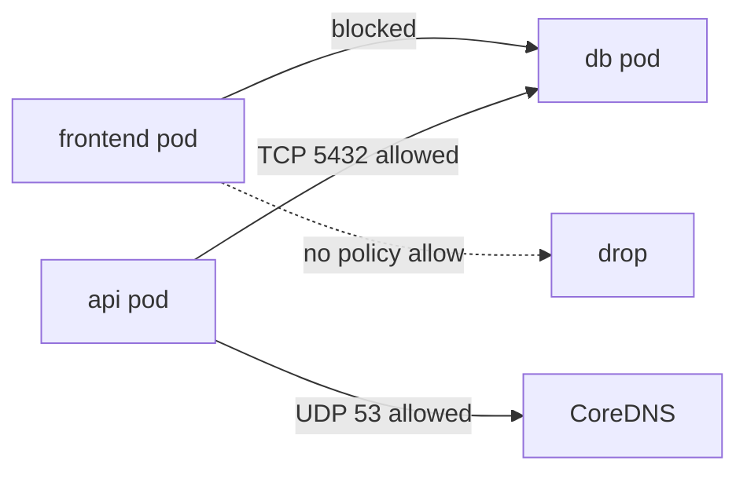

import { ConceptTemplate } from '@/features/kb/components/templates/ConceptTemplate'
import { Callout } from '@/features/kb/components/mdx/Callout'
import { ComparisonTable } from '@/features/kb/components/mdx/ComparisonTable'

export default function Layout({ children }) {
  return (
    <ConceptTemplate title="NetworkPolicies">
      {children}
    </ConceptTemplate>
  )
}

A **NetworkPolicy** is a Kubernetes object that says which pods may receive or send packets. The API does not enforce it. Your **CNI** (Calico, Cilium, Antrea, …) does. Until a policy **selects** a pod, that pod is unrestricted. Once selected, unmatched traffic in that direction is denied.

## 1. Deep Dive and Mechanics

**Default allow.** A new cluster is a flat L3 network. Compromise of a frontend is a path to the database unless you write policy.

**podSelector.** The policy applies to pods in the same namespace that match the selector (or all pods if empty, depending on how you write it). Ingress rules list allowed sources: pods, namespaces, or CIDRs. Egress lists destinations.

**Additive allow-lists.** Several policies that select the same pod are OR-ed for allow. There is no deny rule in the core API. "Deny all" is "select the pod, give empty ingress."

**DNS.** Tight egress must allow the cluster DNS (kube-dns / CoreDNS) on 53 or every name lookup dies. People forget this every time.

**Not L7.** Ports and peers, not HTTP paths. L7 belongs to a mesh or Cilium L7 policy. HostNetwork pods and some CNIs have gaps.

<Callout icon="warning" title="No enforcing CNI means theater">
Kind with a dummy CNI, or a cloud CNI that ignores NetworkPolicy, will accept your YAML and enforce nothing. Verify with a deny-all and a curl from a neighbor pod.
</Callout>

## 2. Mathematical / Theoretical Foundation

**Label predicates.** A packet from pod A to pod B is allowed on ingress of B if there exists a policy P that selects B and a rule whose peer set contains A (by label or CIDR), and the port matches. Otherwise, if any policy selected B for ingress, drop.

**Zero trust as default deny.** The secure posture is: every namespace has a default-deny ingress (and egress if you can operationalize it), then explicit allows. That is a closed-world assumption on the label algebra.

<ComparisonTable
  headers={['Control', 'Layer', 'Enforcer']}
  rows={[
    ['NetworkPolicy', 'L3/L4', 'CNI'],
    ['CiliumNetworkPolicy', 'L3–L7', 'eBPF'],
    ['mesh AuthorizationPolicy', 'L7 + identity', 'sidecar / ztunnel'],
    ['SecurityGroup (cloud)', 'L3/L4 at NIC', 'IaaS'],
  ]}
/>

## 3. Real-World Implementation

```yaml
apiVersion: networking.k8s.io/v1
kind: NetworkPolicy
metadata:
  name: deny-all-ingress
  namespace: shop
spec:
  podSelector: {}
  policyTypes:
    - Ingress
---
apiVersion: networking.k8s.io/v1
kind: NetworkPolicy
metadata:
  name: db-from-api
  namespace: shop
spec:
  podSelector:
    matchLabels:
      app: db
  policyTypes:
    - Ingress
  ingress:
    - from:
        - podSelector:
            matchLabels:
              app: api
      ports:
        - protocol: TCP
          port: 5432
---
apiVersion: networking.k8s.io/v1
kind: NetworkPolicy
metadata:
  name: api-egress
  namespace: shop
spec:
  podSelector:
    matchLabels:
      app: api
  policyTypes:
    - Egress
  egress:
    - to:
        - namespaceSelector:
            matchLabels:
              kubernetes.io/metadata.name: kube-system
          podSelector:
            matchLabels:
              k8s-app: kube-dns
      ports:
        - protocol: UDP
          port: 53
    - to:
        - podSelector:
            matchLabels:
              app: db
      ports:
        - protocol: TCP
          port: 5432
```

Test with a throwaway curl pod that lacks the `app: api` label. It should time out to the database.

## 4. Visualizations



## 5. Interview Prep

**Q: Does a NetworkPolicy apply cluster-wide?**
**A:** No. It is namespaced. `namespaceSelector` lets you allow another namespace's pods as peers. Cluster-wide defaults need a policy in every namespace or a tool that stamps them.

**Q: Why can I still hit the API server?**
**A:** Control-plane paths and some CNIs treat the API specially. Also, if your policy never selected the client pod for egress, egress is still open.

**Q: NetworkPolicy versus Service mesh mTLS?**
**A:** Policy drops packets by IP/label. Mesh authenticates identities and can authorize HTTP methods. Use both: L4 reduce blast radius, L7 encode app rules.

## 6. Production Use Cases

- **PCI zones**: data store namespaces default-deny, only the API label may connect.
- **Egress lock-down** so a compromised pod cannot phone home except through a proxy CIDR.
- **Multi-tenant clusters** as a baseline alongside RBAC.

<Callout icon="tip" title="Policy as code with tests">
Cilium connectivity tests or `kubectl` plus a job that expects timeout/success are cheaper than discovering an open database in an incident.
</Callout>
