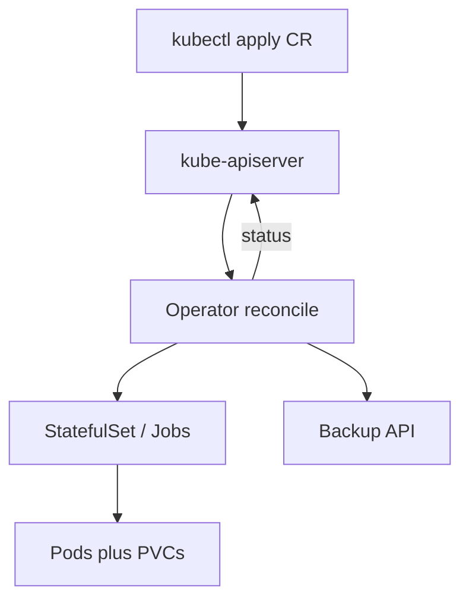

import { ConceptTemplate } from '@/features/kb/components/templates/ConceptTemplate'
import { Callout } from '@/features/kb/components/mdx/Callout'
import { ComparisonTable } from '@/features/kb/components/mdx/ComparisonTable'

export default function Layout({ children }) {
  return (
    <ConceptTemplate title="Kubernetes Operators">
      {children}
    </ConceptTemplate>
  )
}

An **Operator** is a controller that watches a **Custom Resource** and drives real objects (StatefulSets, Services, Jobs, cloud APIs) toward the spec. Kubernetes knows how to keep a stateless replica count. It does not know how to promote a Postgres primary. The Operator is that missing runbook, running in a loop.

## 1. Deep Dive and Mechanics

**CRD.** You add a type such as `PostgresCluster`. Users apply that YAML. The Operator process (a Deployment) has a ServiceAccount and RBAC to create child objects.

**Reconcile.** On create/update/delete (and periodic requeue), the controller reads spec, lists children, diffs, and writes. Status on the CR is how humans and other controllers see health.

**Day 2.** Backup to object storage, rolling major upgrades, certificate rotation, and failover are the reason to use an Operator instead of a Helm chart that only installs once.

**Frameworks.** Operator SDK, Kubebuilder, controller-runtime (Go) are the usual stack. Crossplane-style operators reconcile cloud APIs instead of in-cluster databases.

**Failure modes.** A bad Operator can delete a PVC, or get stuck and leave two primaries. Treat Operators as privileged software. Pin versions. Read the upgrade notes.

<Callout icon="warning" title="An Operator is not magic HA">
If the chart or Operator still runs a single replica database on one PV, you have automation, not a quorum. Read the topology it actually creates.
</Callout>

## 2. Mathematical / Theoretical Foundation

**Level-triggered reconcile.** You do not replay a queue of "user clicked upgrade." You observe current spec versus world and compute the next action. Missed events are healed on the next pass. This is the Kubernetes control-loop theorem in miniature.

**Ownership.** OwnerReferences plus garbage collection form a tree. Delete the CR and children go away if the policy says so — dangerous for databases unless the CR's deletion policy retains PVs.

<ComparisonTable
  headers={['Approach', 'Install', 'Day 2']}
  rows={[
    ['Helm chart', 'Templates', 'You run the runbook'],
    ['Operator', 'CR spec', 'Controller runs the runbook'],
    ['Managed SaaS', 'API / console', 'Vendor'],
    ['StatefulSet only', 'YAML', 'You still do failover'],
  ]}
/>

## 3. Real-World Implementation

```yaml
apiVersion: postgres-operator.crunchydata.com/v1beta1
kind: PostgresCluster
metadata:
  name: shop
  namespace: shop
spec:
  postgresVersion: 16
  instances:
    - name: instance1
      replicas: 3
      dataVolumeClaimSpec:
        accessModes:
          - ReadWriteOnce
        resources:
          requests:
            storage: 50Gi
  backups:
    pgbackrest:
      repos:
        - name: repo1
          s3:
            bucket: shop-pg-backup
            endpoint: s3.amazonaws.com
            region: eu-west-1
```

```go
// Sketch of a reconcile — not a full operator
func (r *ShopReconciler) Reconcile(ctx context.Context, req ctrl.Request) (ctrl.Result, error) {
    var cr shopv1.Shop
    if err := r.Get(ctx, req.NamespacedName, &cr); err != nil {
        return ctrl.Result{}, client.IgnoreNotFound(err)
    }
    // create or patch Deployment, Service; write cr.Status
    return ctrl.Result{RequeueAfter: 30 * time.Second}, nil
}
```

Watch the Operator's own logs and the CR status, not only the child pods.

## 4. Visualizations



## 5. Interview Prep

**Q: Operator versus Helm?**
**A:** Helm renders and applies. An Operator keeps reconciling for the life of the CR, including failover. Use Helm to install the Operator itself.

**Q: What is the Operator pattern?**
**A:** CRD + controller + domain knowledge. Coined by CoreOS. It is still just a control loop.

**Q: How do you test one?**
**A:** envtest (fake API), then a kind cluster with the real CRD. Chaos the primary pod and assert the CR reaches a Ready condition.

## 6. Production Use Cases

- **Datastores**: Postgres, Kafka, Elasticsearch Operators from vendors or CNCF projects.
- **cert-manager**: certificates as CRs, a textbook Operator.
- **Internal platforms**: `Team` or `Microservice` CRs that mint namespaces, repos, and dashboards.

<Callout icon="tip" title="RBAC least privilege for the Operator SA">
A `cluster-admin` Operator is a supply-chain bomb. Scope Roles to the CRs and child kinds it must touch.
</Callout>
