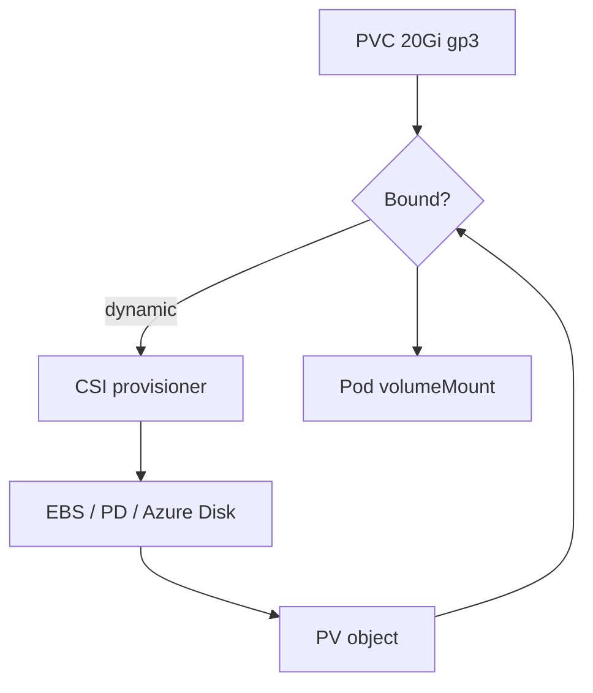

import { ConceptTemplate } from '@/features/kb/components/templates/ConceptTemplate'
import { Callout } from '@/features/kb/components/mdx/Callout'
import { ComparisonTable } from '@/features/kb/components/mdx/ComparisonTable'

export default function Layout({ children }) {
  return (
    <ConceptTemplate title="PersistentVolumeClaims">
      {children}
    </ConceptTemplate>
  )
}

A **PersistentVolumeClaim (PVC)** is what a workload asks for: "20Gi, ReadWriteOnce, class `gp3`." The developer does not name an EBS volume ID. Kubernetes binds a **PersistentVolume (PV)** — dynamically provisioned or pre-created — and the pod mounts the claim. The PVC is namespaced; the PV is cluster-scoped.

## 1. Deep Dive and Mechanics

**Binding.** The persistentvolume controller matches PVC to PV on size (PV ≥ claim), access modes, StorageClass, and selectors. Dynamic provisioning: the StorageClass's CSI provisioner creates the volume and a PV, then binds.

**Access modes.** ReadWriteOnce (one node), ReadOnlyMany, ReadWriteMany (NFS, EFS, CephFS, …), ReadWriteOncePod. A RWO disk cannot attach to two nodes at once; a StatefulSet reschedule may wait for detach.

**volumeClaimTemplates.** StatefulSets create one PVC per ordinal (`data-mongo-0`). That is how identity sticks to a disk.

**Expansion.** If the StorageClass allows it, edit PVC storage request upward. The CSI driver grows the filesystem. Shrinking is almost never supported.

**Deletion.** `reclaimPolicy` lives on the PV. Delete the PVC and the volume may persist (Retain) or be destroyed (Delete). Stateful data plus Delete is a foot-gun.

<Callout icon="warning" title="Pending PVC is a scheduler blocker">
A pod that references an unbound PVC stays Pending. Wrong StorageClass, no provisioner, quota, or zone mismatch. `kubectl describe pvc` before you blame the scheduler.
</Callout>

## 2. Mathematical / Theoretical Foundation

**Matching as a constraint.** Bind if `capacity(PV) ≥ request(PVC)` and mode sets intersect and class strings equal. Dynamic provisioners implement `create(spec) → PV` as an external side effect; Kubernetes only records the result.

**Topology.** WaitForFirstConsumer delays provision until a pod is scheduled, so the disk is in the same AZ as the node. Immediate provisioning can trap a volume in zone A while the pod lands in zone B.

<ComparisonTable
  headers={['Object', 'Scope', 'Who creates it']}
  rows={[
    ['PVC', 'Namespace', 'App / StatefulSet template'],
    ['PV', 'Cluster', 'Admin or CSI'],
    ['StorageClass', 'Cluster', 'Admin'],
    ['Volume in pod spec', 'Pod', 'References a PVC or ephemeral type'],
  ]}
/>

## 3. Real-World Implementation

```yaml
apiVersion: v1
kind: PersistentVolumeClaim
metadata:
  name: api-cache
  namespace: shop
spec:
  accessModes:
    - ReadWriteOnce
  storageClassName: gp3
  resources:
    requests:
      storage: 20Gi
---
apiVersion: apps/v1
kind: Deployment
metadata:
  name: api
  namespace: shop
spec:
  replicas: 1
  selector:
    matchLabels:
      app: api
  template:
    metadata:
      labels:
        app: api
    spec:
      containers:
        - name: api
          image: registry.example.com/api:1.4.2
          volumeMounts:
            - name: cache
              mountPath: /var/cache/api
      volumes:
        - name: cache
          persistentVolumeClaim:
            claimName: api-cache
```

A Deployment with replicas greater than 1 and a single RWO PVC will not schedule extra pods. Use a StatefulSet or RWX.

## 4. Visualizations



## 5. Interview Prep

**Q: PVC versus PV?**
**A:** PVC is the request (user). PV is the actual volume (infra). Binding is the handshake. Users should rarely create PVs by hand on a cloud with CSI.

**Q: Why is the PVC Pending forever?**
**A:** No default StorageClass, provisioner down, quota, or WaitForFirstConsumer waiting on a pod that cannot schedule for another reason (deadlock with affinity).

**Q: Can two pods share a PVC?**
**A:** Only if the access mode and the storage backend allow it (RWX), or they are on the same node (some RWO implementations). Do not assume shareability.

## 6. Production Use Cases

- **App cache** that should survive a container restart but not necessarily a region.
- **StatefulSet data** via volumeClaimTemplates.
- **Build caches** on RWX volumes for CI runners.

<Callout icon="tip" title="Name the StorageClass in the PVC">
Relying on the default class makes clusters non-portable and makes a class rename an outage. Pin `storageClassName`.
</Callout>
