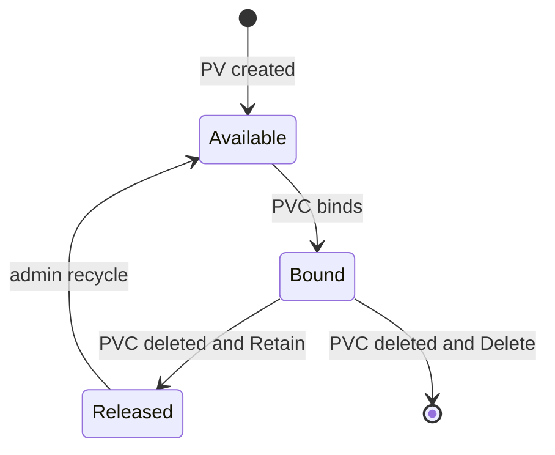

import { ConceptTemplate } from '@/features/kb/components/templates/ConceptTemplate'
import { Callout } from '@/features/kb/components/mdx/Callout'
import { ComparisonTable } from '@/features/kb/components/mdx/ComparisonTable'

export default function Layout({ children }) {
  return (
    <ConceptTemplate title="PersistentVolumes">
      {children}
    </ConceptTemplate>
  )
}

A **PersistentVolume (PV)** is the cluster's record of a piece of storage: an EBS volume, a Persistent Disk, an NFS export, a Ceph RBD. It outlives pods. When a claim binds, kubelet (via CSI) attaches and mounts that backend into the pod. When the pod dies, the data is still on the PV subject to reclaim policy.

## 1. Deep Dive and Mechanics

**Static versus dynamic.** Admins can pre-create PVs (NFS paths, imported snapshots). CSI StorageClasses create PVs on demand when a PVC appears. Dynamic is the cloud default.

**CSI.** The Container Storage Interface splits *controller* (create/delete/attach in the cloud API) and *node* (mount on the worker). Drivers run as sidecars plus a DaemonSet. Kubernetes no longer in-tree ships every cloud disk type.

**Reclaim.** `Delete` removes the cloud volume when the PVC goes. `Retain` leaves a Released PV that still holds data; an admin must scrub and make it Available. `Recycle` is deprecated.

**Phase.** Available → Bound → Released. A Released Retain PV will not auto-bind to a new PVC. That is how you recover from an accidental PVC delete (if you still have the disk).

**Capacity and class.** The PV advertises size and `storageClassName`. Binding requires a match. You can shrink neither the cloud disk nor the PVC in most drivers.

<Callout icon="error" title="Retain is not a backup">
Retain saves you from Delete. It does not replicate across AZs or protect against `rm` inside the filesystem. Snapshots and off-cluster backups are still required.
</Callout>

## 2. Mathematical / Theoretical Foundation

**Independent lifetime.** Let L(pod) be the pod interval and L(pv) the volume interval. Persistence means L(pv) is not a subset of L(pod). Binding is a 1:1 relation at a time (one PVC per PV).

**Attach constraints.** RWO block devices have a hypervisor attach limit of one node. Scheduler plus CSI attach/detach is a distributed lock on that device. Split-brain mounts are the failure the lock exists to prevent.

<ComparisonTable
  headers={['Reclaim', 'After PVC delete', 'Use']}
  rows={[
    ['Delete', 'Cloud volume destroyed', 'Ephemeral env, caches'],
    ['Retain', 'PV Released, data kept', 'Prod databases'],
    ['Recycle', 'Deprecated scrub', 'Do not use'],
  ]}
/>

## 3. Real-World Implementation

```yaml
# Rare today: static NFS PV
apiVersion: v1
kind: PersistentVolume
metadata:
  name: nfs-archive
spec:
  capacity:
    storage: 500Gi
  accessModes:
    - ReadWriteMany
  persistentVolumeReclaimPolicy: Retain
  storageClassName: nfs-archive
  nfs:
    server: 10.0.10.20
    path: /export/archive
```

```yaml
# What CSI usually creates for you
apiVersion: v1
kind: PersistentVolume
metadata:
  name: pvc-3f2a9c
spec:
  capacity:
    storage: 50Gi
  accessModes:
    - ReadWriteOnce
  persistentVolumeReclaimPolicy: Delete
  storageClassName: gp3
  csi:
    driver: ebs.csi.aws.com
    volumeHandle: vol-0abc123
```

Prefer StorageClass + PVC. Hand-written PVs are for NFS, imported volumes, and break-glass restore.

## 4. Visualizations



## 5. Interview Prep

**Q: Why is PV cluster-scoped?**
**A:** Disks are infra. Any namespace could theoretically claim a static PV (subject to RBAC and selectors). The claim is what is namespaced.

**Q: Node affinity on a PV?**
**A:** Zone topology. A disk in `eu-west-1a` cannot mount in `1b`. WaitForFirstConsumer plus topology keys prevent that bind.

**Q: In-tree versus CSI?**
**A:** Old Kubernetes had cloud-specific volume plugins in the kubelet tree. CSI is out-of-tree and versioned with the driver. New clusters should be CSI-only.

## 6. Production Use Cases

- **Block disks** for databases (RWO, Retain, snapshots).
- **Shared NFS/EFS** for CMS uploads (RWX).
- **Imported volumes** after a DR restore (static PV pointing at an existing disk ID).

<Callout icon="tip" title="Snapshot before you trust Retain">
VolumeSnapshot (CSI) plus a backup to another account is the restore story. Retain just pauses deletion.
</Callout>
